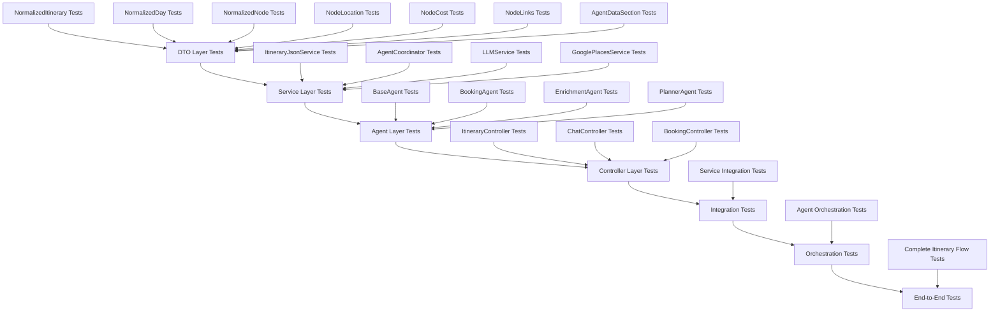
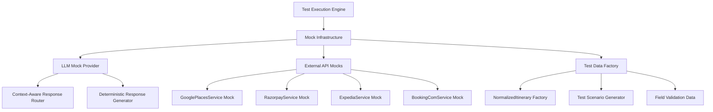

# Design Document

## Overview

This design implements a comprehensive atomic testing framework that builds from individual component validation to complete end-to-end workflow testing. The framework ensures 100% accuracy with zero assumptions by validating each layer independently before combining them.

The design follows a strict bottom-up approach:
**DTO Layer → Service Layer → Agent Layer → Controller Layer → Integration → Orchestration → End-to-End**

Each layer must pass 100% of tests before the next layer can execute, ensuring complete system reliability.

## Architecture

### Testing Layer Architecture



### Mock Infrastructure Architecture



## Components and Interfaces

### 1. Test Execution Engine

**Core Interface:**
```java
public interface TestExecutionEngine {
    TestResult executeLayer(TestLayer layer);
    boolean canProgressToNextLayer(TestLayer currentLayer);
    void stopOnFailure(TestFailure failure);
    TestReport generateReport();
}
```

**Implementation:**
```java
@Component
public class AtomicTestExecutionEngine implements TestExecutionEngine {
    
    private final List<TestLayer> testLayers = Arrays.asList(
        TestLayer.DTO,
        TestLayer.SERVICE,
        TestLayer.AGENT,
        TestLayer.CONTROLLER,
        TestLayer.INTEGRATION,
        TestLayer.ORCHESTRATION,
        TestLayer.END_TO_END
    );
    
    public TestSuiteResult executeCompleteTestSuite() {
        for (TestLayer layer : testLayers) {
            TestResult result = executeLayer(layer);
            if (!result.isSuccess()) {
                return TestSuiteResult.failure(layer, result);
            }
        }
        return TestSuiteResult.success();
    }
}
```

### 2. DTO Layer Testing Framework

**Field Validation Engine:**
```java
@Component
public class DTOFieldValidator {
    
    public FieldValidationResult validateNormalizedItinerary(NormalizedItinerary itinerary) {
        FieldValidationResult result = new FieldValidationResult();
        
        // Validate all 20+ required fields
        result.validateField("itineraryId", itinerary.getItineraryId(), String.class, true);
        result.validateField("version", itinerary.getVersion(), Integer.class, true);
        result.validateField("userId", itinerary.getUserId(), String.class, false);
        result.validateField("createdAt", itinerary.getCreatedAt(), Long.class, false);
        result.validateField("updatedAt", itinerary.getUpdatedAt(), Long.class, false);
        result.validateField("summary", itinerary.getSummary(), String.class, false);
        result.validateField("currency", itinerary.getCurrency(), String.class, false);
        result.validateField("themes", itinerary.getThemes(), List.class, false);
        result.validateField("origin", itinerary.getOrigin(), String.class, false);
        result.validateField("destination", itinerary.getDestination(), String.class, false);
        result.validateField("startDate", itinerary.getStartDate(), String.class, false);
        result.validateField("endDate", itinerary.getEndDate(), String.class, false);
        result.validateField("days", itinerary.getDays(), List.class, true);
        result.validateField("settings", itinerary.getSettings(), ItinerarySettings.class, false);
        result.validateField("agents", itinerary.getAgents(), Map.class, false);
        result.validateField("mapBounds", itinerary.getMapBounds(), MapBounds.class, false);
        result.validateField("countryCentroid", itinerary.getCountryCentroid(), Coordinates.class, false);
        result.validateField("agentData", itinerary.getAgentData(), Map.class, false);
        result.validateField("workflow", itinerary.getWorkflow(), WorkflowData.class, false);
        result.validateField("revisions", itinerary.getRevisions(), List.class, false);
        result.validateField("chat", itinerary.getChat(), List.class, false);
        
        return result;
    }
    
    public FieldValidationResult validateNormalizedDay(NormalizedDay day) {
        FieldValidationResult result = new FieldValidationResult();
        
        // Validate all 13 fields
        result.validateField("dayNumber", day.getDayNumber(), Integer.class, true);
        result.validateField("date", day.getDate(), String.class, false);
        result.validateField("location", day.getLocation(), String.class, false);
        result.validateField("warnings", day.getWarnings(), List.class, false);
        result.validateField("notes", day.getNotes(), String.class, false);
        result.validateField("pace", day.getPace(), String.class, false);
        result.validateField("totalDistance", day.getTotalDistance(), Double.class, false);
        result.validateField("totalCost", day.getTotalCost(), Double.class, false);
        result.validateField("totalDuration", day.getTotalDuration(), Double.class, false);
        result.validateField("timeWindowStart", day.getTimeWindowStart(), String.class, false);
        result.validateField("timeWindowEnd", day.getTimeWindowEnd(), String.class, false);
        result.validateField("timeZone", day.getTimeZone(), String.class, false);
        result.validateField("nodes", day.getNodes(), List.class, true);
        result.validateField("edges", day.getEdges(), List.class, false);
        
        return result;
    }
    
    public FieldValidationResult validateNormalizedNode(NormalizedNode node) {
        FieldValidationResult result = new FieldValidationResult();
        
        // Validate all 16 fields
        result.validateField("id", node.getId(), String.class, true);
        result.validateField("type", node.getType(), String.class, true);
        result.validateField("title", node.getTitle(), String.class, true);
        result.validateField("location", node.getLocation(), NodeLocation.class, false);
        result.validateField("timing", node.getTiming(), NodeTiming.class, false);
        result.validateField("cost", node.getCost(), NodeCost.class, false);
        result.validateField("details", node.getDetails(), NodeDetails.class, false);
        result.validateField("labels", node.getLabels(), List.class, false);
        result.validateField("tips", node.getTips(), NodeTips.class, false);
        result.validateField("links", node.getLinks(), NodeLinks.class, false);
        result.validateField("transit", node.getTransit(), TransitInfo.class, false);
        result.validateField("locked", node.getLocked(), Boolean.class, false);
        result.validateField("bookingRef", node.getBookingRef(), String.class, false);
        result.validateField("status", node.getStatus(), String.class, false);
        result.validateField("updatedBy", node.getUpdatedBy(), String.class, false);
        result.validateField("updatedAt", node.getUpdatedAt(), Long.class, false);
        result.validateField("agentData", node.getAgentData(), Map.class, false);
        
        return result;
    }
    
    public FieldValidationResult validateNodeLocation(NodeLocation location) {
        FieldValidationResult result = new FieldValidationResult();
        
        // Validate all 8 fields
        result.validateField("name", location.getName(), String.class, false);
        result.validateField("address", location.getAddress(), String.class, false);
        result.validateField("coordinates", location.getCoordinates(), Coordinates.class, false);
        result.validateField("placeId", location.getPlaceId(), String.class, false);
        result.validateField("googleMapsUri", location.getGoogleMapsUri(), String.class, false);
        result.validateField("rating", location.getRating(), Double.class, false);
        result.validateField("openingHours", location.getOpeningHours(), String.class, false);
        result.validateField("closingHours", location.getClosingHours(), String.class, false);
        
        return result;
    }
    
    public FieldValidationResult validateNodeCost(NodeCost cost) {
        FieldValidationResult result = new FieldValidationResult();
        
        // Validate both fields
        result.validateField("amountPerPerson", cost.getAmountPerPerson(), Double.class, false);
        result.validateField("currency", cost.getCurrency(), String.class, false);
        
        return result;
    }
    
    public FieldValidationResult validateNodeLinks(NodeLinks links) {
        FieldValidationResult result = new FieldValidationResult();
        
        // Validate nested BookingInfo
        result.validateField("booking", links.getBooking(), NodeLinks.BookingInfo.class, false);
        
        if (links.getBooking() != null) {
            NodeLinks.BookingInfo booking = links.getBooking();
            result.validateField("booking.refNumber", booking.getRefNumber(), String.class, false);
            result.validateField("booking.status", booking.getStatus(), String.class, false);
            result.validateField("booking.details", booking.getDetails(), String.class, false);
        }
        
        return result;
    }
}
```

### 3. Mock Infrastructure

**LLM Mock Provider:**
```java
@Component
public class MockLLMProvider implements LLMProvider {
    
    private final Map<String, String> mockResponses = new HashMap<>();
    private final PromptAnalyzer promptAnalyzer;
    
    public MockLLMProvider() {
        setupMockResponses();
        this.promptAnalyzer = new PromptAnalyzer();
    }
    
    private void setupMockResponses() {
        // Load complete Bali 3-day luxury itinerary response
        mockResponses.put("create_itinerary_bali", loadBaliItineraryResponse());
        
        // Load Tokyo itinerary response
        mockResponses.put("create_itinerary_tokyo", loadTokyoItineraryResponse());
        
        // Intent classification responses
        mockResponses.put("intent_add_activity", "{\"intent\":\"ADD_ACTIVITY\",\"confidence\":0.95}");
        mockResponses.put("intent_change_hotel", "{\"intent\":\"CHANGE_ACCOMMODATION\",\"confidence\":0.92}");
        
        // Agent-specific responses
        mockResponses.put("enrichment_place_details", loadPlaceDetailsResponse());
        mockResponses.put("booking_confirmation", loadBookingConfirmationResponse());
    }
    
    @Override
    public String generateResponse(String prompt, Map<String, Object> context) {
        String mockKey = promptAnalyzer.determineMockKey(prompt, context);
        String response = mockResponses.get(mockKey);
        
        if (response == null) {
            throw new IllegalStateException("No mock response found for key: " + mockKey + 
                                          ". Prompt: " + prompt.substring(0, Math.min(100, prompt.length())));
        }
        
        return response;
    }
    
    private String loadBaliItineraryResponse() {
        // Return the exact JSON structure from the test data file
        return loadResourceFile("mock-data/destinations/bali/3-day-luxury-relaxation.json");
    }
}
```

**Test Data Factory:**
```java
@Component
public class TestDataFactory {
    
    private final ObjectMapper objectMapper;
    
    public TestDataFactory(ObjectMapper objectMapper) {
        this.objectMapper = objectMapper;
    }
    
    public NormalizedItinerary createBaliLuxuryItinerary() {
        NormalizedItinerary itinerary = new NormalizedItinerary();
        
        // Set all required fields with exact values from test data
        itinerary.setItineraryId("it_bali_luxury_3d_001");
        itinerary.setVersion(1);
        itinerary.setUserId("user_luxury_traveler_001");
        itinerary.setCreatedAt(1769184000000L);
        itinerary.setUpdatedAt(1769184000000L);
        itinerary.setSummary("A luxurious 3-day escape to Bali featuring world-class spas, fine dining, and cultural experiences");
        itinerary.setCurrency("USD");
        itinerary.setThemes(Arrays.asList("relaxation", "luxury", "culture", "spa"));
        itinerary.setOrigin(null);
        itinerary.setDestination("Bali, Indonesia");
        itinerary.setStartDate("2026-01-24");
        itinerary.setEndDate("2026-01-27");
        
        // Create complete days with all nodes
        List<NormalizedDay> days = createBaliDays();
        itinerary.setDays(days);
        
        // Set other required objects
        itinerary.setSettings(createItinerarySettings());
        itinerary.setAgents(createAgentStatus());
        itinerary.setMapBounds(createMapBounds());
        itinerary.setCountryCentroid(createCountryCentroid());
        itinerary.setAgentData(new HashMap<>());
        itinerary.setWorkflow(createWorkflowData());
        itinerary.setRevisions(new ArrayList<>());
        itinerary.setChat(new ArrayList<>());
        
        return itinerary;
    }
    
    private List<NormalizedDay> createBaliDays() {
        List<NormalizedDay> days = new ArrayList<>();
        
        // Day 1
        NormalizedDay day1 = new NormalizedDay();
        day1.setDayNumber(1);
        day1.setDate("2026-01-24");
        day1.setLocation("Ubud, Bali");
        day1.setPace("relaxed");
        day1.setTotalDistance(25.0);
        day1.setTotalCost(450.00);
        day1.setTotalDuration(8.0);
        day1.setTimeWindowStart("09:00");
        day1.setTimeWindowEnd("21:00");
        day1.setTimeZone("Asia/Makassar");
        
        // Create nodes for day 1
        List<NormalizedNode> day1Nodes = createDay1Nodes();
        day1.setNodes(day1Nodes);
        day1.setEdges(createDay1Edges());
        
        days.add(day1);
        
        // Add Day 2 and Day 3 with complete data...
        days.add(createDay2());
        days.add(createDay3());
        
        return days;
    }
    
    private List<NormalizedNode> createDay1Nodes() {
        List<NormalizedNode> nodes = new ArrayList<>();
        
        // Airport transfer node
        NormalizedNode transferNode = new NormalizedNode();
        transferNode.setId("arrival_001");
        transferNode.setType("transport");
        transferNode.setTitle("Private Airport Transfer to Ubud");
        
        // Complete NodeLocation with all 8 fields
        NodeLocation transferLocation = new NodeLocation();
        transferLocation.setName("Ngurah Rai International Airport");
        transferLocation.setAddress("Jl. Raya Gusti Ngurah Rai, Tuban, Badung, Bali 80119");
        transferLocation.setCoordinates(new Coordinates(-8.7467, 115.1671));
        transferLocation.setPlaceId("ChIJoQ8Q6NNB0i0RkOYkS7EPkSQ");
        transferLocation.setGoogleMapsUri("https://maps.google.com/?cid=123456789");
        transferLocation.setRating(4.2);
        transferLocation.setOpeningHours("00:00");
        transferLocation.setClosingHours("23:59");
        transferNode.setLocation(transferLocation);
        
        // Complete NodeCost with both fields
        NodeCost transferCost = new NodeCost();
        transferCost.setAmountPerPerson(45.00);
        transferCost.setCurrency("USD");
        transferNode.setCost(transferCost);
        
        // Complete NodeLinks with nested BookingInfo
        NodeLinks transferLinks = new NodeLinks();
        NodeLinks.BookingInfo transferBooking = new NodeLinks.BookingInfo();
        transferBooking.setRefNumber(null);
        transferBooking.setStatus("REQUIRED");
        transferBooking.setDetails(null);
        transferLinks.setBooking(transferBooking);
        transferNode.setLinks(transferLinks);
        
        // Set other required fields
        transferNode.setStatus("planned");
        transferNode.setUpdatedBy("agent");
        transferNode.setUpdatedAt(1769184000000L);
        transferNode.setAgentData(new HashMap<>());
        
        nodes.add(transferNode);
        
        // Hotel check-in node with complete data...
        nodes.add(createHotelNode());
        
        return nodes;
    }
}
```

### 4. Service Layer Testing Framework

**Service Test Base Class:**
```java
@ExtendWith(MockitoExtension.class)
public abstract class BaseServiceTest {
    
    @Mock
    protected DatabaseService databaseService;
    
    @Mock
    protected ObjectMapper objectMapper;
    
    protected TestDataFactory testDataFactory;
    
    @BeforeEach
    void setUp() {
        testDataFactory = new TestDataFactory(new ObjectMapper());
        setupCommonMocks();
    }
    
    protected void setupCommonMocks() {
        // Setup common mock behaviors
    }
    
    protected void verifyNoUnexpectedInteractions() {
        // Verify no unexpected mock interactions occurred
    }
}
```

**ItineraryJsonService Test:**
```java
class ItineraryJsonServiceTest extends BaseServiceTest {
    
    @InjectMocks
    private ItineraryJsonService itineraryJsonService;
    
    @Test
    @DisplayName("Should create itinerary with complete field validation")
    void shouldCreateItineraryWithCompleteFieldValidation() throws JsonProcessingException {
        // Given
        NormalizedItinerary testItinerary = testDataFactory.createBaliLuxuryItinerary();
        String expectedJson = "serialized-json";
        FirestoreItinerary expectedEntity = new FirestoreItinerary("it_bali_luxury_3d_001", 1, expectedJson);
        
        when(objectMapper.writeValueAsString(testItinerary)).thenReturn(expectedJson);
        when(databaseService.save(any(FirestoreItinerary.class))).thenReturn(expectedEntity);
        
        // When
        FirestoreItinerary result = itineraryJsonService.createItinerary(testItinerary);
        
        // Then
        assertThat(result).isNotNull();
        assertThat(result.getItineraryId()).isEqualTo("it_bali_luxury_3d_001");
        assertThat(result.getVersion()).isEqualTo(1);
        assertThat(result.getJsonData()).isEqualTo(expectedJson);
        
        // Verify all interactions
        verify(objectMapper).writeValueAsString(testItinerary);
        verify(databaseService).save(any(FirestoreItinerary.class));
        verifyNoUnexpectedInteractions();
    }
    
    @Test
    @DisplayName("Should handle flexible agent data operations")
    void shouldHandleFlexibleAgentDataOperations() {
        // Test getAgentData, setAgentData, hasAgentData, removeAgentData methods
        // with various Map<String, Object> structures
    }
}
```

## Data Models

### Test Result Models

```java
public class FieldValidationResult {
    private final List<FieldError> errors = new ArrayList<>();
    private final List<FieldSuccess> successes = new ArrayList<>();
    
    public void validateField(String fieldName, Object value, Class<?> expectedType, boolean required) {
        if (required && value == null) {
            errors.add(new FieldError(fieldName, "Required field is null"));
            return;
        }
        
        if (value != null && !expectedType.isInstance(value)) {
            errors.add(new FieldError(fieldName, 
                String.format("Expected type %s but got %s", expectedType.getSimpleName(), value.getClass().getSimpleName())));
            return;
        }
        
        successes.add(new FieldSuccess(fieldName, expectedType, value));
    }
    
    public boolean isValid() {
        return errors.isEmpty();
    }
    
    public List<FieldError> getErrors() {
        return errors;
    }
    
    public int getValidatedFieldCount() {
        return successes.size() + errors.size();
    }
}

public class TestSuiteResult {
    private final boolean success;
    private final TestLayer failedLayer;
    private final List<TestResult> layerResults;
    private final long executionTimeMs;
    
    public static TestSuiteResult success() {
        return new TestSuiteResult(true, null, new ArrayList<>(), System.currentTimeMillis());
    }
    
    public static TestSuiteResult failure(TestLayer failedLayer, TestResult failedResult) {
        return new TestSuiteResult(false, failedLayer, Arrays.asList(failedResult), System.currentTimeMillis());
    }
}
```

## Error Handling

### Failure Fast Strategy

```java
@Component
public class TestFailureHandler {
    
    public void handleTestFailure(TestFailure failure) {
        logger.error("Test failed at layer: {} with error: {}", failure.getLayer(), failure.getMessage());
        
        // Generate detailed failure report
        FailureReport report = generateFailureReport(failure);
        
        // Stop execution immediately
        throw new TestExecutionException("Test execution stopped due to failure", failure, report);
    }
    
    private FailureReport generateFailureReport(TestFailure failure) {
        FailureReport report = new FailureReport();
        
        // Add field-level validation details
        if (failure instanceof FieldValidationFailure) {
            FieldValidationFailure fieldFailure = (FieldValidationFailure) failure;
            report.addFieldErrors(fieldFailure.getFieldErrors());
        }
        
        // Add mock interaction details
        if (failure instanceof MockInteractionFailure) {
            MockInteractionFailure mockFailure = (MockInteractionFailure) failure;
            report.addMockInteractionLogs(mockFailure.getInteractionLogs());
        }
        
        // Add stack trace and context
        report.setStackTrace(failure.getStackTrace());
        report.setTestContext(failure.getTestContext());
        
        return report;
    }
}
```

## Testing Strategy

### Layer-by-Layer Validation

1. **DTO Layer**: Validate every single field in every DTO class with exact type checking and constraint validation
2. **Service Layer**: Test business logic with comprehensive mocking and interaction verification
3. **Agent Layer**: Validate agent capabilities and task handling with mocked LLM responses
4. **Controller Layer**: Test REST endpoints with mocked services and complete request/response validation
5. **Integration Layer**: Test service interactions with real implementations
6. **Orchestration Layer**: Test agent coordination with mocked external dependencies
7. **End-to-End Layer**: Test complete workflows with realistic data and comprehensive validation

### Field Accuracy Validation

Every test must validate:
- **Field Presence**: All required fields are present
- **Field Types**: All fields have correct Java types
- **Field Values**: All fields have valid values according to business rules
- **Nested Objects**: All nested objects are properly constructed and validated
- **Collections**: All lists and maps contain expected elements
- **Flexible Agent Data**: Map<String, Object> structures can store and retrieve any data type

This design ensures 100% accuracy with zero assumptions by validating every component at the atomic level before progressing to higher-level integration testing.