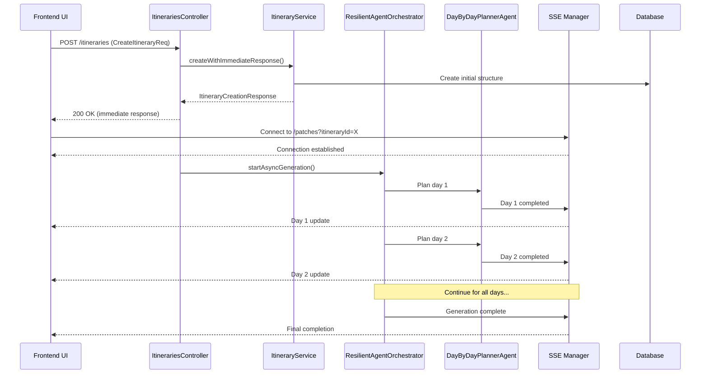

# Real-Time Itinerary Generation - Design Document

## Overview

This design implements a real-time itinerary generation system that provides immediate user feedback and progressive updates during the planning process. The system leverages Server-Sent Events (SSE) for real-time communication, enhanced controller responses for immediate feedback, and agent event integration for progressive updates.

## Architecture

### High-Level Flow



## Components and Interfaces

### 1. Enhanced ItinerariesController

#### New Response DTO
```java
public class ItineraryCreationResponse {
    private ItineraryDto itinerary;           // Initial structure
    private String executionId;               // Unique execution identifier
    private String sseEndpoint;               // SSE endpoint URL
    private LocalDateTime estimatedCompletion; // Estimated completion time
    private CreationStatus status;            // PROCESSING, COMPLETED, FAILED
    private List<AgentExecutionStage> stages; // Planned execution stages
    private String errorMessage;              // Error details if failed
}

public enum CreationStatus {
    PROCESSING, COMPLETED, FAILED, PARTIAL_COMPLETION
}
```

#### Enhanced Create Endpoint
```java
@PostMapping
public ResponseEntity<ItineraryCreationResponse> create(
    @Valid @RequestBody CreateItineraryReq request, 
    HttpServletRequest httpRequest) {
    
    // 1. Create immediate itinerary structure
    ItineraryDto initialItinerary = itineraryService.createInitialStructure(request, userId);
    
    // 2. Start async agent processing
    String executionId = orchestratorService.startAsyncGeneration(initialItinerary.getId(), request);
    
    // 3. Return immediate response
    ItineraryCreationResponse response = ItineraryCreationResponse.builder()
        .itinerary(initialItinerary)
        .executionId(executionId)
        .sseEndpoint("/api/v1/itineraries/patches?itineraryId=" + initialItinerary.getId())
        .estimatedCompletion(calculateEstimatedCompletion(request))
        .status(CreationStatus.PROCESSING)
        .stages(buildExecutionStages(request))
        .build();
        
    return ResponseEntity.ok(response);
}
```

### 2. Real-Time SSE Manager

#### SSE Event Types
```java
public class ItineraryUpdateEvent {
    private String eventType;        // "day_completed", "node_enhanced", "generation_complete"
    private String itineraryId;
    private String executionId;
    private Integer dayNumber;       // For day-specific updates
    private String nodeId;           // For node-specific updates
    private Object data;             // Event-specific data
    private Integer progress;        // Overall progress percentage
    private String message;          // Human-readable status message
    private String agentType;        // Which agent generated this update
    private LocalDateTime timestamp;
}
```

#### Enhanced SSE Endpoint
```java
@GetMapping(value = "/patches", produces = MediaType.TEXT_EVENT_STREAM_VALUE)
public SseEmitter getPatches(@RequestParam String itineraryId,
                           @RequestParam(required = false) String executionId) {
    
    SseEmitter emitter = new SseEmitter(300000L); // 5 minute timeout
    
    // Register emitter with connection manager
    sseConnectionManager.registerConnection(itineraryId, executionId, emitter);
    
    // Send initial connection confirmation
    sendConnectionConfirmation(emitter, itineraryId);
    
    // Setup cleanup handlers
    setupEmitterHandlers(emitter, itineraryId, executionId);
    
    return emitter;
}
```

### 3. SSE Connection Manager

```java
@Service
public class SseConnectionManager {
    private final Map<String, Set<SseEmitter>> itineraryConnections = new ConcurrentHashMap<>();
    private final Map<String, ItineraryUpdateEvent> lastEvents = new ConcurrentHashMap<>();
    
    public void registerConnection(String itineraryId, String executionId, SseEmitter emitter) {
        itineraryConnections.computeIfAbsent(itineraryId, k -> ConcurrentHashMap.newKeySet())
                           .add(emitter);
        
        // Send any missed events since last connection
        sendMissedEvents(emitter, itineraryId, executionId);
    }
    
    public void broadcastUpdate(String itineraryId, ItineraryUpdateEvent event) {
        Set<SseEmitter> emitters = itineraryConnections.get(itineraryId);
        if (emitters != null) {
            List<SseEmitter> deadEmitters = new ArrayList<>();
            
            for (SseEmitter emitter : emitters) {
                try {
                    emitter.send(SseEmitter.event()
                        .name(event.getEventType())
                        .data(event)
                        .id(event.getExecutionId() + "_" + System.currentTimeMillis()));
                } catch (Exception e) {
                    deadEmitters.add(emitter);
                }
            }
            
            // Clean up dead connections
            emitters.removeAll(deadEmitters);
        }
        
        // Store last event for reconnection scenarios
        lastEvents.put(itineraryId + "_" + event.getEventType(), event);
    }
}
```

### 4. Enhanced Agent Integration

#### Agent Event Publisher
```java
@Component
public class AgentEventPublisher {
    private final SseConnectionManager sseConnectionManager;
    
    public void publishDayCompleted(String itineraryId, String executionId, 
                                  NormalizedDay completedDay) {
        ItineraryUpdateEvent event = ItineraryUpdateEvent.builder()
            .eventType("day_completed")
            .itineraryId(itineraryId)
            .executionId(executionId)
            .dayNumber(completedDay.getDayNumber())
            .data(completedDay)
            .progress(calculateProgress(itineraryId, completedDay.getDayNumber()))
            .message("Day " + completedDay.getDayNumber() + " planning completed")
            .agentType("planner")
            .timestamp(LocalDateTime.now())
            .build();
            
        sseConnectionManager.broadcastUpdate(itineraryId, event);
    }
    
    public void publishNodeEnhanced(String itineraryId, String executionId,
                                  String nodeId, NormalizedNode enhancedNode) {
        ItineraryUpdateEvent event = ItineraryUpdateEvent.builder()
            .eventType("node_enhanced")
            .itineraryId(itineraryId)
            .executionId(executionId)
            .nodeId(nodeId)
            .data(enhancedNode)
            .message("Location details added")
            .agentType("enrichment")
            .timestamp(LocalDateTime.now())
            .build();
            
        sseConnectionManager.broadcastUpdate(itineraryId, event);
    }
}
```

#### Enhanced DayByDayPlannerAgent Integration
```java
// In DayByDayPlannerAgent.java - modify planDaysBatch method
private List<NormalizedDay> planDaysBatch(CreateItineraryReq request, int startDay, int batchSize,
                                         List<String> previousDaysSummaries, Set<String> usedLocations) {
    
    List<NormalizedDay> days = new ArrayList<>();
    
    for (int i = 0; i < batchSize; i++) {
        int currentDay = startDay + i;
        
        // Plan individual day
        NormalizedDay day = planSingleDay(request, currentDay, previousDaysSummaries, usedLocations);
        days.add(day);
        
        // Save day immediately to database
        itineraryJsonService.addDayToItinerary(getCurrentItineraryId(), day);
        
        // Publish real-time update
        agentEventPublisher.publishDayCompleted(
            getCurrentItineraryId(), 
            getCurrentExecutionId(), 
            day
        );
        
        // Update progress
        int overallProgress = (currentDay * 100) / getTotalDays();
        agentEventPublisher.publishProgress(
            getCurrentItineraryId(),
            getCurrentExecutionId(),
            overallProgress,
            "Planning day " + currentDay
        );
    }
    
    return days;
}
```

### 5. Frontend Integration

#### Enhanced Itinerary Creation Service
```typescript
export class RealTimeItineraryService {
    private eventSource: EventSource | null = null;
    private reconnectAttempts = 0;
    private maxReconnectAttempts = 5;
    
    async createItinerary(
        request: CreateItineraryRequest,
        callbacks: {
            onDayCompleted?: (day: NormalizedDay) => void;
            onNodeEnhanced?: (nodeId: string, node: NormalizedNode) => void;
            onProgress?: (progress: number, message: string) => void;
            onComplete?: (itinerary: NormalizedItinerary) => void;
            onError?: (error: string) => void;
        }
    ): Promise<ItineraryCreationResponse> {
        
        // Step 1: Create itinerary and get immediate response
        const response = await this.apiClient.createItinerary(request);
        
        // Step 2: Setup real-time updates
        if (response.status === 'PROCESSING' && response.sseEndpoint) {
            this.setupRealTimeUpdates(response, callbacks);
        }
        
        return response;
    }
    
    private setupRealTimeUpdates(
        response: ItineraryCreationResponse,
        callbacks: ItineraryCallbacks
    ) {
        const sseUrl = `${response.sseEndpoint}&executionId=${response.executionId}`;
        this.eventSource = new EventSource(sseUrl);
        
        this.eventSource.addEventListener('day_completed', (event) => {
            const data = JSON.parse(event.data);
            callbacks.onDayCompleted?.(data.data);
        });
        
        this.eventSource.addEventListener('node_enhanced', (event) => {
            const data = JSON.parse(event.data);
            callbacks.onNodeEnhanced?.(data.nodeId, data.data);
        });
        
        this.eventSource.addEventListener('progress_update', (event) => {
            const data = JSON.parse(event.data);
            callbacks.onProgress?.(data.progress, data.message);
        });
        
        this.eventSource.addEventListener('generation_complete', (event) => {
            const data = JSON.parse(event.data);
            callbacks.onComplete?.(data.data);
            this.cleanup();
        });
        
        this.eventSource.onerror = (error) => {
            this.handleConnectionError(response, callbacks);
        };
    }
    
    private handleConnectionError(
        response: ItineraryCreationResponse,
        callbacks: ItineraryCallbacks
    ) {
        if (this.reconnectAttempts < this.maxReconnectAttempts) {
            this.reconnectAttempts++;
            const delay = Math.pow(2, this.reconnectAttempts) * 1000; // Exponential backoff
            
            setTimeout(() => {
                this.setupRealTimeUpdates(response, callbacks);
            }, delay);
        } else {
            callbacks.onError?.('Connection lost. Please refresh to see latest updates.');
        }
    }
}
```

#### React Component Integration
```typescript
export const ItineraryCreationView: React.FC = () => {
    const [itinerary, setItinerary] = useState<NormalizedItinerary | null>(null);
    const [progress, setProgress] = useState(0);
    const [currentMessage, setCurrentMessage] = useState('');
    const [days, setDays] = useState<NormalizedDay[]>([]);
    
    const handleCreateItinerary = async (request: CreateItineraryRequest) => {
        const service = new RealTimeItineraryService();
        
        const response = await service.createItinerary(request, {
            onDayCompleted: (day) => {
                setDays(prev => {
                    const updated = [...prev];
                    updated[day.dayNumber - 1] = day;
                    return updated;
                });
            },
            
            onNodeEnhanced: (nodeId, enhancedNode) => {
                setDays(prev => prev.map(day => ({
                    ...day,
                    nodes: day.nodes.map(node => 
                        node.id === nodeId ? enhancedNode : node
                    )
                })));
            },
            
            onProgress: (progress, message) => {
                setProgress(progress);
                setCurrentMessage(message);
            },
            
            onComplete: (finalItinerary) => {
                setItinerary(finalItinerary);
                setProgress(100);
                setCurrentMessage('Itinerary completed!');
            },
            
            onError: (error) => {
                console.error('Itinerary creation error:', error);
                // Handle error state
            }
        });
        
        // Set initial itinerary structure
        setItinerary(response.itinerary);
        
        // Initialize days array
        setDays(new Array(request.durationDays).fill(null));
    };
    
    return (
        <div className="itinerary-creation-view">
            <ProgressBar progress={progress} message={currentMessage} />
            
            <div className="days-container">
                {days.map((day, index) => (
                    <DayCard 
                        key={index}
                        day={day}
                        dayNumber={index + 1}
                        isLoading={day === null}
                    />
                ))}
            </div>
        </div>
    );
};
```

## Data Models

### Enhanced Itinerary Structure
```java
public class NormalizedItinerary {
    // Existing fields...
    
    // New fields for real-time generation
    private String executionId;
    private GenerationStatus generationStatus;
    private List<GenerationStage> completedStages;
    private LocalDateTime lastUpdateTime;
    private Map<String, Object> generationMetadata;
}

public enum GenerationStatus {
    INITIALIZING,
    PLANNING_DAYS,
    ENRICHING_CONTENT,
    ADDING_BOOKINGS,
    COMPLETED,
    FAILED,
    PARTIAL_COMPLETION
}
```

## Error Handling

### Connection Recovery Strategy
1. **Automatic Reconnection**: Exponential backoff with max 5 attempts
2. **Missed Event Recovery**: Server stores last 10 events per itinerary
3. **Fallback Polling**: If SSE fails completely, fall back to polling every 5 seconds
4. **Partial Failure Handling**: Continue processing other days if one day fails

### Error Event Types
```java
public class ErrorEvent extends ItineraryUpdateEvent {
    private ErrorSeverity severity;  // WARNING, ERROR, CRITICAL
    private String errorCode;        // Structured error code
    private String recoveryAction;   // Suggested user action
    private boolean canRetry;        // Whether retry is possible
}
```

## Testing Strategy

### Unit Tests
- SSE connection management
- Event publishing and broadcasting
- Agent integration points
- Error handling scenarios

### Integration Tests
- End-to-end itinerary creation flow
- Real-time update delivery
- Connection recovery scenarios
- Multi-user concurrent creation

### Performance Tests
- SSE connection scalability
- Event broadcasting performance
- Memory usage with long-running connections
- Database update frequency impact

## Security Considerations

### Authentication
- SSE endpoints require valid authentication
- Execution IDs are validated against user ownership
- Rate limiting on SSE connections

### Data Privacy
- Events only sent to authorized users
- Sensitive data filtered from real-time updates
- Connection logs are anonymized

## Monitoring and Observability

### Metrics
- SSE connection count and duration
- Event publishing rate and latency
- Connection failure and recovery rates
- Agent execution times and success rates

### Logging
- Connection establishment and termination
- Event publishing and delivery
- Error conditions and recovery actions
- Performance bottlenecks