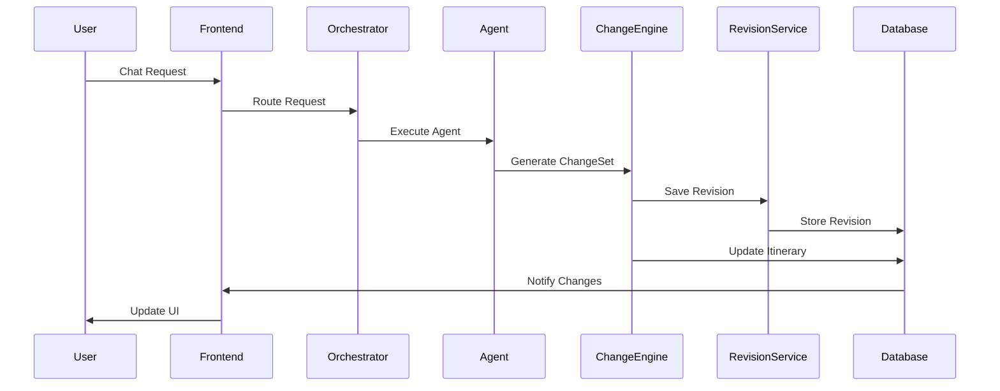

# Design Document

## Overview

This design document outlines the architecture for transforming the current itinerary system into a unified, agent-friendly architecture. The design builds upon the existing Spring Boot backend with NormalizedItinerary and React frontend, extending them to support perfect synchronization between day-by-day and workflow views through a single-source-of-truth approach.

The design follows a clean architecture pattern with no legacy fallbacks, focusing on the foundational change to the unified data structure and starting with the EditorAgent as the MVP. The system addresses current issues including data duplication, sync problems, agent inefficiency, lack of versioning, and JsonEOFException errors.

## Architecture

### High-Level Architecture

```mermaid
graph TB
    subgraph "Frontend Layer"
        A[React App] --> B[UnifiedItineraryContext]
        B --> C[DayByDayView]
        B --> D[WorkflowView]
        E[WebSocketService] --> B
    end
    
    subgraph "Backend Layer"
        F[Spring Boot API] --> G[OrchestratorService]
        G --> H[AgentRegistry]
        H --> I[EditorAgent]
        H --> J[EnrichmentAgent]
        H --> K[BookingAgent]
        L[ChangeEngine] --> M[RevisionService]
        N[LLMService] --> O[GeminiProvider]
        N --> P[QwenProvider]
    end
    
    subgraph "Data Layer"
        Q[Firebase Firestore]
        R[masterItinerary.json]
        S[revisions/{revisionId}]
    end
    
    subgraph "External APIs"
        T[Google Places API]
        U[Booking.com API]
        V[Expedia API]
        W[Razorpay API]
    end
    
    A --> F
    E --> F
    F --> Q
    Q --> R
    Q --> S
    J --> T
    K --> U
    K --> V
    K --> W
```

### Data Flow Architecture



## Components and Interfaces

### 1. Unified Data Structure Extensions

#### NormalizedItinerary Extensions
```java
public class NormalizedItinerary {
    // Existing fields...
    
    @JsonProperty("agentData")
    private Map<String, AgentDataSection> agentData;
    
    @JsonProperty("workflow")
    private WorkflowData workflow;
    
    @JsonProperty("revisions")
    private List<RevisionRecord> revisions;
    
    @JsonProperty("chat")
    private List<ChatRecord> chat;
}
```

#### AgentDataSection
```java
public class AgentDataSection {
    private LocationAgentData location;
    private PhotosAgentData photos;
    private BookingAgentData booking;
    private TransportAgentData transport;
    private DiningAgentData dining;
    private ActivitiesAgentData activities;
    private Map<String, Object> customData;
}
```

#### WorkflowData
```java
public class WorkflowData {
    private List<WorkflowNode> nodes;
    private List<WorkflowEdge> edges;
    private WorkflowLayout layout;
    private WorkflowSettings settings;
}
```

#### RevisionRecord
```java
public class RevisionRecord {
    private String revisionId;
    private Long timestamp;
    private String agent;
    private List<ChangeDetail> changes;
    private String reason;
    private String userId;
}
```

### 2. Enhanced Agent Architecture

#### AgentRegistry Enhancement
```java
@Component
public class AgentRegistry {
    private final Map<String, BaseAgent> agents = new ConcurrentHashMap<>();
    private final Map<String, AgentCapabilities> capabilities = new ConcurrentHashMap<>();
    
    public void registerAgent(BaseAgent agent) {
        String agentId = agent.getAgentId();
        agents.put(agentId, agent);
        capabilities.put(agentId, agent.getCapabilities());
    }
    
    public void disableAgent(String agentId) {
        AgentCapabilities caps = capabilities.get(agentId);
        if (caps != null) {
            caps.setEnabled(false);
        }
    }
    
    public List<BaseAgent> getAgentsForTask(String taskType) {
        return capabilities.entrySet().stream()
            .filter(entry -> entry.getValue().isEnabled())
            .filter(entry -> entry.getValue().getSupportedTasks().contains(taskType))
            .map(entry -> agents.get(entry.getKey()))
            .sorted(Comparator.comparing(agent -> 
                capabilities.get(agent.getAgentId()).getPriority()))
            .collect(Collectors.toList());
    }
    
    public AgentExecutionPlan createExecutionPlan(String taskType, NormalizedItinerary itinerary) {
        List<BaseAgent> suitableAgents = getAgentsForTask(taskType);
        return new AgentExecutionPlan(taskType, suitableAgents, itinerary);
    }
}
```

#### AgentCapabilities
```java
public class AgentCapabilities {
    private List<String> supportedTasks;
    private List<String> supportedDataSections;
    private int priority;
    private boolean enabled = true;
    private Map<String, Object> configuration;
    
    // Getters and setters
}
```

### 3. EditorAgent Implementation

#### EditorAgent
```java
@Component
public class EditorAgent extends BaseAgent {
    private final SummarizationService summarizationService;
    private final ChangeEngine changeEngine;
    private final LLMService llmService;
    
    public EditorAgent(AgentEventBus eventBus, 
                      SummarizationService summarizationService,
                      ChangeEngine changeEngine,
                      LLMService llmService) {
        super(eventBus, AgentEvent.AgentKind.EDITOR);
        this.summarizationService = summarizationService;
        this.changeEngine = changeEngine;
        this.llmService = llmService;
    }
    
    @Override
    public <T> T executeInternal(String itineraryId, AgentRequest<T> request) {
        ChatRequest chatRequest = request.getData(ChatRequest.class);
        
        // Get itinerary summary for context
        NormalizedItinerary itinerary = getItinerary(itineraryId);
        String summary = summarizationService.summarizeItinerary(itinerary, 2000);
        
        // Generate change set using LLM
        ChangeSet changeSet = generateChangeSet(chatRequest, summary);
        
        // Apply changes
        ChangeEngine.ApplyResult result = changeEngine.apply(itineraryId, changeSet);
        
        return (T) result;
    }
    
    private ChangeSet generateChangeSet(ChatRequest request, String context) {
        String prompt = buildChangeSetPrompt(request, context);
        String response = llmService.generateChangeSet(prompt, context);
        return parseChangeSetFromResponse(response);
    }
}
```

### 4. Enhanced Services

#### SummarizationService
```java
@Service
public class SummarizationService {
    private final ObjectMapper objectMapper;
    
    public String summarizeItinerary(NormalizedItinerary itinerary, int maxTokens) {
        StringBuilder summary = new StringBuilder();
        
        // Add basic info
        summary.append("Itinerary: ").append(itinerary.getSummary()).append("\n");
        summary.append("Days: ").append(itinerary.getDays().size()).append("\n");
        summary.append("Currency: ").append(itinerary.getCurrency()).append("\n\n");
        
        // Add day summaries
        for (NormalizedDay day : itinerary.getDays()) {
            String daySummary = summarizeDay(day, maxTokens / itinerary.getDays().size());
            summary.append(daySummary).append("\n");
        }
        
        return truncateToTokenLimit(summary.toString(), maxTokens);
    }
    
    public String summarizeDay(NormalizedDay day, int maxTokens) {
        StringBuilder summary = new StringBuilder();
        summary.append("Day ").append(day.getDayNumber())
               .append(" (").append(day.getLocation()).append("):\n");
        
        for (NormalizedNode node : day.getNodes()) {
            String nodeSummary = summarizeNode(node, maxTokens / day.getNodes().size());
            summary.append("- ").append(nodeSummary).append("\n");
        }
        
        return summary.toString();
    }
    
    public String summarizeNode(NormalizedNode node, int maxTokens) {
        StringBuilder summary = new StringBuilder();
        summary.append(node.getTitle()).append(" (").append(node.getType()).append(")");
        
        if (node.getTiming() != null) {
            summary.append(" at ").append(node.getTiming().getStartTime());
        }
        
        if (node.getCost() != null) {
            summary.append(" - ").append(node.getCost().getAmount())
                   .append(" ").append(node.getCost().getCurrency());
        }
        
        return truncateToTokenLimit(summary.toString(), maxTokens);
    }
    
    private String truncateToTokenLimit(String text, int maxTokens) {
        // Simple approximation: 1 token ≈ 4 characters
        int maxChars = maxTokens * 4;
        if (text.length() <= maxChars) {
            return text;
        }
        return text.substring(0, maxChars - 3) + "...";
    }
}
```

#### RevisionService
```java
@Service
public class RevisionService {
    private final DatabaseService databaseService;
    private final ObjectMapper objectMapper;
    
    public void saveRevision(String itineraryId, RevisionRecord revision) {
        try {
            String path = "itineraries/" + itineraryId + "/revisions/" + revision.getRevisionId();
            String json = objectMapper.writeValueAsString(revision);
            databaseService.saveDocument(path, json);
        } catch (Exception e) {
            logger.error("Failed to save revision", e);
            throw new RuntimeException("Failed to save revision", e);
        }
    }
    
    public List<RevisionRecord> getRevisionHistory(String itineraryId) {
        try {
            String path = "itineraries/" + itineraryId + "/revisions";
            List<String> revisionJsons = databaseService.getDocuments(path);
            
            return revisionJsons.stream()
                .map(this::parseRevisionRecord)
                .filter(Objects::nonNull)
                .sorted(Comparator.comparing(RevisionRecord::getTimestamp).reversed())
                .collect(Collectors.toList());
        } catch (Exception e) {
            logger.error("Failed to get revision history", e);
            return Collections.emptyList();
        }
    }
    
    public NormalizedItinerary rollbackToVersion(String itineraryId, String revisionId) {
        try {
            String path = "itineraries/" + itineraryId + "/revisions/" + revisionId;
            String revisionJson = databaseService.getDocument(path);
            
            RevisionRecord revision = objectMapper.readValue(revisionJson, RevisionRecord.class);
            
            // Reconstruct itinerary from revision
            return reconstructItineraryFromRevision(revision);
        } catch (Exception e) {
            logger.error("Failed to rollback to revision", e);
            throw new RuntimeException("Failed to rollback to revision", e);
        }
    }
}
```

### 5. LLM Service Architecture

#### LLMService
```java
@Service
public class LLMService {
    private final Map<String, LLMProvider> providers;
    
    @Autowired
    public LLMService(List<LLMProvider> providerList) {
        this.providers = providerList.stream()
            .collect(Collectors.toMap(
                provider -> provider.getClass().getSimpleName().toLowerCase(),
                Function.identity()
            ));
    }
    
    public String generateResponse(String prompt, String modelType, Map<String, Object> parameters) {
        LLMProvider provider = providers.get(modelType.toLowerCase() + "provider");
        if (provider == null) {
            throw new IllegalArgumentException("Unknown model type: " + modelType);
        }
        return provider.generate(prompt, parameters);
    }
    
    public IntentResult classifyIntent(String text, String context) {
        Map<String, Object> params = Map.of("context", context);
        String response = generateResponse(buildIntentPrompt(text, context), "qwen2.5-7b", params);
        return parseIntentResult(response);
    }
    
    public ChangeSet generateChangeSet(String request, String context) {
        Map<String, Object> params = Map.of("context", context);
        String response = generateResponse(buildChangeSetPrompt(request, context), "gemini", params);
        return parseChangeSet(response);
    }
}
```

#### LLMProvider Interface
```java
public interface LLMProvider {
    String generate(String prompt, Map<String, Object> parameters);
    boolean supportsModel(String modelName);
    String getProviderName();
}
```

### 6. External API Integration

#### GooglePlacesService
```java
@Service
public class GooglePlacesService {
    private final String apiKey;
    private final RestTemplate restTemplate;
    private final String baseUrl = "https://maps.googleapis.com/maps/api/place";
    
    public PlaceDetails getPlaceDetails(String placeId) {
        String url = baseUrl + "/details/json";
        Map<String, String> params = Map.of(
            "place_id", placeId,
            "fields", "photos,reviews,opening_hours,price_level,rating",
            "key", apiKey
        );
        
        try {
            ResponseEntity<PlaceDetailsResponse> response = restTemplate.getForEntity(
                buildUrlWithParams(url, params), PlaceDetailsResponse.class);
            
            if (response.getStatusCode().is2xxSuccessful() && response.getBody() != null) {
                return response.getBody().getResult();
            }
            
            throw new RuntimeException("Failed to get place details");
        } catch (Exception e) {
            logger.error("Error calling Google Places API", e);
            throw new RuntimeException("Google Places API error", e);
        }
    }
    
    public List<Photo> getPlacePhotos(String placeId) {
        PlaceDetails details = getPlaceDetails(placeId);
        return details.getPhotos();
    }
    
    public List<Review> getPlaceReviews(String placeId) {
        PlaceDetails details = getPlaceDetails(placeId);
        return details.getReviews();
    }
}
```

#### BookingComService
```java
@Service
public class BookingComService {
    private final String apiKey;
    private final String baseUrl = "https://distribution-xml.booking.com/2.5/json";
    private final RestTemplate restTemplate;
    
    public List<Hotel> searchHotels(BookingRequest request) {
        String url = baseUrl + "/hotels";
        Map<String, Object> params = buildHotelSearchParams(request);
        
        try {
            ResponseEntity<HotelSearchResponse> response = restTemplate.postForEntity(
                url, params, HotelSearchResponse.class);
            
            if (response.getStatusCode().is2xxSuccessful() && response.getBody() != null) {
                return response.getBody().getHotels();
            }
            
            return Collections.emptyList();
        } catch (Exception e) {
            logger.error("Error calling Booking.com API", e);
            throw new RuntimeException("Booking.com API error", e);
        }
    }
    
    public BookingConfirmation confirmBooking(Hotel hotel, PaymentResult payment) {
        String url = baseUrl + "/bookings";
        Map<String, Object> params = buildBookingParams(hotel, payment);
        
        try {
            ResponseEntity<BookingConfirmation> response = restTemplate.postForEntity(
                url, params, BookingConfirmation.class);
            
            if (response.getStatusCode().is2xxSuccessful()) {
                return response.getBody();
            }
            
            throw new RuntimeException("Booking confirmation failed");
        } catch (Exception e) {
            logger.error("Error confirming booking", e);
            throw new RuntimeException("Booking confirmation error", e);
        }
    }
}
```

## Data Models

### Unified Data Structure

The unified data structure extends the existing NormalizedItinerary with additional sections:

```json
{
  "itineraryId": "string",
  "version": 1,
  "userId": "string",
  "createdAt": 1234567890,
  "updatedAt": 1234567890,
  "summary": "string",
  "currency": "string",
  "themes": ["string"],
  "destination": "string",
  "startDate": "2024-01-01",
  "endDate": "2024-01-07",
  "days": [...],
  "settings": {...},
  "agents": {...},
  "mapBounds": {...},
  "countryCentroid": {...},
  "agentData": {
    "location": {...},
    "photos": {...},
    "booking": {...},
    "transport": {...},
    "dining": {...},
    "activities": {...}
  },
  "workflow": {
    "nodes": [...],
    "edges": [...],
    "layout": {...},
    "settings": {...}
  },
  "revisions": [...],
  "chat": [...]
}
```

### Frontend State Management

#### UnifiedItineraryContext
```typescript
interface UnifiedItineraryContextType {
  itinerary: NormalizedItinerary | null;
  isLoading: boolean;
  isUpdating: boolean;
  updateNode: (nodeId: string, updates: Partial<NormalizedNode>) => Promise<void>;
  updateDay: (dayNumber: number, updates: Partial<NormalizedDay>) => Promise<void>;
  processWithAgents: (nodeId: string, agentIds: string[]) => Promise<void>;
  rollbackToRevision: (revisionId: string) => Promise<void>;
  subscribeToUpdates: (callback: (update: ItineraryUpdate) => void) => () => void;
}
```

#### WebSocket Integration
```typescript
class WebSocketService {
  private ws: WebSocket | null = null;
  private listeners: Map<string, Function[]> = new Map();
  private reconnectAttempts = 0;
  private maxReconnectAttempts = 5;
  
  connect(itineraryId: string): void {
    const wsUrl = `ws://localhost:8080/ws/itinerary/${itineraryId}`;
    this.ws = new WebSocket(wsUrl);
    
    this.ws.onopen = () => {
      console.log('WebSocket connected');
      this.reconnectAttempts = 0;
    };
    
    this.ws.onmessage = (event) => {
      const message = JSON.parse(event.data);
      this.notifyListeners(message.type, message.data);
    };
    
    this.ws.onclose = () => {
      console.log('WebSocket disconnected');
      this.attemptReconnect(itineraryId);
    };
    
    this.ws.onerror = (error) => {
      console.error('WebSocket error:', error);
    };
  }
  
  subscribe(eventType: string, callback: Function): () => void {
    if (!this.listeners.has(eventType)) {
      this.listeners.set(eventType, []);
    }
    this.listeners.get(eventType)!.push(callback);
    
    // Return unsubscribe function
    return () => {
      const callbacks = this.listeners.get(eventType);
      if (callbacks) {
        const index = callbacks.indexOf(callback);
        if (index > -1) {
          callbacks.splice(index, 1);
        }
      }
    };
  }
  
  private attemptReconnect(itineraryId: string): void {
    if (this.reconnectAttempts < this.maxReconnectAttempts) {
      this.reconnectAttempts++;
      const delay = Math.pow(2, this.reconnectAttempts) * 1000; // Exponential backoff
      setTimeout(() => this.connect(itineraryId), delay);
    }
  }
}
```

## Error Handling

### Backend Error Handling
```java
@ControllerAdvice
public class GlobalExceptionHandler {
    
    @ExceptionHandler(AgentExecutionException.class)
    public ResponseEntity<ErrorResponse> handleAgentError(AgentExecutionException e) {
        ErrorResponse error = new ErrorResponse(
            "AGENT_ERROR",
            e.getMessage(),
            "Check agent configuration and try again"
        );
        return ResponseEntity.status(HttpStatus.INTERNAL_SERVER_ERROR).body(error);
    }
    
    @ExceptionHandler(RevisionNotFoundException.class)
    public ResponseEntity<ErrorResponse> handleRevisionNotFound(RevisionNotFoundException e) {
        ErrorResponse error = new ErrorResponse(
            "REVISION_NOT_FOUND",
            e.getMessage(),
            "Verify revision ID and try again"
        );
        return ResponseEntity.status(HttpStatus.NOT_FOUND).body(error);
    }
    
    @ExceptionHandler(SynchronizationException.class)
    public ResponseEntity<ErrorResponse> handleSyncError(SynchronizationException e) {
        ErrorResponse error = new ErrorResponse(
            "SYNC_ERROR",
            e.getMessage(),
            "Refresh the page and try again"
        );
        return ResponseEntity.status(HttpStatus.CONFLICT).body(error);
    }
}
```

### Frontend Error Handling
```typescript
class ErrorBoundary extends React.Component<Props, State> {
  constructor(props: Props) {
    super(props);
    this.state = { hasError: false, error: null };
  }
  
  static getDerivedStateFromError(error: Error): State {
    return { hasError: true, error };
  }
  
  componentDidCatch(error: Error, errorInfo: React.ErrorInfo) {
    console.error('Error caught by boundary:', error, errorInfo);
    // Send to error tracking service
    this.reportError(error, errorInfo);
  }
  
  private reportError(error: Error, errorInfo: React.ErrorInfo) {
    // Implementation for error reporting
  }
  
  render() {
    if (this.state.hasError) {
      return (
        <div className="error-fallback">
          <h2>Something went wrong</h2>
          <p>Please refresh the page and try again</p>
          <button onClick={() => window.location.reload()}>
            Refresh Page
          </button>
        </div>
      );
    }
    
    return this.props.children;
  }
}
```

## Testing Strategy

### Unit Testing
- **Agent Testing**: Test each agent's executeInternal method with mock data
- **Service Testing**: Test all service methods with various input scenarios
- **Data Transformation Testing**: Test conversion between data structures
- **API Integration Testing**: Test external API calls with mock responses

### Integration Testing
- **Agent Orchestration**: Test complete agent execution flows
- **Database Operations**: Test revision storage and retrieval
- **Real-time Synchronization**: Test WebSocket message handling
- **Frontend-Backend Integration**: Test API calls and state updates

### End-to-End Testing
- **Complete User Workflows**: Test chat-driven modifications end-to-end
- **Booking Flows**: Test complete booking process with external APIs
- **Synchronization Testing**: Test view synchronization across multiple clients
- **Rollback Testing**: Test complete revision rollback workflows

### Performance Testing
- **Load Testing**: Test system under expected user load
- **Stress Testing**: Test system limits and failure points
- **API Rate Limit Testing**: Test behavior at API rate limits
- **Database Performance**: Test query performance with large datasets

This design provides a comprehensive foundation for implementing the unified itinerary system while maintaining compatibility with existing components and ensuring scalability for future enhancements.