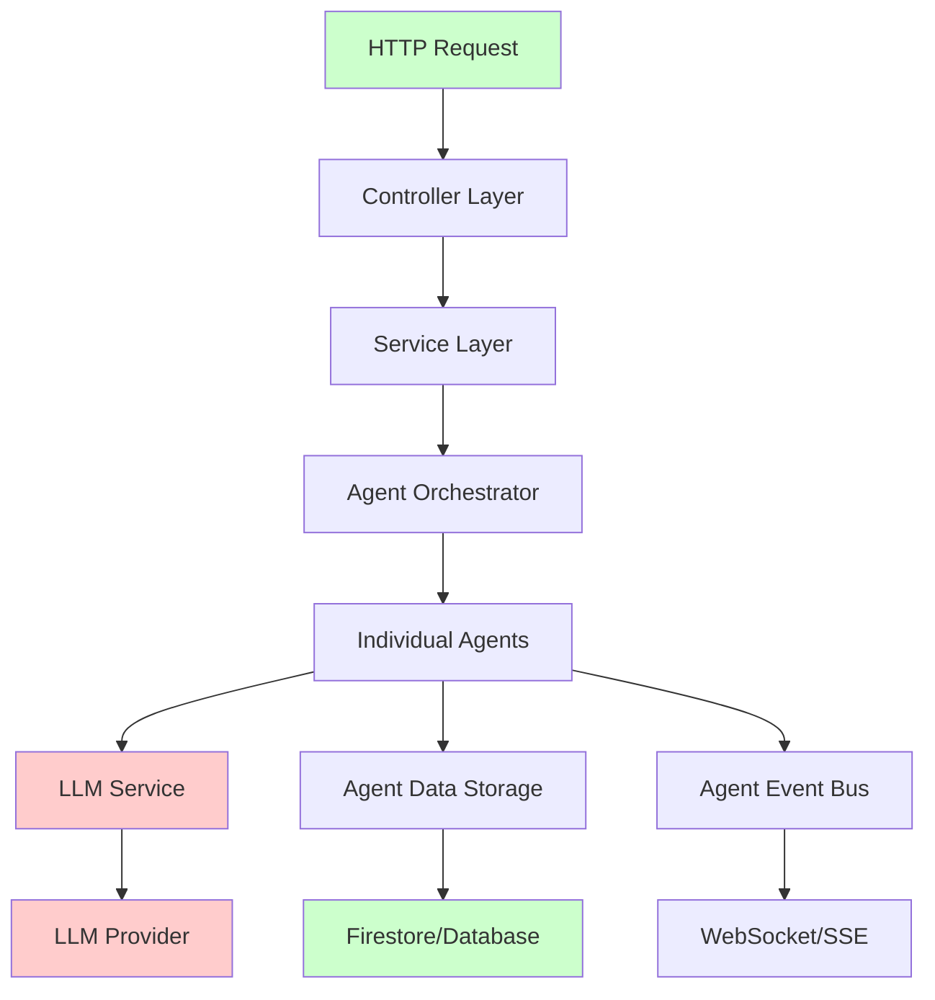

# End-to-End Testing Plan for Trip Planner

## 🎯 **Overview**

This plan outlines comprehensive end-to-end testing with mocked LLM responses while using all real backend components. We'll test the complete flow from API requests through agent processing to final data storage.

## 🏗️ **System Architecture Analysis**

### **Core Flow Components**



**🔴 Mock Points**: LLM Service & LLM Provider  
**🟢 Real Components**: Everything else

## 📋 **Test Scenarios**

### **Scenario 1: Complete Itinerary Creation Flow**
**Endpoint**: `POST /api/v1/itineraries`
**Flow**: User Request → Agent Orchestration → LLM Processing → Agent Data Storage

### **Scenario 2: Chat-Based Itinerary Modification**
**Endpoint**: `POST /api/v1/chat/route`
**Flow**: Chat Request → Intent Classification → Change Engine → Agent Updates

### **Scenario 3: Real-Time Agent Updates**
**Endpoint**: `GET /api/v1/agents/stream`
**Flow**: SSE Connection → Agent Events → Real-time Updates

### **Scenario 4: Booking Flow**
**Endpoint**: Various booking endpoints
**Flow**: Booking Request → BookingAgent → Payment → Data Storage

## 🧪 **Test Implementation Strategy**

### **Phase 1: Mock LLM Service Setup**

#### **1.1 Create Mock LLM Provider**
```java
@Component
@Profile("test")
public class MockLLMProvider implements LLMProvider {
    
    private final Map<String, String> mockResponses = new HashMap<>();
    
    @Override
    public String generate(String prompt, Map<String, Object> parameters) {
        // Return predefined responses based on prompt patterns
        return getMockResponse(prompt);
    }
    
    @Override
    public boolean supportsModel(String modelName) {
        return "mock".equals(modelName) || "gemini".equals(modelName);
    }
    
    @Override
    public String getProviderName() {
        return "mock";
    }
    
    private String getMockResponse(String prompt) {
        // Pattern matching for different types of requests
        if (prompt.contains("create itinerary")) {
            return loadMockItineraryResponse();
        } else if (prompt.contains("classify intent")) {
            return loadMockIntentResponse();
        } else if (prompt.contains("generate changeset")) {
            return loadMockChangesetResponse();
        }
        return "Mock response for: " + prompt.substring(0, Math.min(50, prompt.length()));
    }
}
```

#### **1.2 Mock Response Data**
```java
@Component
public class MockResponseLoader {
    
    public String loadItineraryCreationResponse() {
        // Load from test resources or generate programmatically
        return """
        {
            "itineraryId": "it_test_123",
            "summary": "3-day Tokyo adventure",
            "days": [
                {
                    "dayNumber": 1,
                    "date": "2024-12-01",
                    "location": "Tokyo",
                    "nodes": [
                        {
                            "id": "node_1",
                            "type": "attraction",
                            "title": "Tokyo Tower",
                            "location": {
                                "name": "Tokyo Tower",
                                "coordinates": {"lat": 35.6586, "lng": 139.7454}
                            }
                        }
                    ]
                }
            ]
        }
        """;
    }
    
    public String loadIntentClassificationResponse() {
        return """
        {
            "intent": "add_activity",
            "confidence": 0.95,
            "entities": {
                "activity_type": "restaurant",
                "location": "Shibuya"
            }
        }
        """;
    }
    
    public String loadChangesetResponse() {
        return """
        {
            "changes": [
                {
                    "operation": "add",
                    "target": "day.1.nodes",
                    "data": {
                        "id": "new_node_1",
                        "type": "meal",
                        "title": "Sushi Restaurant"
                    }
                }
            ]
        }
        """;
    }
}
```

### **Phase 2: Integration Test Setup**

#### **2.1 Base Test Configuration**
```java
@SpringBootTest(webEnvironment = SpringBootTest.WebEnvironment.RANDOM_PORT)
@ActiveProfiles("test")
@TestPropertySource(properties = {
    "firebase.enabled=false",
    "razorpay.enabled=false",
    "gemini.enabled=false"
})
public abstract class EndToEndTestBase {
    
    @Autowired
    protected TestRestTemplate restTemplate;
    
    @Autowired
    protected MockLLMProvider mockLLMProvider;
    
    @Autowired
    protected ItineraryJsonService itineraryJsonService;
    
    @Autowired
    protected AgentEventBus agentEventBus;
    
    @MockBean
    protected FirebaseAuth firebaseAuth;
    
    @BeforeEach
    void setUp() {
        // Setup mock authentication
        setupMockAuth();
        
        // Clear any existing data
        clearTestData();
        
        // Setup mock responses
        setupMockResponses();
    }
    
    protected void setupMockAuth() {
        // Mock Firebase authentication for test user
        when(firebaseAuth.verifyIdToken(anyString()))
            .thenReturn(createMockFirebaseToken("test_user_123"));
    }
    
    protected void setupMockResponses() {
        mockLLMProvider.addMockResponse("create_itinerary", 
            mockResponseLoader.loadItineraryCreationResponse());
        mockLLMProvider.addMockResponse("classify_intent", 
            mockResponseLoader.loadIntentClassificationResponse());
    }
}
```

#### **2.2 Complete Itinerary Creation Test**
```java
@Test
public class CompleteItineraryCreationTest extends EndToEndTestBase {
    
    @Test
    void shouldCreateCompleteItineraryEndToEnd() {
        // Given: A valid itinerary creation request
        CreateItineraryReq request = CreateItineraryReq.builder()
            .destination("Tokyo, Japan")
            .startDate(LocalDate.of(2024, 12, 1))
            .endDate(LocalDate.of(2024, 12, 3))
            .durationDays(3)
            .budgetTier("mid")
            .interests(List.of("culture", "food"))
            .build();
        
        HttpHeaders headers = new HttpHeaders();
        headers.setBearerAuth("mock_token");
        HttpEntity<CreateItineraryReq> entity = new HttpEntity<>(request, headers);
        
        // When: Making the API call
        ResponseEntity<ItineraryDto> response = restTemplate.postForEntity(
            "/api/v1/itineraries", entity, ItineraryDto.class);
        
        // Then: Verify immediate response
        assertThat(response.getStatusCode()).isEqualTo(HttpStatus.OK);
        assertThat(response.getBody()).isNotNull();
        assertThat(response.getBody().getStatus()).isEqualTo("generating");
        
        String itineraryId = response.getBody().getId();
        
        // And: Wait for async processing to complete
        await().atMost(30, SECONDS).untilAsserted(() -> {
            Optional<NormalizedItinerary> itinerary = 
                itineraryJsonService.getMasterItinerary(itineraryId);
            
            assertThat(itinerary).isPresent();
            assertThat(itinerary.get().getDays()).isNotEmpty();
            assertThat(itinerary.get().getDays().get(0).getNodes()).isNotEmpty();
        });
        
        // And: Verify agent data was stored flexibly
        Optional<NormalizedItinerary> finalItinerary = 
            itineraryJsonService.getMasterItinerary(itineraryId);
        
        assertThat(finalItinerary).isPresent();
        
        // Verify flexible agent data structure
        Map<String, AgentDataSection> agentData = finalItinerary.get().getAgentData();
        assertThat(agentData).isNotEmpty();
        
        // Check if location agent data exists and is flexible
        if (agentData.containsKey("location")) {
            AgentDataSection locationSection = agentData.get("location");
            Object locationData = locationSection.getAgentData("location");
            assertThat(locationData).isNotNull();
            
            // Verify it's stored as flexible Map
            if (locationData instanceof Map) {
                @SuppressWarnings("unchecked")
                Map<String, Object> locationMap = (Map<String, Object>) locationData;
                assertThat(locationMap).containsKey("enrichmentTimestamp");
            }
        }
        
        // Verify node-level agent data
        NormalizedNode firstNode = finalItinerary.get().getDays().get(0).getNodes().get(0);
        if (firstNode.getAgentData() != null && !firstNode.getAgentData().isEmpty()) {
            // Verify flexible storage at node level
            assertThat(firstNode.getAgentData()).isInstanceOf(Map.class);
        }
    }
}
```

#### **2.3 Chat-Based Modification Test**
```java
@Test
public class ChatModificationTest extends EndToEndTestBase {
    
    @Test
    void shouldModifyItineraryViaChatEndToEnd() {
        // Given: An existing itinerary
        String itineraryId = createTestItinerary();
        
        ChatRequest chatRequest = ChatRequest.builder()
            .itineraryId(itineraryId)
            .scope("day")
            .day(1)
            .text("Add a sushi restaurant in Shibuya for lunch")
            .autoApply(true)
            .build();
        
        HttpHeaders headers = new HttpHeaders();
        headers.setBearerAuth("mock_token");
        HttpEntity<ChatRequest> entity = new HttpEntity<>(chatRequest, headers);
        
        // When: Making the chat API call
        ResponseEntity<ChatResponse> response = restTemplate.postForEntity(
            "/api/v1/chat/route", entity, ChatResponse.class);
        
        // Then: Verify chat response
        assertThat(response.getStatusCode()).isEqualTo(HttpStatus.OK);
        assertThat(response.getBody()).isNotNull();
        assertThat(response.getBody().getIntent()).isEqualTo("add_activity");
        assertThat(response.getBody().isApplied()).isTrue();
        
        // And: Verify the change was applied to the itinerary
        await().atMost(10, SECONDS).untilAsserted(() -> {
            Optional<NormalizedItinerary> itinerary = 
                itineraryJsonService.getMasterItinerary(itineraryId);
            
            assertThat(itinerary).isPresent();
            
            // Find the day and check for new node
            NormalizedDay day1 = itinerary.get().getDays().stream()
                .filter(day -> day.getDayNumber() == 1)
                .findFirst()
                .orElse(null);
            
            assertThat(day1).isNotNull();
            
            // Check if a meal node was added
            boolean hasMealNode = day1.getNodes().stream()
                .anyMatch(node -> "meal".equals(node.getType()) && 
                                node.getTitle().toLowerCase().contains("sushi"));
            
            assertThat(hasMealNode).isTrue();
        });
    }
}
```

#### **2.4 Real-Time Updates Test**
```java
@Test
public class RealTimeUpdatesTest extends EndToEndTestBase {
    
    @Test
    void shouldReceiveRealTimeAgentUpdates() throws Exception {
        // Given: An itinerary and SSE connection
        String itineraryId = createTestItinerary();
        
        List<AgentEvent> receivedEvents = new ArrayList<>();
        CountDownLatch eventLatch = new CountDownLatch(3); // Expect 3 events
        
        // Setup SSE client
        SseEventSourceListener listener = new SseEventSourceListener() {
            @Override
            public void onEvent(EventSource eventSource, String id, String type, String data) {
                try {
                    AgentEvent event = objectMapper.readValue(data, AgentEvent.class);
                    receivedEvents.add(event);
                    eventLatch.countDown();
                } catch (Exception e) {
                    fail("Failed to parse SSE event: " + e.getMessage());
                }
            }
        };
        
        EventSource eventSource = EventSource.builder()
            .url("http://localhost:" + port + "/api/v1/agents/stream?itineraryId=" + itineraryId + "&token=mock_token")
            .listener(listener)
            .build();
        
        eventSource.start();
        
        // When: Triggering agent processing
        triggerAgentProcessing(itineraryId);
        
        // Then: Verify events are received
        boolean eventsReceived = eventLatch.await(30, TimeUnit.SECONDS);
        assertThat(eventsReceived).isTrue();
        assertThat(receivedEvents).hasSize(3);
        
        // Verify event types
        assertThat(receivedEvents).extracting(AgentEvent::getEventType)
            .contains("agent_started", "agent_progress", "agent_completed");
        
        eventSource.close();
    }
}
```

### **Phase 3: Agent-Specific Tests**

#### **3.1 BookingAgent Test**
```java
@Test
public class BookingAgentEndToEndTest extends EndToEndTestBase {
    
    @Test
    void shouldProcessBookingWithFlexibleAgentData() {
        // Given: A booking request
        BookingRequest bookingRequest = new BookingRequest();
        bookingRequest.setBookingType("hotel");
        bookingRequest.setLocation("Tokyo");
        bookingRequest.setUserId("test_user_123");
        bookingRequest.setItineraryId("test_itinerary_123");
        
        // Mock external booking services
        mockBookingServices();
        
        // When: Processing booking through agent
        BookingAgent bookingAgent = applicationContext.getBean(BookingAgent.class);
        AgentRequest<BookingResult> agentRequest = new AgentRequest<>(bookingRequest);
        
        BookingResult result = bookingAgent.execute("test_itinerary_123", agentRequest);
        
        // Then: Verify booking result
        assertThat(result).isNotNull();
        assertThat(result.isSuccessful()).isTrue();
        
        // And: Verify flexible agent data storage
        await().atMost(5, SECONDS).untilAsserted(() -> {
            Optional<Object> agentData = itineraryJsonService
                .getAgentData("test_itinerary_123", "booking");
            
            assertThat(agentData).isPresent();
            assertThat(agentData.get()).isInstanceOf(Map.class);
            
            @SuppressWarnings("unchecked")
            Map<String, Object> bookingData = (Map<String, Object>) agentData.get();
            
            assertThat(bookingData).containsKey("confirmationNumber");
            assertThat(bookingData).containsKey("bookingReference");
            assertThat(bookingData).containsKey("totalAmount");
            assertThat(bookingData).containsKey("timestamp");
        });
    }
}
```

#### **3.2 EnrichmentAgent Test**
```java
@Test
public class EnrichmentAgentEndToEndTest extends EndToEndTestBase {
    
    @Test
    void shouldEnrichNodeWithFlexibleAgentData() {
        // Given: A node that needs enrichment
        NormalizedNode node = createTestNode();
        String itineraryId = "test_itinerary_123";
        
        // Mock Google Places API
        mockGooglePlacesService();
        
        // When: Processing enrichment through agent
        EnrichmentAgent enrichmentAgent = applicationContext.getBean(EnrichmentAgent.class);
        
        // Trigger enrichment
        enrichmentAgent.enrichNode(node, itineraryId);
        
        // Then: Verify node was enriched with flexible data
        assertThat(node.getAgentData()).isNotNull();
        assertThat(node.getAgentData()).containsKey("location");
        
        Object locationData = node.getAgentData().get("location");
        assertThat(locationData).isInstanceOf(Map.class);
        
        @SuppressWarnings("unchecked")
        Map<String, Object> locationMap = (Map<String, Object>) locationData;
        
        assertThat(locationMap).containsKey("placeId");
        assertThat(locationMap).containsKey("rating");
        assertThat(locationMap).containsKey("enrichmentTimestamp");
        assertThat(locationMap).containsKey("source");
        assertThat(locationMap.get("source")).isEqualTo("Google Places API");
        
        // Verify photos data if present
        if (node.getAgentData().containsKey("photos")) {
            Object photosData = node.getAgentData().get("photos");
            assertThat(photosData).isInstanceOf(Map.class);
            
            @SuppressWarnings("unchecked")
            Map<String, Object> photosMap = (Map<String, Object>) photosData;
            
            assertThat(photosMap).containsKey("photos");
            assertThat(photosMap).containsKey("lastUpdated");
            assertThat(photosMap).containsKey("source");
        }
    }
}
```

### **Phase 4: Performance & Load Tests**

#### **4.1 Concurrent Request Test**
```java
@Test
public class ConcurrentRequestTest extends EndToEndTestBase {
    
    @Test
    void shouldHandleConcurrentItineraryCreation() throws InterruptedException {
        int numberOfRequests = 10;
        CountDownLatch latch = new CountDownLatch(numberOfRequests);
        List<CompletableFuture<ResponseEntity<ItineraryDto>>> futures = new ArrayList<>();
        
        // When: Making concurrent requests
        for (int i = 0; i < numberOfRequests; i++) {
            CompletableFuture<ResponseEntity<ItineraryDto>> future = CompletableFuture.supplyAsync(() -> {
                try {
                    CreateItineraryReq request = createTestRequest("Tokyo " + Thread.currentThread().getId());
                    HttpHeaders headers = new HttpHeaders();
                    headers.setBearerAuth("mock_token");
                    HttpEntity<CreateItineraryReq> entity = new HttpEntity<>(request, headers);
                    
                    return restTemplate.postForEntity("/api/v1/itineraries", entity, ItineraryDto.class);
                } finally {
                    latch.countDown();
                }
            });
            futures.add(future);
        }
        
        // Then: All requests should complete successfully
        latch.await(60, TimeUnit.SECONDS);
        
        for (CompletableFuture<ResponseEntity<ItineraryDto>> future : futures) {
            ResponseEntity<ItineraryDto> response = future.get();
            assertThat(response.getStatusCode()).isEqualTo(HttpStatus.OK);
            assertThat(response.getBody()).isNotNull();
        }
    }
}
```

## 🚀 **Execution Plan**

### **Step 1: Setup Test Infrastructure**
1. Create `MockLLMProvider` class
2. Create `MockResponseLoader` with predefined responses
3. Setup test configuration with profiles
4. Create base test classes

### **Step 2: Implement Core Flow Tests**
1. Complete itinerary creation test
2. Chat modification test
3. Real-time updates test
4. Agent data flexibility verification

### **Step 3: Agent-Specific Testing**
1. BookingAgent with flexible data storage
2. EnrichmentAgent with flexible data storage
3. Other agents as needed

### **Step 4: Integration & Performance**
1. Concurrent request handling
2. Error scenarios
3. Data consistency checks
4. Memory and performance profiling

### **Step 5: Validation & Reporting**
1. Test coverage analysis
2. Performance benchmarks
3. Agent data structure validation
4. End-to-end flow documentation

## 📊 **Success Criteria**

### **Functional Requirements**
- ✅ Complete itinerary creation flow works end-to-end
- ✅ Chat-based modifications apply correctly
- ✅ Real-time updates are delivered via SSE
- ✅ Agent data is stored in flexible format
- ✅ All agents work with new flexible structure

### **Performance Requirements**
- ✅ Handle 10+ concurrent requests without errors
- ✅ Complete itinerary creation within 30 seconds
- ✅ Chat responses within 5 seconds
- ✅ SSE events delivered within 1 second

### **Data Integrity Requirements**
- ✅ Agent data stored as flexible Maps
- ✅ No type conversion errors
- ✅ Graceful handling of missing/malformed data
- ✅ Proper error handling and recovery

## 🛠️ **Tools & Dependencies**

```xml
<dependencies>
    <!-- Testing -->
    <dependency>
        <groupId>org.springframework.boot</groupId>
        <artifactId>spring-boot-starter-test</artifactId>
        <scope>test</scope>
    </dependency>
    
    <!-- Async testing -->
    <dependency>
        <groupId>org.awaitility</groupId>
        <artifactId>awaitility</artifactId>
        <scope>test</scope>
    </dependency>
    
    <!-- SSE testing -->
    <dependency>
        <groupId>com.launchdarkly</groupId>
        <artifactId>okhttp-eventsource</artifactId>
        <scope>test</scope>
    </dependency>
    
    <!-- Test containers (if needed) -->
    <dependency>
        <groupId>org.testcontainers</groupId>
        <artifactId>junit-jupiter</artifactId>
        <scope>test</scope>
    </dependency>
</dependencies>
```

This comprehensive plan will test the entire system end-to-end while mocking only the LLM responses, ensuring all your new flexible agent data structures work correctly in real scenarios! 🎯