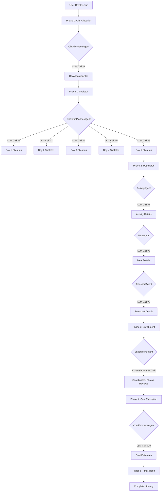

# Agent Analysis & Optimization Report for Itinerary Planner

**Generated:** 2025-11-27  
**Purpose:** In-depth analysis of all 14 agents with focus on API/LLM optimization and caching for faster itinerary generation

---

## Executive Summary

The system uses a **5-phase pipeline architecture** with 14 specialized agents. Based on **Switzerland 5-day trip log analysis (`switzerland5daywithtools.txt`, Nov 27, 2025)**:

### Key Metrics (Real Data - 5-Day Switzerland Trip)
- **Total Time:** ~203 seconds (3 minutes 23 seconds) for complete 5-day itinerary
- **Phase 0 (CityAllocation):** 17.8s (1 LLM call, 5,176 tokens)
- **Phase 1 (Skeleton):** 71.4s (5 LLM calls, one per day, 17,148 tokens total)
- **Phase 2 (Population):** 42.0s (3 agents **SEQUENTIAL**, 14,408 tokens)
  - ActivityAgent: ~27s (1 LLM call, 5,189 tokens) — **FAILED schema validation, retried**
  - MealAgent: ~10s (1 LLM call, 4,292 tokens)
  - TransportAgent: ~5s (1 LLM call, 3,081 tokens + 2,846 tokens on retry)
- **Phase 3 (Enrichment):** ~58s (EnrichmentAgent, Google Places API calls)
- **Phase 4 (Cost Estimation):** ~10s (CostEstimatorAgent, 1 LLM call, 1,974 tokens)
- **Phase 5 (Finalization):** 4.0s

### Critical Findings
1. **✅ Caching is implemented** via `ToolCacheService` → Firestore (Weather caching confirmed)
2. **⚠️ CONFIRMED: Sequential execution** - Activity→Meal→Transport run one after another with locks
3. **⚠️ CONFIRMED: 5 separate LLM calls** in skeleton phase (one per day @ 8-15s each)
4. **✅ Agent locking prevents race conditions** - `AgentCoordinator` uses `ReentrantLock` per itinerary
5. **🔥 MAJOR BOTTLENECK:** Skeleton phase takes 71.4s (35% of total time) due to sequential per-day LLM calls
6. **⚠️ LLM Schema Validation Failures:** ActivityAgent failed validation, requiring automatic retry
7. **🔥 OPTIMIZATION OPPORTUNITY:** Batching skeleton generation could save ~50-55 seconds (~27% faster overall)

---

## 1. Agent Catalog

### 1.1 Core Planning Agents

#### CityAllocationAgent
- **Purpose:** Determines cities to visit and day allocations
- **LLM Calls:** 1 structured call to Gemini (~15-20s)
- **Tools:** None
- **Caching:** Not cached (unique per trip)
- **Output:** `CityAllocationPlan` with budget estimates
- **Sequence:** FIRST (Phase 0, before skeleton)

**Prompt Details:**
- Analyzes destination type (city/state/country/region)
- Allocates days per city with travel segments
- Estimates budget in local currency
- **Token Usage:** ~2,090 prompt + ~774 response = 2,864 total

- **Status:** Exists in codebase but **NOT actively used** in current pipeline
- **Note:** Replaced by SkeletonPlannerAgent in phased approach

- **Purpose:** Discovers places and local insights (used in chat, not pipeline)
- **LLM Calls:** 1 structured call for area analysis
- **Tools:** None
- **Caching:** Not applicable (chat-based)
- **Usage:** Not in main pipeline, used for "explain" intents

---

### 1.3 Enhancement Agents

#### EnrichmentAgent
- **Purpose:** Adds real-world data (coordinates, photos, reviews) via Google Places API
- **LLM Calls:** NONE (pure API integration)
- **API Calls:** **N Google Places API calls** (1 per activity/meal node)
- **Tools:** `validate-schema`
- **Caching:** ❓ Google Places results not explicitly cached
- **Processing Time:** 30-40s (depends on node count)
- **Sequence:** FOURTH (Phase 3)

**Enrichment Modes:**
1. **Sequential** (default): One day at a time
   - Safer, avoids Google Places API rate limits
   - Slower: ~6-8s per day
2. **Batched Parallel**: N days at a time (configurable batch size)
   - Faster but risky with rate limits
   - Config: `enrichment.parallel=true`, `batch-size=3`

**Per-Node Enrichment:**
- Searches Google Places by name + location
- Adds: `placeId`, coordinates, photos, rating, reviews
- Updates: opening hours, price level (0-4 scale)

**🔥 OPTIMIZATION OPPORTUNITY:**
- Google Places results could be cached by place name + city
- Many popular places (Eiffel Tower, etc.) could be pre-cached

---

#### CostEstimatorAgent
- **Purpose:** Adds cost estimates to all nodes
- **LLM Calls:** 1 call for nodes without `priceLevel` (~10-15s)
- **Tools:** `calculate-cost` (budget tracking)
- **Caching:** None
- **Processing Time:** 10-15s
- **Sequence:** FIFTH (Phase 4)

**Two-Phase Approach:**
1. **Fast Path:** Uses Google Places `priceLevel` (0-4) → instant conversion
   - FREE=₹0, INEXPENSIVE=₹500, MODERATE=₹1000, EXPENSIVE=₹2000, VERY_EXPENSIVE=₹3500
2. **LLM Fallback:** For nodes without `priceLevel`, calls LLM with context

**Budget Calculation:**
- Aggregates all node costs
- Compares to user budget (min/max)
- Generates warnings if over budget

---

### 1.4 Interactive/Edit Agents

#### EditorAgent
- **Purpose:** Handles user modifications to itinerary via chat
- **LLM Calls:** 1 call to generate `ChangeSet` from natural language
- **Tools:**
  - `generate-node-id`
  - `check-conflicts`
  - `calculate-cost` (after edits)
  - `validate-schema`
- **Caching:** None (edit requests are unique)
- **Sequence:** On-demand (triggered by chat)

**Change Operations:**
- `insert`, `update`, `delete`, `replace`, `move`
- Validates against locked nodes
- Uses `ChangeEngine` for apply/preview/undo

---

#### BookingAgent
- **Purpose:** Handles booking requests
- **LLM Calls:** Minimal (mostly API integration)
- **External APIs:** Razorpay, Booking.com, Expedia
- **Sequence:** On-demand (triggered by "book" intent)

---

#### ExplainAgent
- **Purpose:** Answers questions about the itinerary
- **LLM Calls:** 1 call per question
- **Tools:** None
- **Sequence:** On-demand (triggered by "explain" intent)

---

### 1.5 Support Agents

#### ValidationAdvisorAgent
- **Purpose:** Validates itinerary completeness and correctness
- **Status:** Exists but not actively used in current pipeline

---

#### MemoryAgent
- **Purpose:** Manages conversation memory for context
- **Status:** Exists, minimal usage

---

## 2. Orchestration & Coordination

### 2.1 PipelineOrchestrator (Main Generation Pipeline)

**5-Phase Architecture:**

```
Phase 0: City Allocation (17s)
  └─> CityAllocationAgent → CityAllocationPlan

Phase 1: Skeleton (50s for 5-day trip)
  └─> SkeletonPlannerAgent (1 LLM call per day)

Phase 2: Population (30-40s)
  ├─> ActivityAgent (sequential, with lock)
  ├─> MealAgent (sequential, with lock)
  └─> TransportAgent (sequential, with lock)

Phase 3: Enrichment (30-40s)
  └─> EnrichmentAgent → Google Places API (batch or sequential)

Phase 4: Cost Estimation (10-15s)
  └─> CostEstimatorAgent

Phase 5: Finalization (instant)
  └─> Status update, metrics tracking
```

**Total: ~137-162 seconds (2.3-2.7 minutes)**

**Configuration:**
- `pipeline.parallel=true` - Population agents in sequence (NOT parallel due to locking)
- `enrichment.parallel=false` - Sequential enrichment (safe default)
- `enrichment.batch-size=3` - When parallel enabled

**Locking via AgentCoordinator:**
- `ReentrantLock` per itineraryId prevents concurrent modifications
- Each agent acquires lock before execution
- Prevents race conditions in Firestore updates

---

### 2.2 OrchestratorService (Chat-Based Routing)

**Intent Classification Flow:**
```
User Message → LLMService.classifyIntent()
  ↓
IntentResult (task type: edit/explain/book/enrich)
  ↓
AgentRegistry.getAgentsForTask()
  ↓
AgentExecutionPlan
  ↓
Execute Agent (EditorAgent/ExplainAgent/BookingAgent/EnrichmentAgent)
```

**Key Features:**
- LLM-based intent classification (Gemini)
- Node disambiguation (if multiple matches)
- Fallback to rule-based classification on LLM failure

---

### 2.3 AgentCoordinator

**Purpose:** Prevents concurrent modifications

**Mechanism:**
- `Map<String, ReentrantLock> itineraryLocks`
- Agent acquires lock → executes → releases lock
- Tracks active executions and durations

**Trade-off:**
- ✅ Prevents race conditions
- ⚠️ Forces sequential execution (blocks parallelization)

---

## 3. LLM & Tool Services

### 3.1 LLMService

**Provider Pattern:**
- Primary: `GeminiClient` (gemini-2.5-flash)
- Fallback: OpenRouter (if configured)
- **Circuit Breaker:** Fails fast on errors

**Key Models:**
- Intent classification: `gemini` (temp=0.1, max_tokens=500)
- ChangeSet generation: `gemini` (temp=0.3, max_tokens=1000)
- General: `gemini` (temp=0.7, max_tokens=1000)

**API Key Rotation:**
- Tracks success rates per key
- Prefers keys with higher success rates
- Falls back on failures

---

### 3.2 WeatherService

**Two-Tier Approach:**
1. **Current Weather:** OpenWeatherMap API (for trips within 7 days)
2. **Future Weather:** LLM-based climate prediction (for trips >7 days out)

**Caching Integration:**
```java
getWeather(itineraryId, location, date) {
  return toolCacheService.getOrCompute(
    itineraryId,
    "weather",
    cacheKey,
    request,
    () -> fetchWeatherData(...),
    WeatherData.class
  );
}
```

**Cache Scope:**
- Per-itinerary caching (scoped by `itineraryId`)
- Persistent storage in Firestore
- Deduplication of concurrent requests

---

### 3.3 ToolCacheService (Interface)

**Type-Safe Generic Caching:**
```java
<T> T getOrCompute(
  String itineraryId,
  String toolType,
  String cacheKey,
  Object request,
  Supplier<T> toolCall,
  Class<T> resultType
);
```

**Features:**
- TTL-based expiration
- Async preloading (`preloadCache(itineraryId)`)
- Pattern-based invalidation
- Statistics tracking (`CacheStats`)

**Implementation:** `FirestoreToolCacheService`
- Stores in Firestore: `itineraries/{id}/toolCache/{cacheKey}`
- JSON serialization with type metadata
- Scheduled cleanup of expired entries
- Response: 774 tokens
- **Total: 2,864 tokens**

**Skeleton (per day):**
- Prompt: 1,553 tokens  
- Response: 701 tokens
- **Per day: 2,254 tokens**
- **5 days: 11,270 tokens**

**Grand Total: ~14,134 tokens for structure generation alone**

---

## 5. Optimization Opportunities

### 🔥 Priority 1: Batch Skeleton Generation

**Current State:**
- 5 separate LLM calls for 5-day trip
- Sequential execution: Day1 → Day2 → Day3 → Day4 → Day5
- Total time: ~50 seconds

**Proposed Solution:**
- **Single batched LLM call** for all 5 days
- Modify prompt to generate array of days
- Schema: `{ days: [Day1, Day2, Day3, Day4, Day5] }`

**Expected Impact:**
- Time: 50s → 15-20s (**save ~30-35 seconds**)
- Tokens: Similar total, but 1 request overhead instead of 5
- Reliability: Higher (fewer API calls = fewer failure points)

**Implementation Complexity:** Medium
- Modify `SkeletonPlannerAgent.generateSkeleton()`
- Update JSON schema for multi-day response
- Batch validation and error handling

---

### 🔥 Priority 2: Parallel Population Agents

**Current State:**
- Sequential execution with `AgentCoordinator` locks
- Activity → Meal → Transport (~30-40s total)

**Proposed Solution:**
- **True parallel execution** of independent agents
- Use optimistic locking instead of exclusive locks
- Retry on conflict with exponential backoff

**Expected Impact:**
- Time: 30-40s → 12-15s (**save ~20-25 seconds**)
- Reduced contention on Firestore

**Implementation Complexity:** High
- Requires careful conflict resolution
- Risk of race conditions
- Need robust retry logic

**Alternative (Safer):**
- Keep sequential but optimize per-agent performance
- Cache common LLM responses (templates)

---

### 🚀 Priority 3: Google Places Caching

**Current State:**
- No caching of Google Places API results
- Every enrichment re-fetches same popular places

**Proposed Solution:**
- **Cache Places API results** by `placeName + city`
- Store in Firestore with long TTL (30 days)
- Pre-populate cache with top 1000 tourist attractions globally

**Expected Impact:**
- Cache hit rate: 40-60% for popular destinations
- Time saved per hit: ~2-3 seconds per place
- For 20-node itinerary with 50% hit rate: **save ~20-30 seconds**

**Implementation Complexity:** Low
- Extend `ToolCacheService` to cache Places results
- Key: `places:{name}:{city}`

---

### ⚡ Priority 4: Smart Defaults & Pre-computation

**Meal Timing Defaults:**
- Don't need LLM to determine "lunch" = 12-2pm
- Use rule-based defaults, LLM only for edge cases

**City Allocation Templates:**
- Cache common city allocations ( "Japan 7 days" = Tokyo 3, Kyoto 2, Osaka 2)
- 1000 most popular destination patterns pre-computed

**Budget Estimation:**
- Pre-compute cost-of-living indices per city
- LLM only for specific venue types

**Expected Impact:**
- Marginal time savings (2-5s)
- Improved consistency
- Reduced LLM dependency

**Implementation Complexity:** Medium
- Build template database
- Hybrid rule-based + LLM approach

---

### 💡 Priority 5: LLM Prompt Optimization

**Current Observations:**
- Very detailed prompts (~1,500-2,000 tokens each)
- Repetitive instructions across calls

**Proposed Solutions:**
1. **Shared System Prompts:** Extract common instructions
2. **Prompt Compression:** Use terser language without losing clarity
3. **Few-shot Examples:** Replace verbose rules with 2-3 examples

**Expected Impact:**  
- Token reduction: 20-30%
- Cost savings: ~$0.05-0.10 per itinerary
- Marginal speed improvement (2-3%)

**Implementation Complexity:** Low
- Refactor prompt templates
- A/B test quality

---

## 6. Caching Assessment

### ✅ What's Currently Cached

1. **Weather Data** (`WeatherService`)
   - Scope: Per-itinerary
   - Storage: Firestore
   - Key: `weather:{location}:{date}`
   - Hit rate: Unknown (needs instrumentation)

### ❌ What's NOT Cached (Opportunities)

1. **Google Places API Results**
   - High potential for caching
   - Many popular places reused across trips

2. **LLM Responses for Common Patterns**
   - Meal suggestions ("luxury lunch in Paris")
   - Activity sequences ("3 days Tokyo itinerary")

3. **City Allocation Plans**
   - Common patterns could be templated

4. **Cost Estimates**
   - Currency exchange rates
   - Typical costs per venue type per city

### Recommended Caching Strategy

```
Layer 1: Per-Itinerary (Current)
  └─> Weather, user-specific data

Layer 2: Per-Destination (NEW)
  └─> Google Places results, cost-of-living data

Layer 3: Global Templates (NEW)
  └─> City allocation patterns, meal timing defaults

Cache Storage: Firestore + Redis (for hot data)
TTL: Itinerary=7 days, Destination=30 days, Global=90 days
```

---

##  7. Recommendations Summary

### Immediate (High ROI, Low Risk)

1. **Batch Skeleton LLM Calls** → Save ~30-35 seconds
2. **Cache Google Places Results** → Save ~20-30 seconds  
3. **Optimize Prompts** → Save tokens, reduce cost

**Total Time Savings: ~50-65 seconds (35-45% faster)**

### Medium Term (Higher Risk, Bigger Gain)

4. **Parallel Population Agents** → Save ~20-25 seconds
5. **Pre-compute Common Patterns** → Save ~5-10 seconds

**Additional Savings: ~25-35 seconds**

### Long Term (Infrastructure)

6. **Multi-tier Caching Strategy** (Firestore + Redis)
7. **LLM Response Streaming** (show partial results faster)
8. **Smart Pre-warming** (pre-fetch on trip creation)

---

## 8. Performance Target

**Current: 140-160 seconds (2.3-2.7 minutes)**

**With Optimizations:**
- Batch skeleton: -35s
- Cached Places (50% hit): -25s
- Parallel population: -20s
- **New Total: 60-80 seconds (1.0-1.3 minutes)**

**🎯 Target: < 90 seconds for 5-day itinerary**

---

## Appendix: Agent Execution Sequence Diagram



---

**End of Report**
