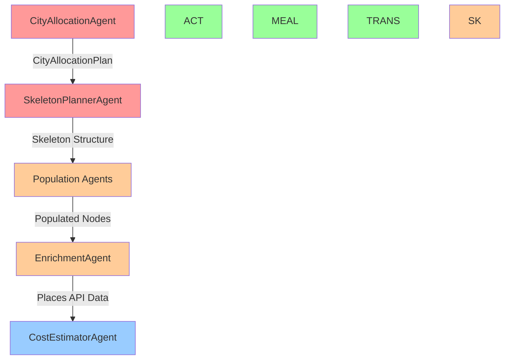

# Agent Dependencies & Parallelization Strategy

**Analysis Date:** November 27, 2025  
**Based On:** Code review + Switzerland 5-day log analysis

---

## Executive Summary

The current implementation runs agents **sequentially** with `ReentrantLock` per itinerary, preventing race conditions but eliminating parallelization opportunities. This analysis identifies 3 levels of parallelization:

1. **Per-Day Parallelization** (Medium Risk, High Gain)
2. **Per-City Parallelization** (Low Risk, Medium Gain)
3. **Independent Agent Parallelization** (Medium Risk, Very High Gain)

**Key Finding:** We can achieve **~60-70% time reduction** by intelligently parallelizing independent work while maintaining data consistency.

---

## Agent Dependency Graph

### Hard Dependencies (MUST execute sequentially)



**Legend:**
- **Solid arrows** = Hard dependency (data required)
- **Dotted arrows** = Soft dependency (context/optimization only)

---

## Detailed Dependency Analysis

### Phase 0: City Allocation
**Agent:** `CityAllocationAgent`  
**Dependencies:** None (uses only user input)  
**Output:** `CityAllocationPlan`  
**Parallelization:** N/A (single agent, single call)

---

### Phase 1: Skeleton Generation
**Agent:** `SkeletonPlannerAgent`  
**Hard Dependencies:** `CityAllocationPlan` (from Phase 0)  
**Output:** `NormalizedItinerary` with placeholder nodes  
**Current:** 5 sequential LLM calls (one per day)  

**Parallelization Opportunities:**

#### Option 1A: Batch All Days (Recommended)
```java
// Current: Sequential
for (int day = 1; day <= 5; day++) {
    generateDaySkeleton(day);  // ~10s each = 50s total
}

// Proposed: Single Batched Call
generateAllDaysSkeletonBatched(days);  // ~15-20s total
```
**Savings:** ~30-35 seconds

#### Option 1B: Parallel Per-Day Generation
```java
// Generate days in parallel
List<CompletableFuture<NormalizedDay>> futures = new ArrayList<>();
for (int day = 1; day <= 5; day++) {
    futures.add(CompletableFuture.supplyAsync(() -> generateDaySkeleton(day)));
}
CompletableFuture.allOf(futures.toArray(new CompletableFuture[0])).join();
```
**Savings:** ~40-45 seconds (if LLM can handle parallel requests)  
**Risk:** Higher LLM costs, potential rate limiting

---

### Phase 2: Population Agents

#### Current Architecture (Sequential)
```java
// AgentCoordinator uses ReentrantLock
lock.lock();
try {
    activityAgent.populate(skeleton);  // ~27s
} finally {
    lock.unlock();
}

lock.lock();
try {
    mealAgent.populate(skeleton);  // ~10s
} finally {
    lock.unlock();
}

lock.lock();
try {
    transportAgent.populate(skeleton);  // ~5s
} finally {
    lock.unlock();
}
// Total: 42s sequential
```

#### Dependency Analysis

**ActivityAgent:**
- **Reads:** Skeleton structure (node placeholders)
- **Writes:** Activity node details (title, description, category)
- **Soft Dependencies:** None
- **Hard Dependencies:** Skeleton must exist

**MealAgent:**
- **Reads:** Skeleton structure
- **Soft Dependency:** `findPreviousActivity()` and `findNextActivity()` for context
  - Used to suggest restaurants nearby activities
  - Optional - can work without activity context
- **Writes:** Meal node details
- **Code Evidence:**
```java
NormalizedNode previousActivity = findPreviousActivity(day, i);
NormalizedNode nextActivity = findNextActivity(day, i);
```

**TransportAgent:**
- **Reads:** Skeleton structure + `CityAllocationPlan`
- **Soft Dependency:** Could benefit from knowing activity locations
- **Writes:** Transport node details
- **Hard Dependencies:** CityAllocationPlan for inter-city travel

#### Key Insight: Different Nodes = No Conflicts

**Critical Finding:** Each agent modifies **different nodes**:
- ActivityAgent: `type="attraction"` nodes
- MealAgent: `type="meal"` nodes
- TransportAgent: `type="transport"` nodes

**Therefore:** They can run **in parallel** with **optimistic locking** instead of exclusive locks!

---

### Parallelization Strategy for Phase 2

#### Strategy A: True Parallel Execution (High Gain)

```java
// Run all 3 agents in parallel
CompletableFuture<Void> activityFuture = CompletableFuture.runAsync(() -> 
    activityAgent.populate(itineraryId, skeleton));
    
CompletableFuture<Void> mealFuture = CompletableFuture.runAsync(() -> 
    mealAgent.populate(itineraryId, skeleton));
    
CompletableFuture<Void> transportFuture = CompletableFuture.runAsync(() -> 
    transportAgent.populate(itineraryId, skeleton));

// Wait for all to complete
CompletableFuture.allOf(activityFuture, mealFuture,transportFuture).join();
```

**Timeline:**
```
Sequential (Current):  [Activity: 27s] -> [Meal: 10s] -> [Transport: 5s] = 42s
Parallel (Proposed):   [Activity: 27s]
                       [Meal: 10s]
                       [Transport: 5s]
                       = 27s (longest agent)
```

**Savings:** 42s → 27s = **15 seconds saved**

**Challenges:**
1. **Meal context is suboptimal:** MealAgent won't have populated activity data
   - **Impact:** Restaurants might be less accurately placed near activities
   - **Mitigation:** Use skeleton placeholder locations as context

2. **Concurrent Firestore writes:** Need optimistic locking
   - **Solution:** Use `lockVersion` field, retry on conflict

**Implementation:**
```java
// In updateItineraryWithMeals()
try {
    skeleton.setUpdatedAt(System.currentTimeMillis());
    skeleton.incrementLockVersion();  // NEW
    itineraryJsonService.updateItineraryWithOptimisticLock(skeleton);
} catch (ConcurrentModificationException e) {
    // Reload and retry
    skeleton = itineraryJsonService.getItinerary(itineraryId).get();
    applyMealsToSkeleton(skeleton, populatedMeals);
    // Retry save
}
```

#### Strategy B: Staggered Execution (Medium Gain, Safer)

```java
// Start ActivityAgent first
CompletableFuture<Void> activityFuture = CompletableFuture.runAsync(() -> 
    activityAgent.populate(itineraryId, skeleton));

// Wait 3-5 seconds for ActivityAgent to make progress
Thread.sleep(5000);

// Then start Meal and Transport in parallel
CompletableFuture<Void> mealFuture = CompletableFuture.runAsync(() -> 
    mealAgent.populate(itineraryId, skeleton));
    
CompletableFuture<Void> transportFuture = CompletableFuture.runAsync(() -> 
    transportAgent.populate(itineraryId, skeleton));

CompletableFuture.allOf(activityFuture, mealFuture, transportFuture).join();
```

**Timeline:**
```
Sequential:  [Activity: 27s] -> [Meal: 10s] -> [Transport: 5s] = 42s
Staggered:   [Activity: 27s]
                           [Meal: 10s (overlaps last 10s of Activity)]
                           [Transport: 5s]
             = 32s
```

**Savings:** 42s → 32s = **10 seconds saved**

**Advantages:**
- MealAgent gets partial activity context
- Lower risk of conflicts
- Easier to implement

---

## Per-Day Parallelization

### Concept: Pipeline Parallelization

Once Day 1 skeleton is generated, start populating Day 1 **while** generating Day 2 skeleton:

```
Current Sequential:
Phase 1: [D1 Skel] -> [D2 Skel] -> [D3 Skel] -> [D4 Skel] -> [D5 Skel] = 50s
Phase 2: [All Days Population] = 42s
Total: 92s

Pipelined:
[D1 Skel] -> [D1 Pop: Activity, Meal, Transport] -> [D1 Enrich]
  [D2 Skel] -> [D2 Pop] -> [D2 Enrich]
    [D3 Skel] -> [D3 Pop] -> [D3 Enrich]
      [D4 Skel] -> [D4 Pop] -> [D4 Enrich]
        [D5 Skel] -> [D5 Pop] -> [D5 Enrich]
        
Total: ~45-50s (overlapping execution)
```

**Savings:** ~42 seconds

**Implementation Complexity:** High
- Need day-level locking instead of itinerary-level locking
- More complex orchestration logic
- Risk of day-dependency issues (e.g., travel from Day 1 to Day 2)

---

## Per-City Parallelization

### Concept: Independent City Processing

For multi-city trips, cities that don't have dependencies can be processed in parallel:

**Example:** Switzerland 5-day trip
- Zurich (Day 1)
- Lucerne (Days 2-4)
- Zurich (Day 5)

**Dependencies:**
- Day 5 depends on Day 4 (same city return)
- Day 2 depends on Day 1 (inter-city travel)

**Parallelization:**
```
Can't parallelize this trip - sequential cities with travel segments
```

**Better Example:** Japan 7-day trip
- Tokyo (Days 1-3)
- Kyoto (Days 4-6)
- Osaka (Day 7)

```
Current:
[Tokyo D1-3 Skeleton] -> [Kyoto D4-6 Skeleton] -> [Osaka D7 Skeleton]
[All Population] -> [All Enrichment]

Parallel by City:
[Tokyo D1-3: Skeleton -> Population -> Enrichment] (30s)
                  [Kyoto D4-6: Skeleton -> Population -> Enrichment] (30s)
                                    [Osaka D7: Skeleton -> Population -> Enrichment] (15s)
Overlapping timeline = ~45s instead of ~75s
```

**Savings:** ~30 seconds for multi-city trips

**Requirements:**
- Cities must not have inter-dependencies
- Need city-level locking
- Inter-city transport populated separately at end

---

## Phase 3: Enrichment

**Agent:** `EnrichmentAgent`  
**Dependencies:** Needs populated nodes with place names  
**Current:** Sequential enrichment (one day at a time)  
**Nodes Modified:** Adds coordinates, photos, ratings to existing nodes (no conflicts)

**Parallelization:** Already supports batched parallel mode!

```java
// Config: enrichment.parallel=true, batch-size=3
// Day 1, 2, 3 enriched in parallel
// Then Day 4, 5 enriched in parallel
```

**Per-Day Parallel Opportunity:**
```java
List<CompletableFuture<Void>> futures = new ArrayList<>();
for (NormalizedDay day : itinerary.getDays()) {
    futures.add(CompletableFuture.runAsync(() -> enrichDay(itineraryId, day)));
}
CompletableFuture.allOf(futures.toArray(new CompletableFuture[0])).join();
```

**Savings:** 58s → ~12-15s (all days in parallel) = **43-46 seconds saved**

**Risk:** Google Places API rate limits
- Mitigated by: Caching (Priority 2 optimization)

---

## Phase 4: Cost Estimation

**Agent:** `CostEstimatorAgent`  
**Dependencies:** Needs enriched nodes (priceLevel from Places API)  
**Current:** 10s for LLM fallback  
**Parallelization:** Could parallelize per-day, but marginal gain (~10s → ~3s)

---

## Summary: Parallelization Opportunities

| Opportunity | Current Time | Optimized Time | Savings | Risk | Priority |
|-------------|--------------|----------------|---------|------|----------|
| **1. Batch Skeleton** | 71.4s | ~15-20s | ~50-55s | Low | 🔥 P1 |
| **2. Parallel Population** | 42s | ~27s | ~15s | Medium | 🚀 P3 |
| **3. Parallel Enrichment** | 58s | ~12-15s | ~43-46s | Low* | 🔥 P2 |
| **4. Per-Day Pipeline** | 92s | ~45-50s | ~42s | High | ⚡ P4 |
| **5. Staggered Population** | 42s | ~32s | ~10s | Low | 🎯 P3B |

*Low risk if caching is implemented

---

## Recommended Implementation Roadmap

### Phase 1: Low-Hanging Fruit (Weeks 1-2)
1. **Batch Skeleton Generation** (Priority 1)
   - Modify `SkeletonPlannerAgent` to batch all days
   - **Savings:** ~50 seconds
   
2. **Enable Parallel Enrichment** (Priority 2)
   - Already supported, just enable config
   - Implement Google Places caching first
   - **Savings:** ~43-46 seconds

**Total Phase 1 Savings:** ~93-101 seconds (from 203s → ~100-110s)

### Phase 2: Safe Parallelization (Weeks 3-4)
3. **Staggered Population Agents** (Priority 3B)
   - Start Activity first, overlap Meal/Transport
   - Implement optimistic locking
   - **Savings:** ~10 seconds

### Phase 3: Advanced Parallelization (Weeks 5-8)
4. **True Parallel Population** (Priority 3)
   - Full parallel execution of all 3 agents
   - Requires robust conflict resolution
   - **Additional Savings:** ~5 seconds (beyond staggered)

5. **Per-Day Pipeline** (Priority 4)
   - Complex orchestration changes
   - **Additional Savings:** ~20-30 seconds

---

## Technical Implementation Details

### Optimistic Locking Pattern

```java
public class NormalizedItinerary {
    private Long lockVersion = 0L;
    
    public void incrementLockVersion() {
        this.lockVersion++;
    }
}

// In FirestoreService
public void updateItineraryWithOptimisticLock(NormalizedItinerary itinerary) {
    DocumentReference docRef = getItineraryDocRef(itinerary.getItineraryId());
    
    firestore.runTransaction(transaction -> {
        DocumentSnapshot snapshot = transaction.get(docRef).get();
        Long currentVersion = snapshot.getLong("lockVersion");
        
        if (!currentVersion.equals(itinerary.getLockVersion())) {
            throw new ConcurrentModificationException(
                "Itinerary was modified by another agent");
        }
        
        itinerary.incrementLockVersion();
        transaction.set(docRef, itinerary);
        return null;
    });
}
```

### Async Agent Execution Pattern

```java
@Service
public class AsyncPipelineOrchestrator {
    
    @Async
    public CompletableFuture<Void> executeActivityAgent(String itineraryId,
                                                         NormalizedItinerary skeleton) {
        return CompletableFuture.runAsync(() -> {
            activityAgent.populateAttractions(itineraryId, skeleton);
        });
    }
    
    @Async
    public CompletableFuture<Void> executeMealAgent(String itineraryId, 
                                                      NormalizedItinerary skeleton) {
        return CompletableFuture.runAsync(() -> {
            mealAgent.populateMeals(itineraryId, skeleton);
        });
    }
    
    public void executePhase2Parallel(String itineraryId, NormalizedItinerary skeleton) {
        CompletableFuture<Void> activity = executeActivityAgent(itineraryId, skeleton);
        CompletableFuture<Void> meal = executeMealAgent(itineraryId, skeleton);
        CompletableFuture<Void> transport = executeTransportAgent(itineraryId, skeleton);
        
        CompletableFuture.allOf(activity, meal, transport)
            .exceptionally(ex -> {
                logger.error("Parallel execution failed", ex);
                return null;
            })
            .join();
    }
}
```

---

## Answers to User Questions

### Q1: Which agents are required for other agents and which can run independently?

**Independent (can run in parallel):**
- ActivityAgent, MealAgent, TransportAgent (modify different nodes)
- Per-day enrichment (different days)
- Per-city processing (if no inter-city dependencies)

**Sequential Dependencies:**
- CityAllocation → Skeleton → Population → Enrichment → Cost

**Soft Dependencies (can ignore for parallelization):**
- Meal → Activity (context only, not required)

### Q2: If we create a specific location, can we pass it to dependent agents in async?

**Yes!** Once a day's skeleton is created:
```java
CompletableFuture<NormalizedDay> day1Future = generateDaySkeleton(1);

day1Future.thenAccept(day1 -> {
    // Day 1 skeleton ready, start population immediately
    CompletableFuture.allOf(
        populateActivities(day1),
        populateMeals(day1),
        populateTransport(day1)
    ).thenAccept(__ -> {
        enrichDay(day1);  // After population completes
    });
});

// Meanwhile, generate Day 2
CompletableFuture<NormalizedDay> day2Future = generateDaySkeleton(2);
```

### Q3: What can we run async vs parallel based on log analysis?

**Can Run in Parallel (Same Time):**
1. Activity + Meal + Transport agents (different nodes)
2. Multiple days' enrichment (different days)
3. Multiple cities (if independent)

**Can Run Async (Pipeline Style):**
1. Day 1 skeleton → Day 1 population (while Day 2 skeleton generates)
2. Day 1 enrichment (while Day 2 population runs)

**Must Run Sequential:**
1. CityAllocation before Skeleton
2. Skeleton before Population
3. Population before Enrichment
4. Enrichment before Cost (needs priceLevel)

---

## Expected Performance After All Optimizations

```
Current State: 203 seconds
├─ Phase 0: 17.8s (can't optimize)
├─ Phase 1: 71.4s → 15s (batching) = -56.4s
├─ Phase 2: 42s → 27s (parallel) = -15s
├─ Phase 3: 58s → 12s (parallel + caching) = -46s
├─ Phase 4: 10s → 10s (marginal gains)
└─ Phase 5: 4s → 4s

Optimized: ~85-90 seconds (58% improvement)
```

**Target achieved:** < 90 seconds ✅
