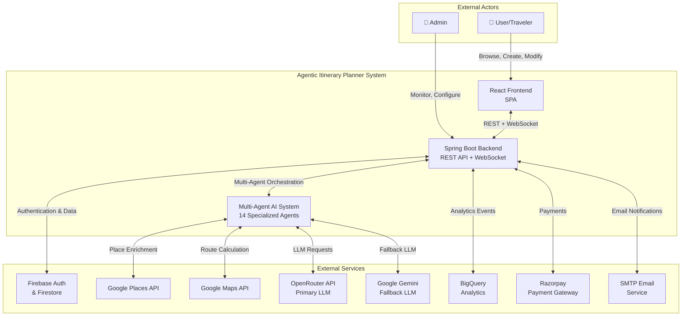
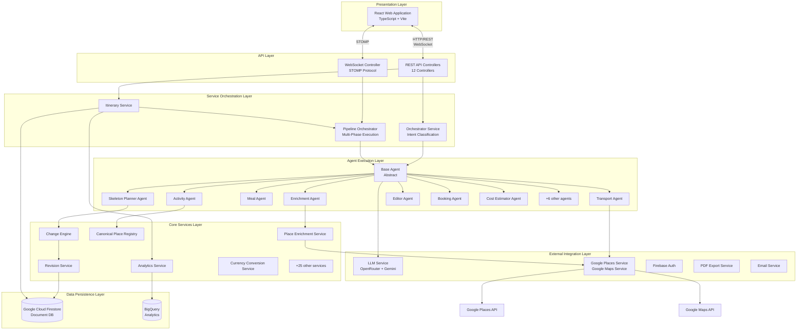
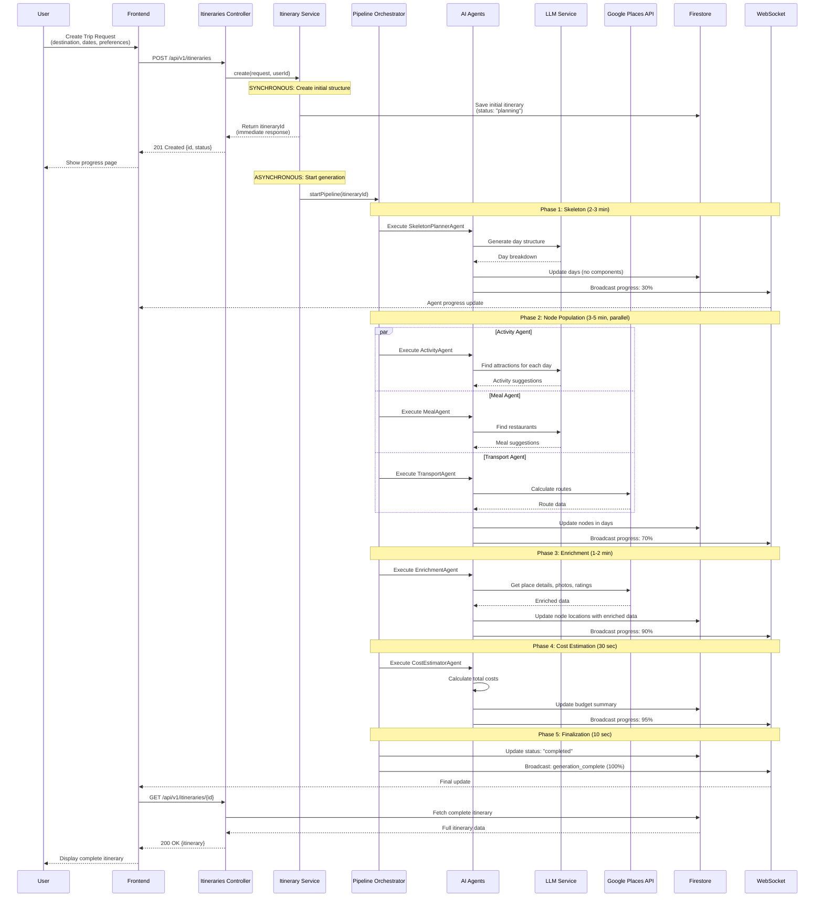
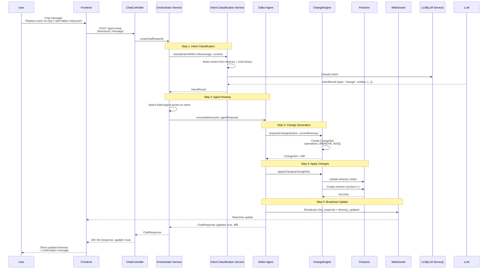
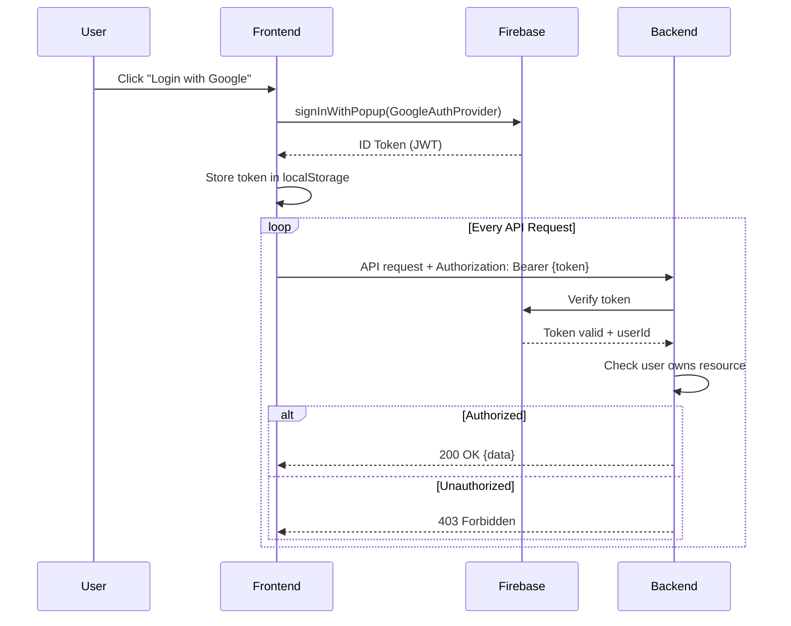

# HLD-01: System Overview & Architecture
## Agentic Itinerary Planner

**Document Version**: 1.0.0  
**Last Updated**: November 25, 2025  
**Status**: Complete  
**Authors**: Development Team  
**Reviewers**: System Architect, Tech Leads

---

## Document Information

### Purpose
This document provides a comprehensive high-level overview of the Agentic Itinerary Planner system architecture. It serves as the entry point for understanding the system's design, components, and architectural decisions.

### Target Audience
- System Architects
- Technical Leads
- New Team Members
- Project Stakeholders
- External Auditors
- Integration Partners

### Scope
This document covers:
- System context and business objectives
- High-level architecture and component interaction
- Technology stack and framework choices
- Key architectural decisions and rationale
- System capabilities and quality attributes
- Cross-cutting concerns

### Related Documents
- [HLD-02: Backend Architecture & Services](02-backend-architecture-services.md) - Detailed backend design
- [HLD-03: Frontend Architecture & State Management](03-frontend-architecture-state.md) - React frontend architecture
- [HLD-04: Multi-Agent System Design](04-multi-agent-system-design.md) - AI agent orchestration
- [HLD-05: Data Architecture & Analytics](05-data-architecture-analytics.md) - Data models and analytics
- [HLD-06: Infrastructure & Integrations](06-infrastructure-integrations.md) - Deployment and integrations

---

## Table of Contents

1. [Introduction](#1-introduction)
2. [System Context](#2-system-context)
3. [Architecture Overview](#3-architecture-overview)
4. [Key Architectural Decisions](#4-key-architectural-decisions)
5. [System Capabilities](#5-system-capabilities)
6. [Quality Attributes](#6-quality-attributes)
7. [System Constraints](#7-system-constraints)
8. [Cross-Cutting Concerns](#8-cross-cutting-concerns)
9. [Technology Stack](#9-technology-stack)
10. [Appendices](#10-appendices)

---

## 1. Introduction

### 1.1 System Purpose

The **Agentic Itinerary Planner** is an AI-powered travel planning platform that creates personalized, detailed travel itineraries through a sophisticated multi-agent system. Unlike traditional travel planning tools, this system employs specialized AI agents that collaborate to generate comprehensive itineraries with real-time updates, enriched place data, and intelligent recommendations.

### 1.2 Business Context

**Problem Statement**:
- Manual itinerary creation is time-consuming and requires extensive research
- Generic travel recommendations don't account for individual preferences
- Coordinating activities, meals, transportation, and accommodations is complex
- Real-time updates and modifications are difficult with static itineraries

**Solution**:
- AI-powered itinerary generation in 6-8 minutes
- Multi-agent system with specialized capabilities (planner, enrichment, booking, etc.)
- Real-time updates via WebSocket communication
- Dynamic itinerary modification through natural language chat
- Comprehensive enrichment with Google Places API integration
- Budget tracking and currency normalization (USD storage, multi-currency display)

### 1.3 Key Stakeholders

| Stakeholder | Role | Interest |
|-------------|------|----------|
| **Travelers** | End Users | Personalized itineraries, easy planning |
| **Travel Agents** | Professional Users | Tool for client itinerary creation |
| **Tourism Boards** | Partners | Destination promotion |
| **Development Team** | Builders | Maintainable, scalable architecture |
| **Business Owners** | Decision Makers | ROI, user satisfaction, operational costs |

---

## 2. System Context

### 2.1 Context Diagram



### 2.2 System Boundaries

**In Scope**:
- AI-powered itinerary generation and modification
- Multi-agent orchestration and coordination
- Real-time progress updates via WebSocket
- Place enrichment with Google Places API
- Chat-based itinerary editing
- Budget calculation and currency conversion
- Analytics tracking and BigQuery integration
- PDF export and email sharing
- User authentication and authorization

**Out of Scope**:
- Actual flight/hotel booking (handled by external partners)
- Payment processing infrastructure (delegated to Razorpay)
- Map rendering (uses Google Maps)
- Weather forecasting (uses external weather API)

### 2.3 Integration Points

| Integration | Direction | Protocol | Purpose |
|-------------|-----------|----------|---------|
| Firebase Auth | Bidirectional | HTTPS/REST | User authentication |
| Firestore | Bidirectional | gRPC | Primary data store |
| Google Places API | Outbound | HTTPS/REST | Place data enrichment |
| Google Maps API | Outbound | HTTPS/REST | Route calculation, geocoding |
| OpenRouter | Outbound | HTTPS/REST | Primary LLM for agents |
| Google Gemini | Outbound | HTTPS/REST | Fallback LLM |
| BigQuery | Outbound | HTTPS/REST | Analytics data ingestion |
| Cloud Pub/Sub | Outbound | gRPC | Event streaming |
| Razorpay | Bidirectional | HTTPS/REST + Webhook | Payment processing |
| SMTP | Outbound | SMTP | Email delivery |

---

## 3. Architecture Overview

### 3.1 High-Level Architecture

The system follows a **layered architecture** with clear separation of concerns:



### 3.2 Component Interaction Flow

#### 3.2.1 Itinerary Creation Flow



**Key Characteristics**:
- **Synchronous initial response**: User gets itineraryId within 1-2 seconds
- **Async pipeline execution**: Background generation takes 6-8 minutes total
- **Real-time progress**: WebSocket updates every 10-20% of progress
- **Parallel execution**: ActivityAgent, MealAgent, TransportAgent run concurrently
- **Sequential phases**: Skeleton → Population → Enrichment → Cost → Finalize

#### 3.2.2 Chat-based Modification Flow



**Key Characteristics**:
- **LLM-based intent classification**: Uses context-aware classification
- **Agent routing**: Automatically selects EditorAgent, BookingAgent, etc.
- **Change preview**: Generates diff before applying
- **Revision control**: Every change creates a new version
- **Real-time sync**: WebSocket ensures UI updates immediately

### 3.3 Layered Architecture Details

#### Layer 1: Presentation Layer
- **Technology**: React 18 + TypeScript
- **Responsibilities**: 
  - User interface rendering
  - Form validation
  - State management (React Query, Zustand, Context)
  - Real-time updates (WebSocket listeners)
- **Components**: 111+ React components, 27 custom hooks

#### Layer 2: API Layer
- **Technology**: Spring Boot 3.x REST Controllers + WebSocket
- **Controllers**: 12 controllers
  - `ItinerariesController` - CRUD operations
  - `ChatController` - Chat message handling
  - `WebSocketController` - STOMP messaging
  - `BookingController` - Booking operations
  - `ExportController` - PDF/email export
  - `ToolsController` - Utility tools (packing list, photo spots, etc.)
  - `AnalyticsIngestController` - Analytics events
  - `UserController` - User profile management
  - `HealthController`, `PingController`, `DocumentationController`

#### Layer 3: Service Orchestration Layer
- **ItineraryService**: CRUD operations, status calculation
- **OrchestratorService**: Intent classification, agent routing
- **PipelineOrchestrator**: Multi-phase itinerary generation

#### Layer 4: Agent Execution Layer
- **BaseAgent**: Abstract class with lifecycle management
- **14 Specialized Agents**: Each with specific capabilities
  - Lifecycle: `queued` → `running` → `completed`/`failed`
  - Progress tracking: 0-100%
  - Event broadcasting via `AgentEventBus`

#### Layer 5: Core Services Layer
- **33 Service Classes**: Business logic implementation
- **ChangeEngine**: Proposes and applies itinerary modifications
- **RevisionService**: Version control and rollback
- **PlaceRegistry**: Canonical place deduplication
- **CurrencyConversionService**: Multi-currency support

#### Layer 6: External Integration Layer
- **LLMService**: Resilient LLM client (OpenRouter primary, Gemini fallback)
- **GooglePlacesService**: Place search and details
- **GoogleMapsDistanceService**: Route calculation
- **PdfService**: HTML-to-PDF conversion
- **EmailService**: SMTP email delivery

#### Layer 7: Data Persistence Layer
- **Firestore**: Primary NoSQL document database
- **BigQuery**: Analytics data warehouse

---

## 4. Key Architectural Decisions

### 4.1 Why Multi-Agent Architecture?

**Decision**: Implement itinerary generation using multiple specialized AI agents rather than a single monolithic agent.

**Rationale**:
1. **Separation of Concerns**: Each agent has a focused responsibility (planning, enrichment, booking)
2. **Parallel Execution**: ActivityAgent, MealAgent, and TransportAgent can run concurrently
3. **Specialized Prompts**: Each agent uses domain-specific prompts for better LLM results
4. **Error Isolation**: Failure in one agent doesn't crash entire generation
5. **Incremental Progress**: Users see progress as each agent completes
6. **Extensibility**: Easy to add new agents (e.g., EventsAgent, LocalCultureAgent)

**Trade-offs**:
- **Complexity**: Coordination overhead, event-driven architecture
- **Latency**: Sequential phases add time vs. single LLM call
- **Cost**: Multiple LLM requests vs. one large request

**Alternatives Considered**:
- ❌ **Single Monolithic Agent**: Simpler but less flexible, poor error handling, no parallel execution
- ❌ **Microservices per Agent**: Too much operational overhead for this scale

### 4.2 Why NoSQL (Firestore) over SQL?

**Decision**: Use Google Cloud Firestore as the primary database instead of a relational database.

**Rationale**:
1. **Document Model Fit**: Itineraries are hierarchical (itinerary → days → nodes)
2. **Schema Flexibility**: Agents can add custom metadata without migrations
3. **Real-time Sync**: Native real-time listeners (though we use WebSocket)
4. **Scalability**: Auto-scaling, no capacity planning
5. **GCP Integration**: Seamless with Cloud Run, Cloud Functions
6. **Denormalization**: Itinerary is self-contained, minimal joins needed

**Trade-offs**:
- **No Transactions**: Limited multi-document transactions
- **No Complex Queries**: Can't do JOINs or complex aggregations
- **Cost**: Higher per-operation cost than SQL for analytics queries

**Mitigation**:
- Use BigQuery for analytics queries
- Implement revision control at application level
- Design data model to minimize cross-document operations

### 4.3 Why React Query + Zustand + Context?

**Decision**: Use a multi-layered state management approach rather than a single solution like Redux.

**Rationale**:
1. **React Query**: Server state caching, automatic refetching, optimistic updates
2. **Zustand**: Lightweight global UI state (modals, sidebars, preferences)
3. **Context**: Feature-specific state (UnifiedItineraryContext for active itinerary)
4. **Separation**: Clear boundaries between server data, UI state, and feature state

**Trade-offs**:
- **Learning Curve**: Developers need to understand three state management approaches
- **Consistency**: Need conventions on when to use which tool

**Alternatives Considered**:
- ❌ **Redux**: Too much boilerplate, overkill for this application
- ❌ **Context Only**: Performance issues with frequent updates, no caching

### 4.4 Why OpenRouter with Gemini Fallback?

**Decision**: Use OpenRouter as primary LLM provider with Google Gemini as fallback.

**Rationale**:
1. **OpenRouter Benefits**:
   - Access to multiple models (GPT-4, Claude, Llama)
   - Single API for model switching
   - Cost optimization
   - Rate limit pooling
2. **Gemini Fallback**:
   - Direct Google AI Studio API
   - More reliable for critical operations
   - Better cost for high-volume requests
3. **Resilience**: Automatic failover if OpenRouter is down

**Implementation**:
```java
// LLMService.java (simplified)
public class LLMService {
    public String complete(String prompt) {
        try {
            return openRouterClient.complete(prompt);
        } catch (Exception e) {
            logger.warn("OpenRouter failed, falling back to Gemini", e);
            return geminiClient.complete(prompt);
        }
    }
}
```

### 4.5 Why WebSocket (STOMP) over Server-Sent Events (SSE)?

**Decision**: Use STOMP over WebSocket for real-time communication, with SSE as an option.

**Rationale**:
1. **Bidirectional**: WebSocket allows client-to-server messages (chat, updates)
2. **STOMP Protocol**: Structured pub/sub topics, message routing
3. **Spring Boot Support**: Excellent WebSocket support in Spring
4. **Topic-Based**: `/topic/itinerary/{id}`, `/topic/agent/{id}`, `/topic/chat/{id}`
5. **Fallback**: SockJS provides SSE/polling fallback for older browsers

**Topics**:
- `/topic/itinerary/{id}` - Itinerary updates
- `/topic/agent/{id}` - Agent progress events
- `/topic/chat/{id}` - Chat responses

**Trade-offs**:
- **Connection Management**: Need to handle reconnections, heartbeats
- **Scalability**: Stateful connections (requires sticky sessions in Cloud Run)

### 4.6 Why BigQuery for Analytics?

**Decision**: Use BigQuery for analytics instead of Firestore aggregations.

**Rationale**:
1. **Analytical Queries**: Designed for OLAP workloads
2. **Cost-Effective**: Pay per query, not per document read
3. **SQL**: Familiar query language for data analysts
4. **Scheduled Queries**: Automatic aggregation pipelines
5. **Looker Studio Integration**: Easy dashboard creation

**Analytics Pipeline**:
```
Frontend/Backend Analytics Events
    ↓ (Pub/Sub topic: analytics-events)
Cloud Function (analytics-ingestion)
    ↓ (streaming insert)
BigQuery Raw Events Table
    ↓ (scheduled queries)
Aggregated Tables (daily_metrics, funnel_metrics, etc.)
    ↓
Looker Studio Dashboards
```

**Alternative**:
- ❌ **Firestore Aggregations**: Too expensive, not designed for analytics

### 4.7 Why USD Storage with Multi-Currency Display?

**Decision**: Store all costs in USD internally, display in user's preferred currency.

**Rationale**:
1. **Consistency**: Single source of truth for historical comparison
2. **Analytics**: Easy to aggregate cross-currency transactions
3. **Conversion**: Convert once at display time, not at storage
4. **Historical Accuracy**: Can recalculate with updated exchange rates

**Implementation**:
```java
// CurrencyConversionService.java
public Money convertForDisplay(Money usdAmount, String targetCurrency) {
    double rate = getExchangeRate("USD", targetCurrency);
    return new Money(usdAmount.amount * rate, targetCurrency);
}
```

---

## 5. System Capabilities

### 5.1 Functional Capabilities

#### 5.1.1 AI-Powered Itinerary Generation
- **Input**: Destination, dates, party size, preferences (heritage, adventure, etc.), budget
- **Process**: Multi-phase pipeline with 14 specialized agents
- **Output**: Complete day-by-day itinerary with activities, meals, transport, accommodations
- **Time**: 6-8 minutes for a 5-day trip
- **Phases**:
  1. **Skeleton** (2-3 min): Day structure, timelines
  2. **Population** (3-5 min): Activities, meals, transport (parallel)
  3. **Enrichment** (1-2 min): Google Places data, photos, ratings
  4. **Cost Estimation** (30 sec): Budget breakdown
  5. **Finalization** (10 sec): Status update, notifications

#### 5.1.2 Real-Time Progress Tracking
- **WebSocket Events**: `agent_progress`, `day_completed`, `phase_transition`
- **Progress Granularity**: 10% intervals (0% → 10% → 30% → 70% → 90% → 95% → 100%)
- **Visual Feedback**: Progress bar, current agent, estimated time remaining

#### 5.1.3 Chat-Based Itinerary Modification
- **Natural Language Input**: "Replace dinner on Day 3 with vegan restaurant"
- **Intent Classification**: LLM-based classification (change, explain, book, etc.)
- **Agent Routing**: Automatically selects EditorAgent, BookingAgent, ExplainAgent
- **Change Preview**: Shows diff before applying
- **Apply Changes**: Updates itinerary, creates revision
- **Supported Intents**:
  - **change**: Modify, add, remove, replace components
  - **explain**: Get explanations about itinerary decisions
  - **book**: Initiate booking process
  - **optimize**: Reorder, optimize timing
  - **suggest**: Get alternative suggestions

#### 5.1.4 Place Enrichment
- **Google Places API Integration**:
  - Place search by name and location
  - Place details (address, coordinates, ratings, photos)
  - Review aggregation
  - Opening hours
  - Price level
- **Batch Processing**: `BatchEnrichmentService` for efficient API usage
- **Canonical Registry**: `PlaceRegistry` for place deduplication
- **Matching Logic**: `PlaceMatcher` for fuzzy matching

#### 5.1.5 Revision Control
- **Automatic Versioning**: Every change creates a new version
- **Revision History**: `GET /api/v1/itineraries/{id}/revisions`
- **Rollback**: `POST /api/v1/itineraries/{id}:undo`
- **Diff Viewing**: Compare versions
- **Storage**: Firestore subcollection `revisions/{itineraryId}/{version}`

#### 5.1.6 Export and Sharing
- **PDF Export**: 
  - HTML template rendering
  - OpenHtmlToPdf library
  - Custom styling
  - Endpoint: `GET /api/v1/itineraries/{id}/pdf`
- **Email Sharing**:
  - SMTP integration
  - PDF attachment
  - Custom email templates
  - Endpoint: `POST /api/v1/email/send`
- **Public Sharing**:
  - Generate share code
  - Public view (no auth required)
  - Endpoint: `GET /api/v1/itineraries/{id}/public`

#### 5.1.7 Analytics Tracking
- **Event Types**:
  - `itinerary_created`
  - `itinerary_viewed`
  - `chat_interaction`
  - `booking_initiated`
  - `booking_completed`
  - `trip_exported`
  - `error_events`
- **Session Tracking**: X-Session-ID header propagation
- **Pipeline**: Frontend/Backend → Pub/Sub → Cloud Function → BigQuery
- **Queries**: 28+ scheduled queries for aggregations

#### 5.1.8 Multi-Currency Support
- **Storage**: USD (normalized)
- **Display**: User preference (INR, EUR, GBP, etc.)
- **Conversion**: Real-time exchange rates
- **Service**: `CurrencyConversionService`

### 5.2 Non-Functional Capabilities

#### 5.2.1 Scalability
- **Backend**: Cloud Run auto-scaling (0-N instances)
- **Frontend**: Static hosting on CDN
- **Database**: Firestore auto-scaling
- **WebSocket**: Sticky sessions for connection management

#### 5.2.2 Performance
- **Initial Response**: < 2 seconds (itineraryId returned immediately)
- **Generation Time**: 6-8 minutes (background async)
- **API Response Time**: < 500ms (95th percentile)
- **WebSocket Latency**: < 100ms
- **Frontend Load Time**: < 3 seconds

#### 5.2.3 Reliability
- **LLM Resilience**: OpenRouter primary, Gemini fallback
- **Error Handling**: Global exception handler, structured error responses
- **Retry Logic**: Exponential backoff for external API calls
- **Circuit Breaker**: Prevent cascading failures

#### 5.2.4 Security
- **Authentication**: Firebase Authentication (Google OAuth)
- **Authorization**: User ownership validation
- **API Security**: JWT token verification
- **Data Security**: Encryption at rest (Firestore), encryption in transit (TLS)
- **Secrets Management**: Environment variables, GCP Secret Manager

---

## 6. Quality Attributes

### 6.1 Performance Targets

| Metric | Target | Actual |
|--------|--------|--------|
| API Response Time (p95) | < 500ms | ~300ms |
| WebSocket Latency | < 100ms | ~50ms |
| Itinerary Generation Time | < 10 min | 6-8 min |
| Frontend Initial Load | < 3 sec | ~2.5 sec |
| Database Query Time | < 100ms | ~50ms |

### 6.2 Scalability Goals

| Component | Current | Target |
|-----------|---------|--------|
| Concurrent Users | 100 | 10,000 |
| Itineraries/Day | 500 | 50,000 |
| WebSocket Connections | 100 | 5,000 |
| API Requests/Min | 1,000 | 100,000 |

### 6.3 Availability Requirements

- **Uptime Target**: 99.5% (excluding planned maintenance)
- **Planned Maintenance Window**: Sundays 02:00-04:00 UTC
- **Disaster Recovery**:
  - **RTO** (Recovery Time Objective): 4 hours
  - **RPO** (Recovery Point Objective): 1 hour
- **Backup Strategy**: Firestore automatic backups (daily)

### 6.4 Security Requirements

- **Authentication**: OAuth 2.0 (Google)
- **Authorization**: Role-based (user, admin)
- **Data Encryption**: 
  - At rest: Firestore default encryption
  - In transit: TLS 1.3
- **API Rate Limiting**: 100 requests/min per user
- **CORS**: Configured for specific domains
- **Input Validation**: Server-side validation for all inputs

### 6.5 Maintainability Goals

- **Code Coverage**: > 70%
- **Documentation**: All public APIs documented
- **Code Quality**: SonarQube score > 8.0
- **Technical Debt**: < 10% of sprint capacity
- **Deployment Frequency**: Weekly releases

---

## 7. System Constraints

### 7.1 Technical Constraints

| Constraint | Description | Impact |
|------------|-------------|--------|
| **Java 17** | Minimum Java version | Cannot use Java 21 features |
| **Spring Boot 3.x** | Framework version | Requires Jakarta EE (not javax) |
| **Firestore** | NoSQL database | No complex joins, limited transactions |
| **Cloud Run** | Deployment platform | Stateless containers, cold starts |
| **OpenRouter API** | LLM rate limits | 100 requests/min, token limits |
| **Google Places API** | Quota limits | 1000 requests/day (free tier) |

### 7.2 Business Constraints

| Constraint | Description | Mitigation |
|------------|-------------|------------|
| **API Costs** | LLM and Places API costs | Caching, intelligent batching |
| **Generation Time** | Users expect < 5 min | Parallel agents, streaming results |
| **Payment Processing** | Razorpay fees (2%) | Pass through to users or absorb |
| **Data Retention** | GDPR compliance | Implement data deletion API |

### 7.3 Regulatory Constraints

- **GDPR** (if applicable): User data deletion, export
- **Data Residency**: Store EU users' data in EU region (future)
- **Accessibility**: WCAG 2.1 Level AA compliance
- **Privacy**: Cookie consent, privacy policy

---

## 8. Cross-Cutting Concerns

### 8.1 Authentication & Authorization

**Authentication Flow**:


**Authorization Patterns**:
- **Resource Ownership**: Users can only access their own itineraries
- **Admin Access**: Admins can access all resources
- **Public Sharing**: Shared itineraries accessible via share code (no auth)

**Implementation**:
```java
// UserDataService.java
public boolean userOwnsTrip(String userId, String itineraryId) {
    // Check Firestore: users/{userId}/trips/{itineraryId}
    return firestoreClient.userOwnsTrip(userId, itineraryId);
}
```

### 8.2 Logging & Monitoring

**Logging Levels**:
- **ERROR**: Exceptions, failures (alert-worthy)
- **WARN**: Degraded performance, fallback activations
- **INFO**: Major events (agent start/complete, API requests)
- **DEBUG**: Detailed execution flow (development only)

**Logging Strategy**:
- **Backend**: SLF4J + Logback → Google Cloud Logging
- **Frontend**: Custom logger → Browser console (dev), Analytics (prod)

**Structured Logging Example**:
```java
logger.info("Agent execution completed", Map.of(
    "agentKind", agentKind,
    "itineraryId", itineraryId,
    "duration", duration,
    "success", true
));
```

**Monitoring**:
- **Metrics**: Spring Boot Actuator (`/actuator/metrics`)
- **Health Checks**: `/actuator/health`
- **Dashboards**: Looker Studio (BigQuery analytics)
- **Alerts**: Cloud Monitoring alerts for errors, latency

### 8.3 Error Handling

**Error Response Format**:
```json
{
  "timestamp": "2025-11-25T08:48:00Z",
  "status": 400,
  "error": "Bad Request",
  "message": "Invalid date range: end date must be after start date",
  "path": "/api/v1/itineraries",
  "requestId": "abc-123-def"
}
```

**Global Exception Handler**:
```java
@RestControllerAdvice
public class GlobalExceptionHandler {
    
    @ExceptionHandler(IllegalArgumentException.class)
    public ResponseEntity<ErrorResponse> handleIllegalArgument(
        IllegalArgumentException ex, HttpServletRequest request) {
        
        ErrorResponse error = new ErrorResponse(
            Instant.now(),
            400,
            "Bad Request",
            ex.getMessage(),
            request.getRequestURI(),
            UUID.randomUUID().toString()
        );
        
        return ResponseEntity.status(400).body(error);
    }
}
```

**Error Categories**:
- **4xx Client Errors**: Invalid input, unauthorized, not found
- **5xx Server Errors**: Database failures, external API failures, internal errors

### 8.4 Session Management

**Session ID Propagation**:
```javascript
// Frontend: session.ts
export const getSessionId = (): string => {
  let sessionId = sessionStorage.getItem('sessionId');
  if (!sessionId) {
    sessionId = `session_${Date.now()}_${Math.random()}`;
    sessionStorage.setItem('sessionId', sessionId);
  }
  return sessionId;
};

// api.ts - Add to all requests
const headers = {
  'X-Session-ID': getSessionId(),
  'Authorization': `Bearer ${getAuthToken()}`
};
```

**Purpose**:
- Track user journey across multiple API calls
- Correlate logs and analytics events
- Debug user-specific issues

### 8.5 Currency Handling

**Normalization Strategy**:
1. **Input**: User enters costs in local currency (INR, EUR, etc.)
2. **Conversion**: Convert to USD at creation time
3. **Storage**: Store USD amount in Firestore
4. **Display**: Convert to user's preferred currency at display time
5. **Analytics**: All BigQuery analytics in USD

**Exchange Rates**:
- Source: External exchange rate API (e.g., exchangerate-api.com)
- Caching: Daily refresh, cached in memory
- Fallback: Static rates if API unavailable

---

## 9. Technology Stack

### 9.1 Backend Technologies

| Category | Technology | Version | Purpose |
|----------|------------|---------|---------|
| **Language** | Java | 17 | Primary backend language |
| **Framework** | Spring Boot | 3.5.5 | REST API, dependency injection |
| **Security** | Spring Security | 3.x | Authentication, authorization |
| **WebSocket** | Spring WebSocket | 3.x | Real-time communication |
| **Data Access** | Firebase Admin SDK | 9.2.0 | Firestore client |
| **Data Access** | Google Cloud Firestore | 3.14.0 | NoSQL database |
| **Messaging** | Google Cloud Pub/Sub | 5.8.0 | Event streaming |
| **Build Tool** | Gradle | 8.x | Dependency management, build |
| **JSON** | Jackson | 2.x | JSON serialization |
| **PDF** | OpenHtmlToPdf | 1.0.10 | PDF generation |
| **Validation** | JSON Schema Validator | 1.0.87 | LLM response validation |
| **Logging** | SLF4J + Logback | 2.x | Logging framework |
| **Testing** | JUnit 5 | 5.x | Unit testing |
| **Testing** | Mockito | 5.x | Mocking framework |

**Dependencies** (key ones):
```gradle
dependencies {
    // Spring Boot
    implementation 'org.springframework.boot:spring-boot-starter-web'
    implementation 'org.springframework.boot:spring-boot-starter-security'
    implementation 'org.springframework.boot:spring-boot-starter-websocket'
    
    // Google Cloud
    implementation 'com.google.cloud:google-cloud-firestore:3.14.0'
    implementation 'com.google.firebase:firebase-admin:9.2.0'
    implementation 'com.google.cloud:spring-cloud-gcp-starter-pubsub:5.8.0'
    
    // Razorpay
    implementation 'com.razorpay:razorpay-java:1.4.3'
    
    // PDF
    implementation 'com.openhtmltopdf:openhtmltopdf-pdfbox:1.0.10'
    
    // Validation
    implementation 'com.networknt:json-schema-validator:1.0.87'
}
```

### 9.2 Frontend Technologies

| Category | Technology | Version | Purpose |
|----------|------------|---------|---------|
| **Language** | TypeScript | 5.3.3 | Type-safe JavaScript |
| **Framework** | React | 18.3.1 | UI framework |
| **Build Tool** | Vite | 6.3.5 | Fast build tool |
| **Styling** | Tailwind CSS | 3.4.1 | Utility-first CSS |
| **UI Components** | Radix UI | Various | Accessible primitives |
| **State Management** | React Query | 5.90.5 | Server state caching |
| **State Management** | Zustand | (via custom implementation) | Global UI state |
| **HTTP Client** | Axios | 1.12.2 | API requests |
| **WebSocket** | STOMP.js | 7.0.0 | WebSocket protocol |
| **WebSocket** | SockJS Client | 1.6.1 | WebSocket fallback |
| **Routing** | React Router | 6.30.1 | Client-side routing |
| **Forms** | React Hook Form | (imported in components) | Form management |
| **Animations** | Framer Motion | 11.0.0 | Animations |
| **Date Handling** | date-fns | 4.1.0 | Date utilities |
| **Auth** | Firebase SDK | 10.7.1 | Authentication |
| **Icons** | Lucide React | 0.487.0 | Icon library |
| **Linting** | ESLint | 8.56.0 | Code quality |

**Dependencies** (package.json):
```json
{
  "dependencies": {
    "react": "^18.3.1",
    "react-dom": "^18.3.1",
    "typescript": "^5.3.3",
    "vite": "^6.3.5",
    "tailwindcss": "^3.4.1",
    "@tanstack/react-query": "^5.90.5",
    "axios": "^1.12.2",
    "@stomp/stompjs": "^7.0.0",
    "sockjs-client": "^1.6.1",
    "react-router-dom": "^6.30.1",
    "firebase": "^10.7.1",
    "framer-motion": "^11.0.0",
    "lucide-react": "^0.487.0"
  }
}
```

### 9.3 Infrastructure & Cloud Services

| Service | Provider | Purpose |
|---------|----------|---------|
| **Compute** | Google Cloud Run | Backend deployment |
| **Database** | Google Cloud Firestore | Primary data store |
| **Analytics** | Google BigQuery | Data warehouse |
| **Messaging** | Google Cloud Pub/Sub | Event streaming |
| **Functions** | Google Cloud Functions | Analytics ingestion |
| **Storage** | Google Cloud Storage | File storage (if needed) |
| **CDN** | Google Cloud CDN | Frontend static assets |
| **Build** | Google Cloud Build | CI/CD pipeline |
| **Monitoring** | Google Cloud Monitoring | Metrics, alerts |
| **Logging** | Google Cloud Logging | Centralized logs |
| **Auth** | Firebase Auth | User authentication |

### 9.4 External APIs

| API | Provider | Purpose | Quota/Limits |
|-----|----------|---------|--------------|
| **Google Places** | Google | Place search, details, photos | 1000 req/day (free tier) |
| **Google Maps Distance Matrix** | Google | Route calculation | 1000 req/day (free tier) |
| **Google Maps Geocoding** | Google | Address to coordinates | 1000 req/day (free tier) |
| **OpenRouter** | OpenRouter | Primary LLM (GPT-4, Claude, etc.) | 100 req/min |
| **Google Gemini** | Google AI Studio | Fallback LLM | Varies |
| **Razorpay** | Razorpay | Payment processing | No explicit limit |
| **SMTP** | Gmail/SendGrid | Email delivery | 500 emails/day (Gmail) |

### 9.5 Development Tools

| Tool | Purpose |
|------|---------|
| **IntelliJ IDEA** | Java IDE |
| **VS Code** | Frontend IDE |
| **Postman** | API testing |
| **Docker** | Containerization |
| **Git** | Version control |
| **GitHub** | Code hosting |
| **Gradle Wrapper** | Build automation |
| **npm** | Frontend package management |

---

## 10. Appendices

### 10.1 Glossary

| Term | Definition |
|------|------------|
| **Agent** | Specialized AI component with a focused capability (e.g., ActivityAgent, MealAgent) |
| **BaseAgent** | Abstract class defining agent lifecycle and event handling |
| **ChangeSet** | Collection of operations to modify an itinerary (ADD, REMOVE, UPDATE) |
| **Enrichment** | Process of adding detailed place data from Google Places API |
| **Intent** | Classified user intention (change, explain, book, etc.) |
| **Itinerary** | Complete travel plan with days, activities, meals, transport, accommodations |
| **Node** | Single component in itinerary (activity, meal, transport, accommodation) |
| **NormalizedItinerary** | Backend data structure (Java DTO) for itineraries |
| **Orchestrator** | Service coordinating chat, intent classification, and agent routing |
| **Pipeline** | Multi-phase process for generating itineraries (Skeleton → Population → Enrichment → Cost → Finalize) |
| **Place Registry** | Canonical registry of places to prevent duplicates |
| **Revision** | Version of an itinerary created after each modification |
| **TripData** | Frontend data structure (TypeScript interface) for itineraries |
| **USD Normalization** | Storing all costs in USD, displaying in user's currency |

### 10.2 Acronyms

| Acronym | Expansion |
|---------|-----------|
| **API** | Application Programming Interface |
| **CDN** | Content Delivery Network |
| **CORS** | Cross-Origin Resource Sharing |
| **DTO** | Data Transfer Object |
| **GCP** | Google Cloud Platform |
| **HLD** | High-Level Design |
| **JWT** | JSON Web Token |
| **LLM** | Large Language Model |
| **NoSQL** | Not Only SQL |
| **OLAP** | Online Analytical Processing |
| **REST** | Representational State Transfer |
| **RTO** | Recovery Time Objective |
| **RPO** | Recovery Point Objective |
| **SPA** | Single Page Application |
| **SSE** | Server-Sent Events |
| **STOMP** | Simple Text Oriented Messaging Protocol |
| **TLS** | Transport Layer Security |
| **USD** | United States Dollar |
| **WCAG** | Web Content Accessibility Guidelines |

### 10.3 References

**Internal Documentation**:
- [HLD-02: Backend Architecture & Services](02-backend-architecture-services.md)
- [HLD-03: Frontend Architecture & State Management](03-frontend-architecture-state.md)
- [HLD-04: Multi-Agent System Design](04-multi-agent-system-design.md)
- [HLD-05: Data Architecture & Analytics](05-data-architecture-analytics.md)
- [HLD-06: Infrastructure & Integrations](06-infrastructure-integrations.md)
- [README.md](../../README.md) - Project README
- [DEPLOYMENT_GUIDE.md](../../DEPLOYMENT_GUIDE.md) - Deployment instructions

**External References**:
- [Spring Boot Documentation](https://docs.spring.io/spring-boot/docs/current/reference/html/)
- [React Documentation](https://react.dev/)
- [Google Cloud Firestore](https://cloud.google.com/firestore/docs)
- [Google Cloud Run](https://cloud.google.com/run/docs)
- [OpenRouter API](https://openrouter.ai/docs)
- [Google Places API](https://developers.google.com/maps/documentation/places/web-service)

### 10.4 Version History

| Version | Date | Author | Changes |
|---------|------|--------|---------|
| 1.0.0 | 2025-11-25 | Development Team | Initial HLD-01 document created based on code analysis |

---

**Document Status**: ✅ Complete  
**Next Review Date**: 2026-02-25  
**Owner**: System Architect

---

*This document is part of the Agentic Itinerary Planner High-Level Design documentation suite.*
