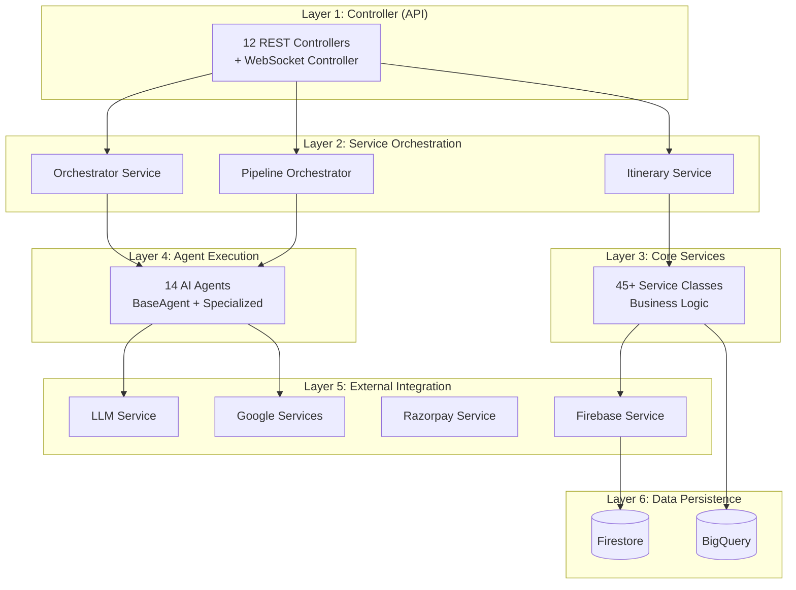
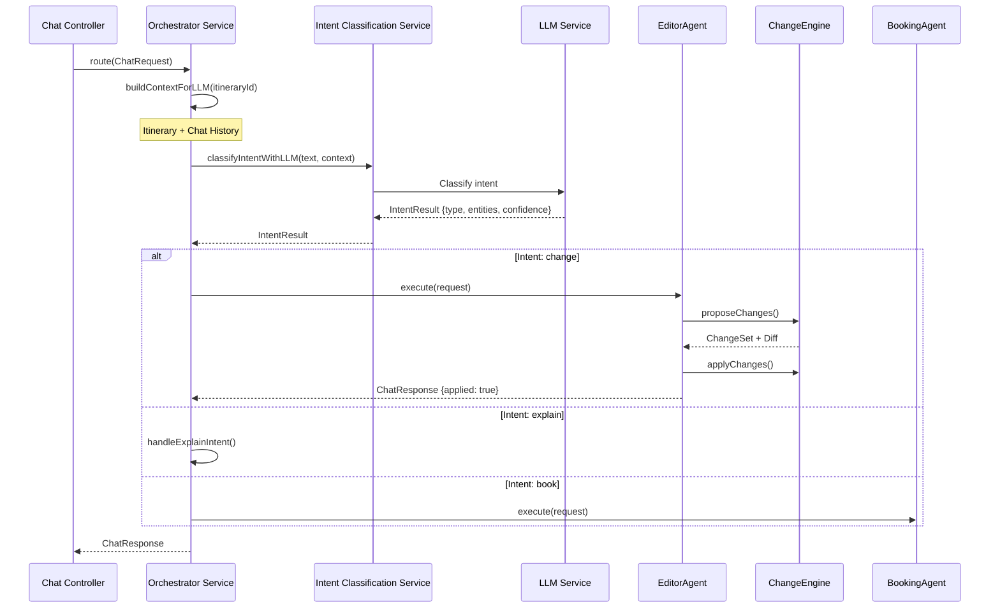
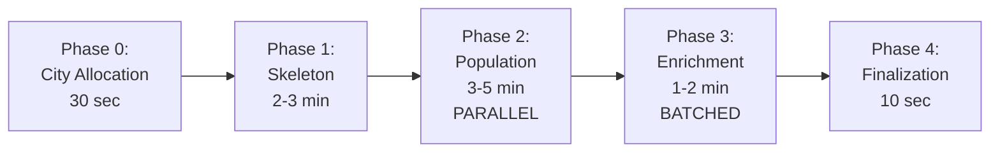
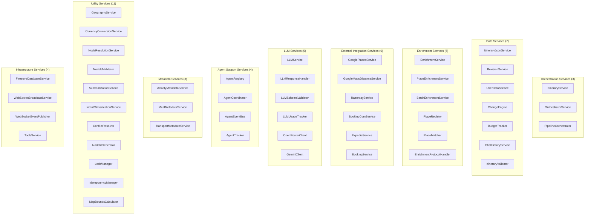
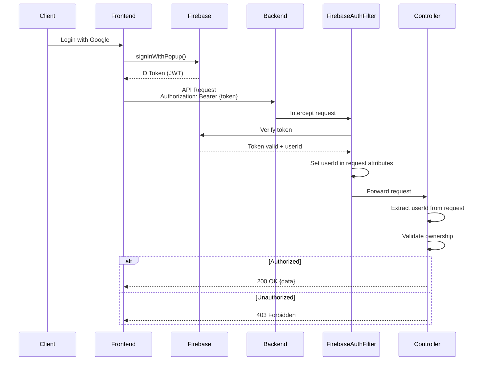

# HLD-02: Backend Architecture & Services
## Agentic Itinerary Planner

**Document Version**: 1.0.0  
**Last Updated**: November 25, 2025  
**Status**: Complete  
**Authors**: Backend Development Team  
**Reviewers**: Backend Tech Lead, System Architect

---

## Document Information

### Purpose
This document provides comprehensive documentation of the backend architecture, service layer organization, REST API design, and implementation patterns for the Agentic Itinerary Planner system.

### Target Audience
- Backend Developers
- API Consumers
- Integration Engineers
- DevOps Engineers
- System Architects

### Scope
This document covers:
- Backend package structure and layered architecture
- REST API design (12 controllers, 50+ endpoints)
- Core services layer (45+ service classes)
- Data Transfer Objects (98+ DTOs)
- Security architecture and authentication flow
- Configuration management
- Error handling strategy

### Related Documents
- [HLD-01: System Overview & Architecture](01-system-overview-architecture.md) - System context
- [HLD-03: Frontend Architecture & State Management](03-frontend-architecture-state.md) - API consumers
- [HLD-04: Multi-Agent System Design](04-multi-agent-system-design.md) - Agent implementation
- [HLD-05: Data Architecture & Analytics](05-data-architecture-analytics.md) - Data models

---

## Table of Contents

1. [Backend Architecture Overview](#1-backend-architecture-overview)
2. [REST API Design](#2-rest-api-design)
3. [Controller Layer](#3-controller-layer)
4. [Service Orchestration](#4-service-orchestration)
5. [Core Services](#5-core-services)
6. [Data Transfer Objects](#6-data-transfer-objects)
7. [Security Architecture](#7-security-architecture)
8. [Configuration Management](#8-configuration-management)
9. [Error Handling](#9-error-handling)
10. [Appendices](#10-appendices)

---

## 1. Backend Architecture Overview

### 1.1 Technology Stack

**Core Framework**: Spring Boot 3.5.5 + Java 17

**Key Dependencies**:
```gradle
// Spring Boot
implementation 'org.springframework.boot:spring-boot-starter-web'
implementation 'org.springframework.boot:spring-boot-starter-security'
implementation 'org.springframework.boot:spring-boot-starter-websocket'
implementation 'org.springframework.boot:spring-boot-starter-validation'

// Google Cloud
implementation 'com.google.cloud:google-cloud-firestore:3.14.0'
implementation 'com.google.firebase:firebase-admin:9.2.0'
implementation 'com.google.cloud:spring-cloud-gcp-starter-pubsub:5.8.0'

// Razorpay
implementation 'com.razorpay:razorpay-java:1.4.3'

// PDF Generation
implementation 'com.openhtmltopdf:openhtmltopdf-pdfbox:1.0.10'

// JSON Schema Validation
implementation 'com.networknt:json-schema-validator:1.0.87'
```

### 1.2 Package Structure

```
com.tripplanner/
├── agents/                    # 14 AI agents
│   ├── BaseAgent.java         # Abstract agent class
│   ├── SkeletonPlannerAgent.java
│   ├── ActivityAgent.java
│   ├── MealAgent.java
│   ├── TransportAgent.java
│   ├── EnrichmentAgent.java
│   ├── EditorAgent.java
│   ├── BookingAgent.java
│   ├── CostEstimatorAgent.java
│   └── ... (6 more agents)
│
├── controller/                # 12 REST controllers
│   ├── ItinerariesController.java
│   ├── ChatController.java
│   ├── BookingController.java
│   ├── ExportController.java
│   ├── ToolsController.java
│   ├── AnalyticsIngestController.java
│   ├── UserController.java
│   ├── WebSocketController.java
│   └── ... (4 more controllers)
│
├── service/                   # 45+ service classes
│   ├── ItineraryService.java
│   ├── OrchestratorService.java
│   ├── PipelineOrchestrator.java
│   ├── ChangeEngine.java
│   ├── RevisionService.java
│   ├── GooglePlacesService.java
│   ├── llm/                   # LLM services
│   │   ├── LLMService.java
│   │   ├── LLMResponseHandler.java
│   │   └── LLMSchemaValidator.java
│   ├── client/                # API clients
│   │   ├── OpenRouterClient.java
│   │   └── GeminiClient.java
│   ├── external/              # External integrations
│   │   ├── RazorpayService.java
│   │   ├── BookingComService.java
│   │   └── ExpediaService.java
│   ├── firebase/
│   │   └── FirestoreDatabaseService.java
│   ├── analytics/
│   │   ├── ItineraryMetricsTracker.java
│   │   └── TraceManager.java
│   ├── agents/                # Agent support
│   │   ├── AgentRegistry.java
│   │   ├── AgentCoordinator.java
│   │   ├── AgentEventBus.java
│   │   └── AgentTracker.java
│   ├── metadata/
│   │   └── ActivityMetadataService.java
│   └── utilities/
│       ├── NodeIdGenerator.java
│       ├── LockManager.java
│       └── IdempotencyManager.java
│
├── dto/                       # 98+ Data Transfer Objects
│   ├── CreateItineraryReq.java
│   ├── NormalizedItinerary.java
│   ├── NormalizedDay.java
│   ├── NormalizedNode.java
│   ├── ChatRequest.java
│   ├── ChatResponse.java
│   ├── ChangeSet.java
│   ├── IntentResult.java
│   └── ... (90 more DTOs)
│
├── config/                    # Configuration classes
│   ├── WebSocketConfig.java
│   ├── SecurityConfig.java
│   ├── FirebaseConfig.java
│   └── CorsConfig.java
│
├── data/                      # Data layer
│   └── FirestoreClientWrapper.java
│
├── exception/                 # Exception handling
│   ├── GlobalExceptionHandler.java
│   ├── ValidationException.java
│   ├── ResourceNotFoundException.java
│   └── UnauthorizedException.java
│
├── filter/                    # HTTP filters
│   └── FirebaseAuthenticationFilter.java
│
├── enums/                     # Enumerations
│   └── (Various enums)
│
└── util/                      # Utility classes
    └── (Various utilities)
```

### 1.3 Layered Architecture

The backend follows a classic **layered architecture** with clear separation of concerns:



### 1.4 Dependency Injection

Spring Boot's **dependency injection** is used throughout:

```java
// Example: ItineraryService dependencies
@Service
public class ItineraryService {
    
    private final FirestoreDatabaseService firestoreService;
    private final PipelineOrchestrator pipelineOrchestrator;
    private final WebSocketBroadcastService webSocketService;
    private final RevisionService revisionService;
    private final ItineraryValidator validator;
    
    // Constructor injection (recommended)
    public ItineraryService(
            FirestoreDatabaseService firestoreService,
            PipelineOrchestrator pipelineOrchestrator,
            WebSocketBroadcastService webSocketService,
            RevisionService revisionService,
            ItineraryValidator validator) {
        this.firestoreService = firestoreService;
        this.pipelineOrchestrator = pipelineOrchestrator;
        this.webSocketService = webSocketService;
        this.revisionService = revisionService;
        this.validator = validator;
    }
}
```

---

## 2. REST API Design

### 2.1 API Versioning

**Base URL**: `/api/v1`

All APIs are versioned to allow for backward-compatible changes:
- Current version: `v1`
- Future versions: `v2`, `v3`, etc.

### 2.2 REST Conventions

The API follows RESTful conventions:

| HTTP Method | Purpose | Idempotent |
|-------------|---------|------------|
| GET | Retrieve resources | Yes |
| POST | Create resources | No |
| PUT | Update/replace resources | Yes |
| PATCH | Partial update | No |
| DELETE | Delete resources | Yes |

**Custom Actions**: Use colon notation (`:action`) for non-CRUD operations:
- `POST /itineraries/{id}:propose` - Propose changes
- `POST /itineraries/{id}:apply` - Apply changes
- `POST /itineraries/{id}:undo` - Undo changes

### 2.3 Request/Response Format

**Request Headers**:
```http
POST /api/v1/itineraries
Authorization: Bearer {firebase-jwt-token}
X-Session-ID: {session-id}
Content-Type: application/json
```

**Response Format**:
```json
{
  "id": "itin_123",
  "status": "generating",
  "data": { ... },
  "timestamp": "2025-11-25T08:54:34Z"
}
```

**Error Response**:
```json
{
  "timestamp": "2025-11-25T08:54:34Z",
  "status": 400,
  "error": "Bad Request",
  "message": "Invalid date range",
  "path": "/api/v1/itineraries",
  "requestId": "req_abc123"
}
```

### 2.4 Pagination

**Query Parameters**:
```
GET /api/v1/itineraries?page=1&size=20
```

**Response**:
```json
{
  "content": [...],
  "page": 1,
  "size": 20,
  "totalElements": 150,
  "totalPages": 8
}
```

### 2.5 Filtering & Sorting

**Query Parameters**:
```
GET /api/v1/itineraries?status=completed&sortBy=createdAt&order=desc
```

---

## 3. Controller Layer

### 3.1  ItinerariesController

**Path**: `/api/v1/itineraries`  
**Purpose**: Core CRUD operations for itineraries

**Endpoints** (15 endpoints):

#### 3.1.1 Create Itinerary
```java
@PostMapping
public ResponseEntity<ItineraryCreationResponse> create(
        @Valid @RequestBody CreateItineraryReq request,
        HttpServletRequest httpRequest) {
    // Extract userId from Firebase token
    String userId = (String) httpRequest.getAttribute("userId");
    
    // Create initial itinerary (SYNC - returns immediately)
    ItineraryCreationResponse response = itineraryService.create(request, userId);
    
    // Async pipeline generation starts in background
    return ResponseEntity.status(201).body(response);
}
```

**Request**:
```json
{
  "destination": "Paris, France",
  "startDate": "2025-12-15",
  "endDate": "2025-12-20",
  "partySize": 2,
  "budget": 3000,
  "currency": "USD",
  "preferences": {
    "heritage": 80,
    "adventure": 40,
    "relaxation": 60
  }
}
```

**Response** (immediate):
```json
{
  "id": "itin_abc123",
  "status": "generating",
  "estimatedCompletionTime": "2025-11-25T09:02:00Z",
  "executionStages": [
    {"phase": "skeleton", "estimatedDuration": 180},
    {"phase": "population", "estimatedDuration": 240},
    {"phase": "enrichment", "estimatedDuration": 120}
  ]
}
```

#### 3.1.2 Get All Itineraries
```java
@GetMapping
public ResponseEntity<List<ItineraryDto>> getAll(HttpServletRequest httpRequest) {
    String userId = (String) httpRequest.getAttribute("userId");
    List<ItineraryDto> itineraries = itineraryService.getUserItineraries(userId, 0, 50);
    return ResponseEntity.ok(itineraries);
}
```

#### 3.1.3 Get Itinerary by ID
```java
@GetMapping("/{id}")
public ResponseEntity<ItineraryDto> getById(
        @PathVariable String id,
        HttpServletRequest httpRequest) {
    String userId = (String) httpRequest.getAttribute("userId");
    ItineraryDto itinerary = itineraryService.get(id, userId);
    return ResponseEntity.ok(itinerary);
}
```

#### 3.1.4 Get Itinerary JSON (Full Data)
```java
@GetMapping("/{id}/json")
public ResponseEntity<NormalizedItinerary> getItineraryJson(
        @PathVariable String id,
        HttpServletRequest httpRequest) {
    // Returns complete normalized JSON
    NormalizedItinerary itinerary = itineraryJsonService.get(id);
    return ResponseEntity.ok(itinerary);
}
```

#### 3.1.5 Delete Itinerary
```java
@DeleteMapping("/{id}")
public ResponseEntity<Void> delete(
        @PathVariable String id,
        HttpServletRequest httpRequest) {
    String userId = (String) httpRequest.getAttribute("userId");
    itineraryService.delete(id, userId);
    return ResponseEntity.noContent().build();
}
```

#### 3.1.6 Propose Changes (Preview)
```java
@PostMapping("/{id}:propose")
public ResponseEntity<ProposeResponse> proposeChanges(
        @PathVariable String id,
        @Valid @RequestBody ChangeSet changeSet) {
    // Preview changes without writing to DB
    NormalizedItinerary proposed = changeEngine.proposeChanges(id, changeSet);
    ItineraryDiff diff = changeEngine.generateDiff(currentItinerary, proposed);
    
    return ResponseEntity.ok(new ProposeResponse(proposed, diff, nextVersion));
}
```

**Request**:
```json
{
  "description": "Replace lunch on Day 2 with vegetarian restaurant",
  "operations": [
    {
      "type": "REMOVE",
      "targetType": "node",
      "targetId": "day2_lunch_1"
    },
    {
      "type": "ADD",
      "targetType": "node",
      "targetPath": "days[1].nodes",
      "node": {
        "type": "meal",
        "title": "Vegetarian Bistro",
        "mealType": "lunch"
      }
    }
  ]
}
```

**Response**:
```json
{
  "proposed": { /* full itinerary with changes */ },
  "diff": {
    "added": [{ "path": "days[1].nodes[2]", ...}],
    "removed": [{ "path": "days[1].nodes[1]", ...}],
    "modified": []
  },
  "previewVersion": 5
}
```

#### 3.1.7 Apply Changes
```java
@PostMapping("/{id}:apply")
public ResponseEntity<ApplyResponse> applyChanges(
        @PathVariable String id,
        @Valid @RequestBody ApplyRequest request) {
    // Apply changes and increment version
    int newVersion = changeEngine.applyChanges(id, request.getChangeSet());
    ItineraryDiff diff = changeEngine.getDiff();
    
    return ResponseEntity.ok(new ApplyResponse(newVersion, diff));
}
```

#### 3.1.8 Undo Changes
```java
@PostMapping("/{id}:undo")
public ResponseEntity<UndoResponse> undoChanges(
        @PathVariable String id,
        @Valid @RequestBody UndoRequest request) {
    // Rollback to previous version
    int targetVersion = request.getToVersion() != null 
        ? request.getToVersion() 
        : currentVersion - 1;
        
    revisionService.rollback(id, targetVersion);
    return ResponseEntity.ok(new UndoResponse(targetVersion, diff));
}
```

#### 3.1.9 Toggle Node Lock
```java
@PutMapping("/{id}/nodes/{nodeId}/lock")
public ResponseEntity<Void> toggleNodeLock(
        @PathVariable String id,
        @PathVariable String nodeId,
        @RequestBody Map<String, Boolean> request) {
    boolean locked = request.get("locked");
    itineraryJsonService.setNodeLock(id, nodeId, locked);
    return ResponseEntity.ok().build();
}
```

**Full Endpoint List**:

| Method | Endpoint | Auth | Purpose |
|--------|----------|------|---------|
| POST | `/itineraries` | Yes | Create new itinerary |
| GET | `/itineraries` | Yes | Get user's itineraries |
| GET | `/itineraries/{id}` | Yes | Get summary |
| GET | `/itineraries/{id}/json` | Yes | Get full JSON |
| GET | `/itineraries/{id}/public` | No | Public view |
| DELETE | `/itineraries/{id}` | Yes | Delete itinerary |
| POST | `/itineraries/{id}:propose` | Yes | Preview changes |
| POST | `/itineraries/{id}:apply` | Yes | Apply changes |
| POST | `/itineraries/{id}:undo` | Yes | Rollback |
| PUT | `/itineraries/{id}/nodes/{nodeId}/lock` | Yes | Lock/unlock node |
| GET | `/itineraries/{id}/lock-states` | Yes | Debug lock states |
| POST | `/itineraries/{id}:save` | Yes | Save/favorite |
| POST | `/itineraries/{id}:share` | Yes | Make public |
| POST | `/itineraries/{id}:unshare` | Yes | Make private |
| POST | `/itineraries/{id}/agents/{type}/execute` | Yes | Execute agent |

### 3.2 ChatController

**Path**: `/api/v1/chat`  
**Purpose**: Natural language interface for itinerary modifications

#### 3.2.1 Route Chat Message
```java
@PostMapping("/route")
public ResponseEntity<ChatResponse> route(
        @Valid @RequestBody ChatRequest request,
        HttpServletRequest httpRequest) {
    
    // Validate request
    validateChatRequest(request);
    
    // Route through orchestrator (intent classification + agent execution)
    ChatResponse response = orchestratorService.route(request);
    
    return ResponseEntity.ok(response);
}
```

**Request**:
```json
{
  "itineraryId": "itin_abc123",
  "scope": "day",
  "day": 2,
  "text": "Replace the lunch with a vegetarian restaurant",
  "autoApply": true
}
```

**Response**:
```json
{
  "message": "I've replaced the lunch on Day 2 with a vegetarian bistro",
  "intent": "change",
  "applied": true,
  "changeSet": { ... },
  "diff": { ... }
}
```

**Endpoints**:

| Method | Endpoint | Purpose |
|--------|----------|---------|
| POST | `/chat/route` | Route chat message |

### 3.3 BookingController

**Path**: `/api/v1/bookings`  
**Purpose**: Booking operations

**Endpoints** (6 endpoints):

| Method | Endpoint | Purpose |
|--------|----------|---------|
| POST | `/bookings` | Create booking |
| GET | `/bookings/{id}` | Get booking details |
| POST | `/bookings/{id}:confirm` | Confirm booking |
| POST | `/bookings/{id}:cancel` | Cancel booking |
| GET | `/bookings/user` | Get user's bookings |
| POST | `/providers/{vertical}/{provider}:book` | Execute booking |

### 3.4 ExportController

**Path**: `/api/v1/export`  
**Purpose**: PDF and email export

**Endpoints**:

| Method | Endpoint | Purpose |
|--------|----------|---------|
| GET | `/export/{id}/pdf` | Generate PDF |
| POST | `/export/{id}/email` | Email itinerary |

### 3.5 ToolsController

**Path**: `/api/v1/tools`  
**Purpose**: Utility tools (packing list, photo spots, etc.)

**Endpoints**:

| Method | Endpoint | Purpose |
|--------|----------|---------|
| POST | `/tools/packing-list` | Generate packing list |
| POST | `/tools/photo-spots` | Get photo spots |
| POST | `/tools/must-try-foods` | Get food recommendations |
| POST | `/tools/cost-estimator` | Estimate costs |

### 3.6 AnalyticsIngestController

**Path**: `/api/v1/analytics`  
**Purpose**: Analytics event collection

**Endpoints**:

| Method | Endpoint | Purpose |
|--------|----------|---------|
| POST | `/analytics/events` | Ingest analytics events |

### 3.7 UserController

**Path**: `/api/v1/users`  
**Purpose**: User profile management

**Endpoints**:

| Method | Endpoint | Purpose |
|--------|----------|---------|
| GET | `/users/me` | Get current user profile |
| PUT | `/users/me` | Update user profile |

### 3.8 WebSocketController

**Path**: `/ws`  
**Purpose**: WebSocket connection management

**Topics**:
- `/topic/itinerary/{id}` - Itinerary updates
- `/topic/agent/{id}` - Agent progress
- `/topic/chat/{id}` - Chat responses

### 3.9 HealthController, PingController, DocumentationController

**Utility controllers** for health checks, monitoring, and API documentation.

---

## 4. Service Orchestration

### 4.1 ItineraryService

**Purpose**: Core CRUD operations for itineraries  
**Location**: `com.tripplanner.service.ItineraryService`

**Key Methods**:

```java
@Service
public class ItineraryService {
    
    /**
     * Create new itinerary with async pipeline generation
     */
    public ItineraryCreationResponse create(CreateItineraryReq request, String userId) {
        // 1. Generate itineraryId
        String itineraryId = generateItineraryId();
        
        // 2. Create initial structure (SYNC - for ownership)
        NormalizedItinerary initial = initializeItinerary(itineraryId, request, userId);
        firestoreService.save(initial);
        
        // 3. Start async pipeline in background
        pipelineOrchestrator.generateItinerary(itineraryId, request, userId);
        
        // 4. Return immediate response
        return new ItineraryCreationResponse(itineraryId, "generating", ...);
    }
    
    /**
     * Get itinerary by ID for authenticated user
     */
    public ItineraryDto get(String id, String userId) {
        // Validate ownership
        if (!userDataService.userOwnsTrip(userId, id)) {
            throw new UnauthorizedException("You don't own this itinerary");
        }
        
        // Fetch from Firestore
        NormalizedItinerary itinerary = firestoreService.get(id);
        
        // Convert to DTO
        return convertToDto(itinerary);
    }
    
    /**
     * Calculate itinerary status based on agent states
     */
    public String calculateItineraryStatus(NormalizedItinerary itinerary) {
        // Priority logic:
        // 1. If any agent is running → "generating"
        // 2. If days exist with components → "completed"
        // 3. If days exist but no components → "planning"
        // 4. Otherwise → "planning"
        
        boolean anyAgentRunning = itinerary.getAgents().values().stream()
            .anyMatch(agent -> agent.getStatus() == AgentStatus.running);
            
        if (anyAgentRunning) return "generating";
        
        boolean hasComponents = itinerary.getDays().stream()
            .anyMatch(day -> !day.getNodes().isEmpty());
            
        return hasComponents ? "completed" : "planning";
    }
}
```

**Dependencies**:
- `FirestoreDatabaseService` - Database operations
- `PipelineOrchestrator` - Async generation
- `WebSocketBroadcastService` - Real-time updates
- `RevisionService` - Version control
- `ItineraryValidator` - Validation
- `UserDataService` - Ownership checks

### 4.2 OrchestratorService

**Purpose**: Chat message routing and intent classification  
**Location**: `com.tripplanner.service.OrchestratorService`

**Workflow**:



**Key Methods**:

``` java
@Service
public class OrchestratorService {
    
    /**
     * Main routing method for chat requests
     */
    public ChatResponse route(ChatRequest request) {
        // 1. Build context (itinerary + chat history)
        String context = buildContextForLLM(request.getItineraryId());
        
        // 2. Classify intent using LLM
        IntentResult intent = intentClassificationService.classifyIntentWithLLM(
            request.getText(), 
            context
        );
        
        // 3. Check for conversational intent (greetings, etc.)
        if (isConversationalIntent(intent, request.getText())) {
            return handleConversationalIntent(request, intent);
        }
        
        // 4. Select appropriate agent
        BaseAgent agent = selectAgentForIntent(intent);
        
        // 5. Execute agent
        Object result = agent.execute(request.getItineraryId(), convertToAgentRequest(request));
        
        // 6. Generate response
        return generateChatResponse(result);
    }
    
    /**
     * Select agent based on intent
     */
    private BaseAgent selectAgentForIntent(IntentResult intent) {
        switch (intent.getType()) {
            case "change":
                return editorAgent;
            case "book":
                return bookingAgent;
            case "explain":
                return explainAgent;
            case "optimize":
                return editorAgent; // Same agent, different prompt
            default:
                throw new IllegalArgumentException("Unknown intent: " + intent.getType());
        }
    }
}
```

### 4.3 PipelineOrchestrator

**Purpose**: Multi-phase itinerary generation pipeline  
**Location**: `com.tripplanner.service.PipelineOrchestrator`

**Pipeline Phases**:



**Implementation**:

```java
@Service
public class PipelineOrchestrator {
    
    /**
     * Generate itinerary using multi-phase pipeline
     */
    @Async
    public void generateIt inerary(String itineraryId, CreateItineraryReq request, String userId) {
        String executionId = UUID.randomUUID().toString();
        long startTime = System.currentTimeMillis();
        
        try {
            // Phase 0: City Allocation (for multi-city trips)
            if (request.isMultiCity()) {
                executeCityAllocationPhase(itineraryId, request, executionId);
            }
            
            // Phase 1: Skeleton Generation
            NormalizedItinerary skeleton = executeSkeletonPhase(itineraryId, request, executionId);
            
            // Phase 2: Node Population (PARALLEL)
            executePopulationPhase(itineraryId, skeleton, executionId);
            
            // Phase 3: Enrichment (BATCHED PARALLEL)
            executeEnrichmentPhase(itineraryId, skeleton, executionId);
            
            // Phase 4: Finalization
            executeFinalizationPhase(itineraryId);
            
            // Publish completion event
            long totalTime = System.currentTimeMillis() - startTime;
            publishPipelineComplete(itineraryId, executionId, totalTime);
            
        } catch (Exception e) {
            logger.error("Pipeline failed for itinerary: " + itineraryId, e);
            publishPipelineError(itineraryId, executionId, e);
        }
    }
    
    /**
     * Phase 2: Population - Run agents in parallel
     */
    private void executePopulationPhase(String itineraryId, NormalizedItinerary skeleton, String executionId) {
        publishPhaseStart(itineraryId, executionId, "population", "Populating activities, meals, and transport");
        
        // Create parallel tasks
        List<CompletableFuture<Void>> futures = new ArrayList<>();
        
        // Activity Agent
        futures.add(CompletableFuture.runAsync(() -> {
            activityAgent.execute(itineraryId, new AgentRequest(skeleton, NormalizedItinerary.class));
        }, executorService));
        
        // Meal Agent
        futures.add(CompletableFuture.runAsync(() -> {
            mealAgent.execute(itineraryId, new AgentRequest(skeleton, NormalizedItinerary.class));
        }, executorService));
        
        // Transport Agent
        futures.add(CompletableFuture.runAsync(() -> {
            transportAgent.execute(itineraryId, new AgentRequest(skeleton, NormalizedItinerary.class));
        }, executorService));
        
        // Wait for all to complete
        CompletableFuture.allOf(futures.toArray(new CompletableFuture[0])).join();
        
        publishPhaseComplete(itineraryId, executionId, "population", durationMs);
    }
    
    /**
     * Phase 3: Enrichment - Batched parallel processing
     */
    private void executeEnrichmentPhase(String itineraryId, NormalizedItinerary skeleton, String executionId) {
        if ("sequential".equals(enrichmentMode)) {
            executeEnrichmentSequential(itineraryId, skeleton, executionId);
        } else {
            executeEnrichmentBatchedParallel(itineraryId, skeleton, executionId);
        }
    }
}
```

---

## 5. Core Services

The backend includes **45+ service classes** organized by functionality. Here's a comprehensive breakdown:

### 5.1 Service Categories



### 5.2 Orchestration Services (3 services)

#### 5.2.1 ItineraryService
**Purpose**: Core CRUD operations for itineraries  
**Key Methods**:
- `create()` - Create new itinerary with async generation
- `get()` - Retrieve itinerary for user
- `getUserItineraries()` - List user's itineraries
- `delete()` - Delete itinerary
- `save()` - Mark as saved/favorite
- `share()` / `unshare()` - Public sharing
- `calculateItineraryStatus()` - Compute status from agent states

#### 5.2.2 OrchestratorService
**Purpose**: Chat message routing and intent classification  
**Key Methods**:
- `route()` - Main routing method
- `classifyIntentWithLLM()` - LLM-based intent classification
- `executeAgentPlan()` - Execute agent based on intent
- `handleChangeIntent()` - Handle modification requests
- `handleExplainIntent()` - Handle explanation requests
- `buildContextForLLM()` - Build context from itinerary + chat history

#### 5.2.3 PipelineOrchestrator
**Purpose**: Multi-phase itinerary generation  
**Key Methods**:
- `generateItinerary()` - Main pipeline execution
- `executeSkeletonPhase()` - Phase 1: Day structure
- `executePopulationPhase()` - Phase 2: Parallel node population
- `executeEnrichmentPhase()` - Phase 3: Google Places enrichment
- `executeFinalizationPhase()` - Phase 4: Finalize and publish

### 5.3 Data Services (7 services)

#### 5.3.1 ItineraryJsonService
**Purpose**: Master JSON management for itineraries  
**Key Methods**:
- `get()` - Get complete JSON
- `save()` - Save full JSON
- `setNodeLock()` - Lock/unlock specific nodes

#### 5.3.2 RevisionService
**Purpose**: Version control and rollback  
**Key Methods**:
- `createRevision()` - Create new version
- `getRevisions()` - List all versions
- `rollback()` - Restore previous version
- `compareVersions()` - Generate diff between versions

#### 5.3.3 ChangeEngine
**Purpose**: Propose and apply itinerary modifications  
**Key Methods**:
- `proposeChanges()` - Preview changes without saving
- `applyChanges()` - Apply and increment version
- `generateDiff()` - Create diff between old and new

#### 5.3.4 UserDataService
**Purpose**: User trip metadata and ownership  
**Key Methods**:
- `userOwnsTrip()` - Validate ownership
- `getUserTrips()` - Get user's trip list
- `saveTripMetadata()` - Save trip metadata

### 5.4 Enrichment Services (6 services)

#### 5.4.1 EnrichmentService
**Purpose**: Orchestrate enrichment process  
**Key Methods**:
- `enrichItinerary()` - Enrich entire itinerary
- `enrichDay()` - Enrich single day
- `enrichNode()` - Enrich single node

#### 5.4.2 BatchEnrichmentService
**Purpose**: Batch process enrichment for efficiency  
**Key Methods**:
- `enrichBatch()` - Enrich multiple nodes in one call
- `groupByLocation()` - Group for efficient API usage

#### 5.4.3 PlaceRegistry
**Purpose**: Canonical place management  
**Key Methods**:
- `registerPlace()` - Add place to registry
- `findPlace()` - Search for existing place
- `deduplicatePlaces()` - Merge duplicate places

### 5.5 LLM Services (6 services)

#### 5.5.1 LLMService
**Purpose**: Resilient LLM client with fallback  
**Key Methods**:
- `complete()` - Text completion (primary + fallback)
- `completeWithSchema()` - Schema-validated completion

**Implementation**:
```java
@Service
public class LLMService {
    
    private final OpenRouterClient openRouterClient;
    private final GeminiClient geminiClient;
    
    public String complete(String prompt) {
        try {
            // Try OpenRouter first
            return openRouterClient.complete(prompt);
        } catch (Exception e) {
            logger.warn("OpenRouter failed, falling back to Gemini", e);
            try {
                // Fallback to Gemini
                return geminiClient.complete(prompt);
            } catch (Exception fallbackEx) {
                logger.error("Both LLM providers failed", fallbackEx);
                throw new RuntimeException("LLM service unavailable");
            }
        }
    }
}
```

#### 5.5.2 LLMResponseHandler
**Purpose**: Parse and validate LLM responses

#### 5.5.3 LLMSchemaValidator
**Purpose**: JSON schema validation for LLM outputs

#### 5.5.4 OpenRouterClient
**Purpose**: OpenRouter API client

#### 5.5.5 GeminiClient
**Purpose**: Google Gemini API client

### 5.6 Full Service List (45+ services)

| Category | Services |
|----------|----------|
| **Orchestration** | ItineraryService, OrchestratorService, PipelineOrchestrator |
| **Data** | ItineraryJsonService, RevisionService, UserDataService, ChangeEngine, BudgetTracker, ChatHistoryService, ItineraryValidator |
| **Enrichment** | EnrichmentService, PlaceEnrichmentService, BatchEnrichmentService, PlaceRegistry, PlaceMatcher, EnrichmentProtocolHandler |
| **External** | GooglePlacesService, GoogleMapsDistanceService, RazorpayService, BookingComService, ExpediaService, BookingService |
| **LLM** | LLMService, LLMResponseHandler, LLMSchemaValidator, LLMUsageTracker, OpenRouterClient, GeminiClient |
| **Agents** | AgentRegistry, AgentCoordinator, AgentEventBus, AgentTracker |
| **Metadata** | ActivityMetadataService, MealMetadataService, TransportMetadataService |
| **Utilities** | GeographyService, CurrencyConversionService, NodeResolutionService, NodeIdValidator, SummarizationService, IntentClassificationService, ConflictResolver, NodeIdGenerator, LockManager, IdempotencyManager, MapBoundsCalculator |
| **Infrastructure** | FirestoreDatabaseService, WebSocketBroadcastService, WebSocketEventPublisher, ToolsService |
| **Analytics** | ItineraryMetricsTracker, TraceManager |
| **Migration** | ItineraryMigrationService, ItineraryInitializationService |

---

## 6. Data Transfer Objects (DTOs)

### 6.1 DTO Categories

The backend uses **98+ DTOs** for type-safe communication:

**Request DTOs** (input from client):
- `CreateItineraryReq`
- `ChatRequest`
- `BookingRequest`
- `ChangeSet`
- `ApplyRequest`
- `UndoRequest`
- ... (20+ more)

**Response DTOs** (output to client):
- `ItineraryCreationResponse`
- `ChatResponse`
- `ProposeResponse`
- `ApplyResponse`
- `AgentEvent`
- ... (15+ more)

**Domain DTOs** (core data structures):
- `NormalizedItinerary`
- `NormalizedDay`
- `NormalizedNode`
- `IntentResult`
- `ChangeOperation`
- ... (30+ more)

**Integration DTOs** (external APIs):
- `PlaceSearchResponse`
- `PlaceDetailsResponse`
- `DistanceMatrixResponse`
- `BookingConfirmation`
- ... (20+ more)

### 6.2 Key DTOs

#### 6.2.1 NormalizedItinerary

```java
public class NormalizedItinerary {
    private String itineraryId;
    private String userId;
    private Integer version;
    private String status; // "planning", "generating", "completed", "failed"
    private String summary;
    private Instant createdAt;
    private Instant updatedAt;
    
    // Core data
    private List<NormalizedDay> days;
    private ItinerarySettings settings;
    private BudgetSummary budget;
    
    // Agent states
    private Map<AgentKind, AgentState> agents;
    
    // Metadata
    private Map<String, Object> metadata;
}
```

#### 6.2.2 NormalizedDay

```java
public class NormalizedDay {
    private Integer dayNumber;
    private String date; // ISO-8601
    private String location;
    private String theme;
    
    private List<NormalizedNode> nodes;
    
    private Integer totalDistance; // km
    private Double totalCost; // USD
}
```

#### 6.2.3 NormalizedNode

```java
public class NormalizedNode {
    private String id;
    private String type; // "activity", "meal", "transport", "accommodation"
    private String title;
    private String description;
    
    // Timing
    private String startTime; // ISO-8601
    private String endTime;
    private Integer duration; // minutes
    
    // Location
    private NodeLocation location;
    
    // Cost
    private NodeCost cost;
    
    // Metadata
    private Boolean locked;
    private String source; // "ai", "user", "enrichment"
    private Instant lastModified;
    
    // Type-specific data
    private Map<String, Object> details;
}
```

#### 6.2.4 CreateItineraryReq

```java
@Valid
public class CreateItineraryReq {
    @NotBlank
    private String destination;
    
    @NotNull
    private LocalDate startDate;
    
    @NotNull
    private LocalDate endDate;
    
    @Min(1) @Max(20)
    private Integer partySize;
    
    @Min(0)
    private Double budget;
    
    private String currency; // Default: USD
    
    private TravelPreferences preferences;
    private TripSettings settings;
}
```

#### 6.2.5 ChatRequest

```java
@Valid
public class ChatRequest {
    @NotBlank
    private String itineraryId;
    
    @NotBlank
    private String scope; // "trip" or "day"
    
    private Integer day; // Required if scope = "day"
    
    @NotBlank
    @Size(max = 1000)
    private String text;
    
    private String selectedNodeId;
    
    private Boolean autoApply; // Default: false
}
```

#### 6.2.6 ChangeSet

```java
public class ChangeSet {
    private String description;
    private List<ChangeOperation> operations;
    private ChangePreferences preferences;
    private Instant timestamp;
}

public class ChangeOperation {
    private String type; // "ADD", "REMOVE", "UPDATE", "MOVE"
    private String targetType; // "node", "day"
    private String targetId;
    private String targetPath; // JSONPath
    private Object newValue;
    private Object oldValue;
}
```

---

## 7. Security Architecture

### 7.1 Authentication Flow



### 7.2 Firebase Authentication Filter

```java
@Component
public class FirebaseAuthenticationFilter extends OncePerRequestFilter {
    
    private final FirebaseAuth firebaseAuth;
    
    @Override
    protected void doFilterInternal(
            HttpServletRequest request,
            HttpServletResponse response,
            FilterChain filterChain) throws ServletException, IOException {
        
        // Extract Authorization header
        String authHeader = request.getHeader("Authorization");
        
        if (authHeader != null && authHeader.startsWith("Bearer ")) {
            String token = authHeader.substring(7);
            
            try {
                // Verify Firebase token
                FirebaseToken decodedToken = firebaseAuth.verifyIdToken(token);
                
                // Extract userId
                String userId = decodedToken.getUid();
                
                // Set userId in request attributes
                request.setAttribute("userId", userId);
                
                logger.debug("Authenticated user: {}", userId);
                
            } catch (FirebaseAuthException e) {
                logger.warn("Invalid Firebase token", e);
                response.setStatus(HttpServletResponse.SC_UNAUTHORIZED);
                return;
            }
        }
        
        filterChain.doFilter(request, response);
    }
    
    @Override
    protected boolean shouldNotFilter(HttpServletRequest request) {
        // Skip filter for public endpoints
        String path = request.getRequestURI();
        return path.contains("/public") || 
               path.contains("/health") ||
               path.contains("/ping");
    }
}
```

### 7.3 Ownership Validation

```java
@Service
public class UserDataService {
    
    /**
     * Check if user owns the itinerary
     */
    public boolean userOwnsTrip(String userId, String itineraryId) {
        // Check Firestore: users/{userId}/trips/{itineraryId}
        DocumentReference tripRef = firestore
            .collection("users")
            .document(userId)
            .collection("trips")
            .document(itineraryId);
            
        try {
            DocumentSnapshot snapshot = tripRef.get().get();
            return snapshot.exists();
        } catch (Exception e) {
            logger.error("Failed to check trip ownership", e);
            return false;
        }
    }
}
```

### 7.4 Security Configuration

```java
@Configuration
@EnableWebSecurity
public class SecurityConfig {
    
    @Bean
    public SecurityFilterChain filterChain(HttpSecurity http) throws Exception {
        http
            .csrf().disable() // Disabled for REST API
            .cors().and()
            .authorizeHttpRequests(auth -> auth
                .requestMatchers("/api/v1/itineraries/*/public").permitAll()
                .requestMatchers("/health", "/ping").permitAll()
                .requestMatchers("/api/v1/**").authenticated()
                .anyRequest().permitAll()
            )
            .addFilterBefore(firebaseAuthFilter, UsernamePasswordAuthenticationFilter.class);
            
        return http.build();
    }
}
```

---

## 8. Configuration Management

### 8.1 Application Properties

**File**: `application.properties` or `application.yml`

```yaml
# Server Configuration
server:
  port: 8080
  servlet:
    context-path: /api/v1

# Firebase Configuration
firebase:
  project-id: ${GOOGLE_PROJECT_ID}
  credentials-path: ${GOOGLE_APPLICATION_CREDENTIALS}

# OpenRouter Configuration
openrouter:
  api-key: ${OPENROUTER_API_KEY}
  base-url: https://openrouter.ai/api/v1
  model: anthropic/claude-3-opus

# Gemini Configuration
gemini:
  api-key: ${GEMINI_API_KEY}
  model: gemini-1.5-pro

# Google Places API
google:
  places:
    api-key: ${GOOGLE_PLACES_API_KEY}
  maps:
    api-key: ${GOOGLE_MAPS_API_KEY}

# Razorpay Configuration
razorpay:
  key-id: ${RAZORPAY_KEY_ID}
  key-secret: ${RAZORPAY_KEY_SECRET}

# Email Configuration
spring:
  mail:
    host: smtp.gmail.com
    port: 587
    username: ${SMTP_USERNAME}
    password: ${SMTP_PASSWORD}

# WebSocket Configuration
websocket:
  allowed-origins: http://localhost:5173,https://your-domain.com

# Pipeline Configuration
pipeline:
  enrichment-mode: batched-parallel # or "sequential"
  enrichment-batch-size: 3
  max-parallel-agents: 3
  timeout-seconds: 600

# Analytics
analytics:
  enabled: true
  pub-sub-topic: analytics-events
```

### 8.2 Environment Variables

**Required**:
- `GOOGLE_PROJECT_ID`
- `GOOGLE_APPLICATION_CREDENTIALS`
- `OPENROUTER_API_KEY`
- `GEMINI_API_KEY`
- `RAZORPAY_KEY_ID`
- `RAZORPAY_KEY_SECRET`
- `SMTP_USERNAME`
- `SMTP_PASSWORD`

**Optional**:
- `PIPELINE_ENRICHMENT_MODE` (default: batched-parallel)
- `ANALYTICS_ENABLED` (default: true)

---

## 9. Error Handling

### 9.1 Exception Hierarchy

```java
// Base exception
public class TripPlannerException extends RuntimeException {
    private final String code;
    private final HttpStatus status;
}

// Specific exceptions
public class ResourceNotFoundException extends TripPlannerException {
    // HTTP 404
}

public class ValidationException extends TripPlannerException {
    // HTTP 400
}

public class UnauthorizedException extends TripPlannerException {
    // HTTP 403
}

public class ExternalServiceException extends TripPlannerException {
    // HTTP 502
}
```

### 9.2 Global Exception Handler

```java
@RestControllerAdvice
public class GlobalExceptionHandler {
    
    @ExceptionHandler(ValidationException.class)
    public ResponseEntity<ErrorResponse> handleValidation(ValidationException ex) {
        ErrorResponse error = new ErrorResponse(
            Instant.now(),
            400,
            "Bad Request",
            ex.getMessage(),
            request.getRequestURI(),
            UUID.randomUUID().toString()
        );
        return ResponseEntity.status(400).body(error);
    }
    
    @ExceptionHandler(ResourceNotFoundException.class)
    public ResponseEntity<ErrorResponse> handleNotFound(ResourceNotFoundException ex) {
        ErrorResponse error = new ErrorResponse(
            Instant.now(),
            404,
            "Not Found",
            ex.getMessage(),
            request.getRequestURI(),
            UUID.randomUUID().toString()
        );
        return ResponseEntity.status(404).body(error);
    }
    
    @ExceptionHandler(Exception.class)
    public ResponseEntity<ErrorResponse> handleGeneric(Exception ex) {
        logger.error("Unexpected error", ex);
        ErrorResponse error = new ErrorResponse(
            Instant.now(),
            500,
            "Internal Server Error",
            "An unexpected error occurred",
            request.getRequestURI(),
            UUID.randomUUID().toString()
        );
        return ResponseEntity.status(500).body(error);
    }
}
```

---

## 10. Appendices

### 10.1 Complete API Endpoint Reference

**Itineraries** (15 endpoints):
```
POST   /api/v1/itineraries
GET    /api/v1/itineraries
GET    /api/v1/itineraries/{id}
GET    /api/v1/itineraries/{id}/json
GET    /api/v1/itineraries/{id}/public
DELETE /api/v1/itineraries/{id}
POST   /api/v1/itineraries/{id}:propose
POST   /api/v1/itineraries/{id}:apply
POST   /api/v1/itineraries/{id}:undo
POST   /api/v1/itineraries/{id}:save
POST   /api/v1/itineraries/{id}:share
POST   /api/v1/itineraries/{id}:unshare
PUT    /api/v1/itineraries/{id}/nodes/{nodeId}/lock
GET    /api/v1/itineraries/{id}/lock-states
POST   /api/v1/itineraries/{id}/agents/{type}/execute
```

**Chat** (1 endpoint):
```
POST   /api/v1/chat/route
```

**Bookings** (6 endpoints):
```
POST   /api/v1/bookings
GET    /api/v1/bookings/{id}
POST   /api/v1/bookings/{id}:confirm
POST   /api/v1/bookings/{id}:cancel
GET    /api/v1/bookings/user
POST   /api/v1/providers/{vertical}/{provider}:book
```

**Export** (2 endpoints):
```
GET    /api/v1/export/{id}/pdf
POST   /api/v1/export/{id}/email
```

**Tools** (4 endpoints):
```
POST   /api/v1/tools/packing-list
POST   /api/v1/tools/photo-spots
POST   /api/v1/tools/must-try-foods
POST   /api/v1/tools/cost-estimator
```

**Analytics** (1 endpoint):
```
POST   /api/v1/analytics/events
```

**Users** (2 endpoints):
```
GET    /api/v1/users/me
PUT    /api/v1/users/me
```

**Utility** (3 endpoints):
```
GET    /health
GET    /ping
GET    /docs
```

**Total**: 34+ REST endpoints + WebSocket

### 10.2 Version History

| Version | Date | Changes |
|---------|------|---------|
| 1.0.0 | 2025-11-25 | Initial HLD-02 document |

---

**Document Status**: ✅ Complete  
**Next Review Date**: 2026-02-25  
**Owner**: Backend Tech Lead

---

*This document is part of the Agentic Itinerary Planner High-Level Design documentation suite.*
