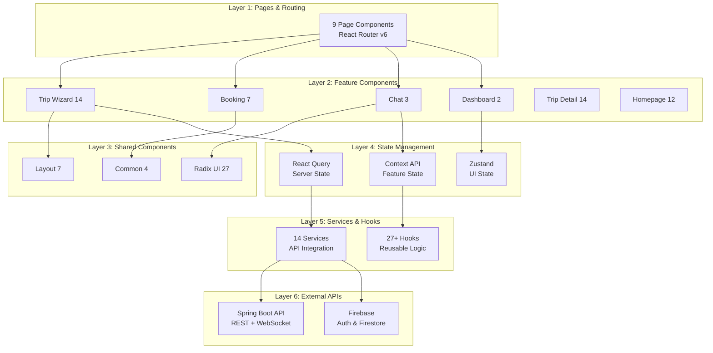
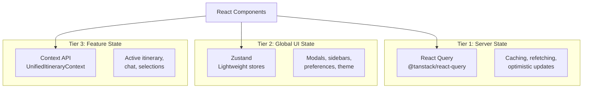
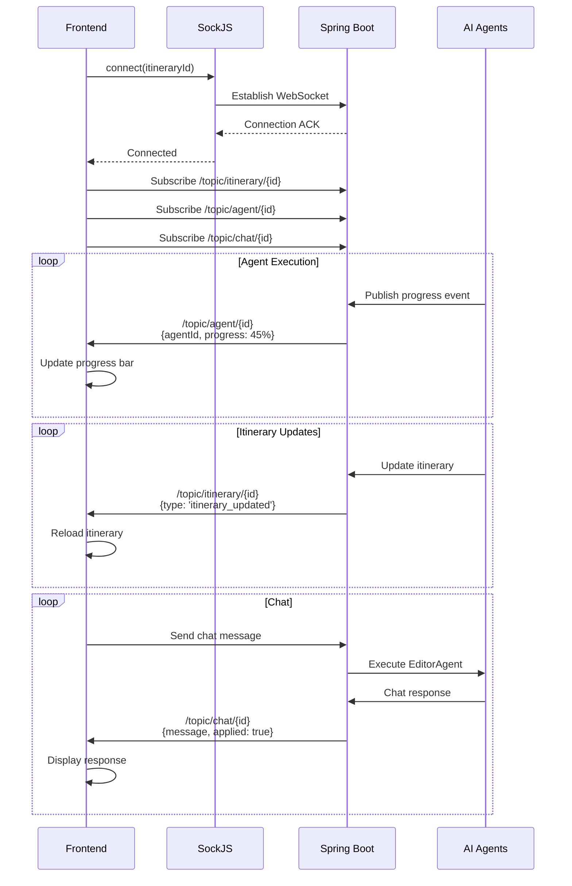

# HLD-03: Frontend Architecture & State Management
## Agentic Itinerary Planner

**Document Version**: 1.0.0  
**Last Updated**: November 25, 2025  
**Status**: Complete  
**Authors**: Frontend Development Team  
**Reviewers**: Frontend Tech Lead, System Architect

---

## Document Information

### Purpose
This document provides comprehensive documentation of the React/TypeScript frontend architecture, component organization, state management patterns, real-time communication, and performance optimization strategies for the Agentic Itinerary Planner.

### Target Audience
- Frontend Developers
- Full-Stack Developers
- UI/UX Engineers
- Mobile Web Developers

### Scope
This document covers:
- React component architecture (111+ components)
- Multi-layered state management (React Query + Zustand + Context)
- Service layer and API integration (14 services)
- Custom hooks library (27+ hooks)
- Real-time communication (WebSocket + STOMP)
- Routing and navigation patterns
- Performance optimization techniques
- Mobile-first responsive design

### Related Documents
- [HLD-01: System Overview & Architecture](01-system-overview-architecture.md) - System context
- [HLD-02: Backend Architecture & Services](02-backend-architecture-services.md) - API endpoints
- [HLD-04: Multi-Agent System Design](04-multi-agent-system-design.md) - Agent progress tracking
- [HLD-05: Data Architecture & Analytics](05-data-architecture-analytics.md) - Data models

---

## Table of Contents

1. [Frontend Architecture Overview](#1-frontend-architecture-overview)
2. [Component Architecture](#2-component-architecture)
3. [State Management](#3-state-management)
4. [Service Layer](#4-service-layer)
5. [Custom Hooks](#5-custom-hooks)
6. [Real-Time Communication](#6-real-time-communication)
7. [Routing & Navigation](#7-routing--navigation)
8. [Performance Optimization](#8-performance-optimization)
9. [Mobile-First Design](#9-mobile-first-design)
10. [Appendices](#10-appendices)

---

## 1. Frontend Architecture Overview

### 1.1 Technology Stack

**Core Framework**: React 18.3.1 + TypeScript 5.3.3

**Build Tool**: Vite 6.3.5

**Key Dependencies**:
```json
{
  "dependencies": {
    // Core
    "react": "^18.3.1",
    "react-dom": "^18.3.1",
    "typescript": "^5.3.3",
    
    // Routing
    "react-router-dom": "^6.30.1",
    
    // State Management
    "@tanstack/react-query": "^5.90.5",
    "zustand": "(custom implementation)",
    
    // Styling
    "tailwindcss": "^3.4.1",
    "@radix-ui/react-*": "various",
    
    // HTTP & WebSocket
    "axios": "^1.12.2",
    "@stomp/stompjs": "^7.0.0",
    "sockjs-client": "^1.6.1",
    
    // Animations
    "framer-motion": "^11.0.0",
    
    // Utilities
    "date-fns": "^4.1.0",
    "lucide-react": "^0.487.0",
    "firebase": "^10.7.1"
  }
}
```

### 1.2 Directory Structure

```
frontend/src/
├── App.tsx                    # Root component
├── main.tsx                   # Entry point
├── index.css                  # Global styles
│
├── components/                # 111+ React components
│   ├── ai-planner/           # Trip wizard components (14)
│   ├── auth/                 # Authentication (1)
│   ├── booking/              # Booking components (7)
│   ├── chat/                 # Chat interface (3)
│   ├── common/               # Shared components (4)
│   ├── dashboard/            # Dashboard (2)
│   ├── error/                # Error handling (2)
│   ├── export/               # PDF export (1)
│   ├── homepage/             # Landing page (12)
│   ├── layout/               # Layout components (7)
│   ├── loading/              # Loading states (2)
│   ├── map/                  # Map integration (1)
│   ├── packing/              # Packing list (3)
│   ├── places/               # Place components (1)
│   ├── premium/              # Premium features (6)
│   ├── search/               # Search (1)
│   ├── share/                # Sharing (2)
│   ├── trip/                 # Trip components (14)
│   ├── ui/                   # Radix UI primitives (27)
│   └── weather/              # Weather (1)
│
├── contexts/                  # React Context providers
│   ├── UnifiedItineraryContext.tsx
│   ├── UnifiedItineraryTypes.ts
│   ├── UnifiedItineraryReducer.ts
│   ├── UnifiedItineraryActions.ts
│   ├── UnifiedItineraryHooks.ts
│   └── CurrencyContext.tsx
│
├── hooks/                     # 27+ custom hooks
│   ├── useItinerary.ts
│   ├── useNormalizedItinerary.ts
│   ├── useWebSocket.ts
│   ├── useStompWebSocket.ts
│   ├── useAnalyticsTracking.ts
│   ├── useCurrency.ts
│   ├── useDebounce.ts
│   ├── useThrottle.ts
│   ├── useLocalStorage.ts
│   ├── useMediaQuery.ts
│   ├── usePullToRefresh.ts
│   ├── animations/           # Animation hooks (5)
│   ├── data/                 # Data hooks (1)
│   └── interactions/         # Interaction hooks (1)
│
├── pages/                     # 9 page components
│   ├── HomePage.tsx
│   ├── TripWizardPage.tsx
│   ├── AgentProgressPage.tsx
│   ├── DashboardPage.tsx
│   ├── TripDetailPage.tsx
│   ├── SearchPage.tsx
│   ├── LoginPage.tsx
│   ├── ProfilePage.tsx
│   └── SignupPage.tsx
│
├── services/                  # 14 service modules
│   ├── api.ts               # HTTP API client
│   ├── websocket.ts         # WebSocket service
│   ├── analytics.ts         # Analytics tracking
│   ├── firebase.ts          # Firebase integration
│   ├── chatApi.ts           # Chat API
│   ├── agentService.ts      # Agent execution
│   ├── bookingService.ts    # Booking service
│   ├── currencyService.ts   # Currency conversion
│   ├── exportService.ts     # PDF export
│   ├── geocodingService.ts  # Geocoding
│   ├── placesService.ts     # Google Places
│   ├── weatherService.ts    # Weather data
│   ├── recommendationService.ts
│   └── mapService.ts
│
├── types/                     # TypeScript type definitions
│   ├── TripData.ts          # Main itinerary types
│   ├── NormalizedItinerary.ts
│   ├── ChatTypes.ts
│   ├── AgentTypes.ts
│   └── ...
│
├── utils/                     # Utility functions
│   ├── logger.ts
│   ├── session.ts
│   ├── dateFormatter.ts
│   ├── currencyFormatter.ts
│   ├── typeGuards.ts
│   └── ...
│
└── store/                     # Zustand stores
    ├── modalStore.ts
    ├── uiStore.ts
    └── preferencesStore.ts
```

### 1.3 Architectural Layers



---

## 2. Component Architecture

### 2.1 Component Organization

The frontend has **111+ React components** organized by feature/domain:

#### 2.1.1 Component Categories

| Category | Count | Purpose |
|----------|-------|---------|
| **AI Planner** | 14 | Trip creation wizard |
| **Trip Management** | 14 | Itinerary display & editing |
| **Homepage** | 12 | Landing page & hero |
| **UI Primitives** | 27 | Radix UI components |
| **Booking** | 7 | Booking flow |
| **Layout** | 7 | Navigation, header, footer |
| **Premium** | 6 | Premium features |
| **Common** | 4 | Shared utilities |
| **Chat** | 3 | Chat interface |
| **Packing** | 3 | Packing list |
| **Share** | 2 | Sharing options |
| **Dashboard** | 2 | User dashboard |
| **Loading** | 2 | Loading states |
| **Error** | 2 | Error handling |
| **Auth** | 1 | Protected routes |
| **Export** | 1 | PDF export |
| **Map** | 1 | Google Maps |
| **Places** | 1 | Place details |
| **Search** | 1 | Search interface |
| **Weather** | 1 | Weather widget |

### 2.2 Component Patterns

#### 2.2.1 Functional Components with Hooks

All components use functional components with hooks (no class components):

```tsx
// Example: TripWizardPage.tsx
export function TripWizardPage() {
  const [step, setStep] = useState(1);
  const navigate = useNavigate();
  const { trackEvent } = useAnalyticsTracking();
  
  const handleNext = () => {
    trackEvent('wizard_step_completed', { step });
    setStep(step + 1);
  };
  
  return (
    <div className="wizard-container">
      <WizardProgress currentStep={step} totalSteps={5} />
      {step === 1 && <DestinationStep onNext={handleNext} />}
      {step === 2 && <DatesStep onNext={handleNext} />}
      {/* ... */}
    </div>
  );
}
```

#### 2.2.2 Component Composition

Heavy use of composition for flexibility:

```tsx
// Layout composition
<Layout>
  <Header />
  <Sidebar>
    <NavItems />
  </Sidebar>
  <MainContent>
    {children}
  </MainContent>
  <BottomNav />
</Layout>
```

#### 2.2.3 Lazy Loading

Pages are lazy-loaded for performance:

```tsx
// App.tsx
const TripWizardPage = lazy(() => import('./pages/TripWizardPage'));
const AgentProgressPage = lazy(() => import('./pages/AgentProgressPage'));
const DashboardPage = lazy(() => import('./pages/DashboardPage'));

function App() {
  return (
    <Suspense fallback={<PageLoader />}>
      <Routes>
        <Route path="/planner" element={<TripWizardPage />} />
        <Route path="/planner-progress" element={<AgentProgressPage />} />
        <Route path="/dashboard" element={<DashboardPage />} />
      </Routes>
    </Suspense>
  );
}
```

### 2.3 Key Component Deep Dive

#### 2.3.1 AgentProgressPage

**Purpose**: Real-time display of AI agent progress during itinerary generation

**Features**:
- WebSocket connection for live updates
- Smooth progress animations
- Phase transition visualization
- Agent status tracking

```tsx
export function AgentProgressPage() {
  const { itineraryId } = useParams();
  const navigate = useNavigate();
  
  // WebSocket hook for real-time updates
  const { connected, error } = useStompWebSocket(itineraryId || '');
  
  // Smooth progress animation
  const { progress, currentPhase } = useSmoothProgress(itineraryId || '');
  
  // Navigate when complete
  useEffect(() => {
    if (progress === 100) {
      setTimeout(() => navigate(`/trip/${itineraryId}`), 2000);
    }
  }, [progress, itineraryId, navigate]);
  
  return (
    <div className="progress-container">
      <AnimatedHeader />
      
      {/* Phase indicator */}
      <PhaseIndicator currentPhase={currentPhase} />
      
      {/* Progress bar */}
      <ProgressBar value={progress} />
      
      {/* Agent cards */}
      <AgentStatusCards agents={agents} />
      
      {/* Connection status */}
      {!connected && <ConnectionError />}
    </div>
  );
}
```

#### 2.3.2 TripDetailPage

**Purpose**: Display and edit complete itinerary with chat interface

**Features**:
- Day-by-day itinerary display
- Interactive map
- Chat-based editing
- Real-time updates

```tsx
export function TripDetailPage() {
  const { id } = useParams();
  
  // Main itinerary state (UnifiedItineraryContext)
  const {
    state,
    loadItinerary,
    sendChatMessage,
    setSelectedDay
  } = useUnifiedItinerary();
  
  // Load itinerary on mount
  useEffect(() => {
    if (id) {
      loadItinerary(id);
    }
  }, [id, loadItinerary]);
  
  return (
    <div className="trip-detail-layout">
      {/* Header with summary */}
      <TripHeader itinerary={state.itinerary} />
      
      {/* Two-column layout: Itinerary + Chat */}
      <div className="grid grid-cols-1 lg:grid-cols-3 gap-4">
        {/* Left: Itinerary */}
        <div className="lg:col-span-2">
          <DaySelector 
            days={state.itinerary?.days || []}
            selectedDay={state.selectedDay}
            onSelectDay={setSelectedDay}
          />
          
          <DayItinerary 
            day={getCurrentDay()}
            onNodeClick={handleNodeClick}
          />
        </div>
        
        {/* Right: Chat */}
        <div className="lg:col-span-1">
          <ChatPanel 
            itineraryId={id!}
            messages={state.chatMessages}
            onSend={sendChatMessage}
          />
        </div>
      </div>
      
      {/* Map */}
      <InteractiveMap 
        itinerary={state.itinerary}
        selectedDay={state.selectedDay}
      />
    </div>
  );
}
```

### 2.4 UI Component Library (Radix UI)

**27 Radix UI primitives** for accessible, unstyled components:

| Component | Purpose |
|-----------|---------|
| `Button` | Primary interactions |
| `Dialog` | Modals |
| `DropdownMenu` | Dropdowns |
| `Select` | Select inputs |
| `Slider` | Range inputs |
| `Tabs` | Tab navigation |
| `Tooltip` | Hover tooltips |
| `Accordion` | Collapsible sections |
| `AlertDialog` | Confirmation dialogs |
| `Checkbox` | Checkboxes |
| `RadioGroup` | Radio buttons |
| `Switch` | Toggle switches |
| `Popover` | Popovers |
| `Progress` | Progress bars |
| `Separator` | Visual separators |
| ... (12 more) |

**Example Usage**:
```tsx
import { Button } from '@/components/ui/button';
import { Dialog, DialogContent, DialogTrigger } from '@/components/ui/dialog';

export function BookingDialog() {
  return (
    <Dialog>
      <DialogTrigger asChild>
        <Button variant="primary">Book Now</Button>
      </DialogTrigger>
      <DialogContent>
        <BookingForm />
      </DialogContent>
    </Dialog>
  );
}
```

---

## 3. State Management

### 3.1 Multi-Layered Approach

The frontend uses a **3-tier state management** strategy:



### 3.2 Tier 1: React Query (Server State)

**Purpose**: Cache and synchronize server data

**Configuration**:
```tsx
// main.tsx
import { QueryClient, QueryClientProvider } from '@tanstack/react-query';

const queryClient = new QueryClient({
  defaultOptions: {
    queries: {
      staleTime: 5 * 60 * 1000, // 5 minutes
      cacheTime: 10 * 60 * 1000, // 10 minutes
      refetchOnWindowFocus: false,
      retry: 2,
    },
  },
});

root.render(
  <QueryClientProvider client={queryClient}>
    <App />
  </QueryClientProvider>
);
```

**Usage Example**:
```tsx
// useItinerary.ts (custom hook wrapping React Query)
import { useQuery, useMutation, useQueryClient } from '@tanstack/react-query';
import { itineraryApi } from '../services/api';

export function useItinerary(itineraryId: string) {
  const queryClient = useQueryClient();
  
  // Query: Fetch itinerary
  const { data, isLoading, error } = useQuery({
    queryKey: ['itinerary', itineraryId],
    queryFn: () => itineraryApi.getItinerary(itineraryId),
    enabled: !!itineraryId,
  });
  
  // Mutation: Update itinerary
  const updateMutation = useMutation({
    mutationFn: (updates) => itineraryApi.updateItinerary(itineraryId, updates),
    onSuccess: () => {
      // Invalidate and refetch
      queryClient.invalidateQueries(['itinerary', itineraryId]);
    },
  });
  
  return {
    itinerary: data,
    isLoading,
    error,
    updateItinerary: updateMutation.mutate,
  };
}
```

### 3.3 Tier 2: Zustand (Global UI State)

**Purpose**: Lightweight global state for UI concerns

**Example Store**:
```tsx
// store/modalStore.ts
import create from 'zustand';

interface ModalStore {
  isBookingModalOpen: boolean;
  isShareModalOpen: boolean;
  isPremiumModalOpen: boolean;
  
  openBookingModal: () => void;
  closeBookingModal: () => void;
  openShareModal: () => void;
  closeShareModal: () => void;
  openPremiumModal: () => void;
  closePremiumModal: () => void;
}

export const useModalStore = create<ModalStore>((set) => ({
  isBookingModalOpen: false,
  isShareModalOpen: false,
  isPremiumModalOpen: false,
  
  openBookingModal: () => set({ isBookingModalOpen: true }),
  closeBookingModal: () => set({ isBookingModalOpen: false }),
  openShareModal: () => set({ isShareModalOpen: true }),
  closeShareModal: () => set({ isShareModalOpen: false }),
  openPremiumModal: () => set({ isPremiumModalOpen: true }),
  closePremiumModal: () => set({ isPremiumModalOpen: false }),
}));
```

**Usage**:
```tsx
function BookingButton() {
  const openBookingModal = useModalStore(state => state.openBookingModal);
  
  return (
    <Button onClick={openBookingModal}>
      Book Now
    </Button>
  );
}
```

### 3.4 Tier 3: Context API (Feature State)

**Primary Context**: `UnifiedItineraryContext`

**Purpose**: Manage active itinerary, chat, selections, and real-time updates

**Architecture**:
```
UnifiedItineraryContext.tsx (Provider)
    ├── UnifiedItineraryTypes.ts (Types)
    ├── UnifiedItineraryReducer.ts (Reducer)
    ├── UnifiedItineraryActions.ts (Action creators)
    └── UnifiedItineraryHooks.ts (Custom hooks)
```

**State Shape**:
```tsx
// UnifiedItineraryTypes.ts
export interface UnifiedItineraryState {
  // Core data
  itinerary: NormalizedItinerary | null;
  loading: boolean;
  error: string | null;
  
  // Chat
  chatMessages: ChatMessage[];
  chatLoading: boolean;
  
  // Selections
  selectedDay: number | null;
  selectedNodes: string[];
  
  // View state
  viewMode: 'timeline' | 'map' | 'list';
  sidebarOpen: boolean;
  
  // Real-time
  connected: boolean;
  lastSyncTime: Date | null;
  
  // Agent state
  agentProgress: Record<string, number>;
  currentPhase: string | null;
  
  // Revisions
  revisions: RevisionInfo[];
  currentRevision: number;
}
```

**Provider Setup**:
```tsx
// UnifiedItineraryContext.tsx
export function UnifiedItineraryProvider({ 
  children, 
  itineraryId 
}: UnifiedItineraryProviderProps) {
  const [state, dispatch] = useReducer(unifiedItineraryReducer, initialState);
  
  // Load itinerary on mount
  useEffect(() => {
    if (itineraryId) {
      loadItinerary(itineraryId);
    }
  }, [itineraryId]);
  
  // Set up WebSocket connection
  useEffect(() => {
    if (!itineraryId) return;
    
    webSocketService.connect(itineraryId).then(() => {
      logger.info('WebSocket connected');
    });
    
    // Listen for messages
    const handleMessage = (message: any) => {
      switch (message.type) {
        case 'itinerary_updated':
          dispatch({ type: 'SET_ITINERARY', payload: message.data });
          break;
        case 'agent_progress':
          dispatch({ 
            type: 'UPDATE_AGENT_PROGRESS', 
            payload: { agentId: message.agentId, progress: message.progress }
          });
          break;
        case 'chat_response':
          dispatch({ type: 'ADD_CHAT_MESSAGE', payload: message.data });
          break;
      }
    };
    
    webSocketService.on('message', handleMessage);
    
    return () => {
      webSocketService.off('message', handleMessage);
      webSocketService.disconnect();
    };
  }, [itineraryId]);
  
  // Memoize context value
  const contextValue = useMemo(() => ({
    state,
    loadItinerary,
    saveItinerary,
    sendChatMessage,
    setSelectedDay,
    // ... other actions
  }), [state, /* ...dependencies */]);
  
  return (
    <UnifiedItineraryContext.Provider value={contextValue}>
      {children}
    </UnifiedItineraryContext.Provider>
  );
}
```

**Usage**:
```tsx
function TripDetailPage() {
  const { id } = useParams();
  const { state, sendChatMessage, setSelectedDay } = useUnifiedItinerary();
  
  return (
    <div>
      <h1>{state.itinerary?.summary}</h1>
      {state.loading && <Spinner />}
      {state.error && <ErrorMessage message={state.error} />}
      
      <DaySelector 
        selectedDay={state.selectedDay}
        onSelect={setSelectedDay}
      />
      
      <ChatPanel 
        messages={state.chatMessages}
        onSend={sendChatMessage}
      />
    </div>
  );
}
```

---

## 4. Service Layer

### 4.1 Service Overview

**14 service modules** handle external communication and business logic:

| Service | Purpose | Key Methods |
|---------|---------|-------------|
| `api.ts` | HTTP API client | `get()`, `post()`, `request()` with retry |
| `websocket.ts` | WebSocket service | `connect()`, `disconnect()`, `sendMessage()` |
| `analytics.ts` | Analytics tracking | `track()`, `page()`, `identify()` |
| `firebase.ts` | Firebase integration | `auth`, `signIn()`, `signOut()` |
| `chatApi.ts` | Chat API | `sendMessage()`, `getHistory()` |
| `agentService.ts` | Agent execution | `executeAgent()`, `getProgress()` |
| `bookingService.ts` | Booking operations | `createBooking()`, `confirmBooking()` |
| `currencyService.ts` | Currency conversion | `convert()`, `getExchangeRate()` |
| `exportService.ts` | PDF export | `generatePDF()`, `emailPDF()` |
| `geocodingService.ts` | Geocoding | `geocode()`, `reverseGeocode()` |
| `placesService.ts` | Google Places | `search()`, `getDetails()` |
| `weatherService.ts` | Weather data | `getWeather()`, `getForecast()` |
| `recommendationService.ts` | Recommendations | `getRecommendations()` |
| `mapService.ts` | Map utilities | `calculateBounds()`, `fitBounds()` |

### 4.2 API Service (api.ts)

**Purpose**: Centralized HTTP client with retry, error handling, and auth

**Key Features**:
- Exponential backoff retry
- User-friendly error messages
- Firebase JWT token injection
- Session ID propagation
- Request/response interceptors

**Implementation**:
```tsx
// services/api.ts
class ApiService {
  private baseUrl: string;
  private authToken: string | null = null;
  private retryConfig: RetryConfig;
  
  constructor(baseUrl: string, retryConfig: RetryConfig) {
    this.baseUrl = baseUrl;
    this.retryConfig = retryConfig;
  }
  
  // Set auth token
  setAuthToken(token: string | null): void {
    this.authToken = token;
  }
  
  // Request with retry
  async requestWithRetry<T>(
    endpoint: string,
    options: RequestInit = {},
    attempt: number = 0
  ): Promise<T> {
    const url = `${this.baseUrl}${endpoint}`;
    
    // Build headers
    const headers = {
      'Content-Type': 'application/json',
      'X-Session-ID': getSessionId(),
      ...(this.authToken && { 'Authorization': `Bearer ${this.authToken}` }),
      ...options.headers,
    };
    
    try {
      const response = await fetch(url, { ...options, headers });
      
      if (!response.ok) {
        // Check if retryable
        if (this.isRetryableError(response.status) && attempt < this.retryConfig.maxRetries) {
          const delay = this.calculateDelay(attempt);
          await this.sleep(delay);
          return this.requestWithRetry(endpoint, options, attempt + 1);
        }
        
        throw new Error(`HTTP ${response.status}: ${response.statusText}`);
      }
      
      return await response.json();
      
    } catch (error) {
      // Network error - retry
      if (attempt < this.retryConfig.maxRetries) {
        const delay = this.calculateDelay(attempt);
        await this.sleep(delay);
        return this.requestWithRetry(endpoint, options, attempt + 1);
      }
      
      throw this.createUserFriendlyError(error as Error);
    }
  }
  
  // Itinerary endpoints
  async getItinerary(itineraryId: string): Promise<NormalizedItinerary> {
    return this.requestWithRetry(`/itineraries/${itineraryId}/json`);
  }
  
  async createItinerary(request: CreateItineraryReq): Promise<ItineraryCreationResponse> {
    return this.requestWithRetry('/itineraries', {
      method: 'POST',
      body: JSON.stringify(request),
    });
  }
  
  async updateItinerary(id: string, updates: Partial<NormalizedItinerary>): Promise<void> {
    return this.requestWithRetry(`/itineraries/${id}`, {
      method: 'PUT',
      body: JSON.stringify(updates),
    });
  }
  
  async deleteItinerary(id: string): Promise<void> {
    return this.requestWithRetry(`/itineraries/${id}`, {
      method: 'DELETE',
    });
  }
  
  // Chat endpoints
  async sendChatMessage(itineraryId: string, request: ChatRequest): Promise<ChatResponse> {
    return this.requestWithRetry('/chat/route', {
      method: 'POST',
      body: JSON.stringify(request),
    });
  }
  
  // ... many more endpoints
}

// Export singleton
export const itineraryApi = new ApiService(API_BASE_URL);
```

### 4.3 WebSocket Service (websocket.ts)

**Purpose**: Real-time bidirectional communication Using STOMP over WebSocket

**Key Features**:
- Automatic reconnection
- Topic-based subscriptions
- Event emitter pattern
- Connection state tracking
- Heartbeat mechanism

**Implementation**:
```tsx
// services/websocket.ts
import { Client, IMessage } from '@stomp/stompjs';
import SockJS from 'sockjs-client';

class WebSocketService {
  private client: Client | null = null;
  private currentItineraryId: string | null = null;
  private reconnectAttempts = 0;
  private eventListeners: Map<string, Function[]> = new Map();
  private connectionHandlers: ((connected: boolean) => void)[] = [];
  
  // Connect to WebSocket
  async connect(itineraryId: string): Promise<void> {
    this.currentItineraryId = itineraryId;
    
    // Create STOMP client
    this.client = new Client({
      webSocketFactory: () => new SockJS(this.getWebSocketUrl()),
      
      connectHeaders: {
        'X-Session-ID': getSessionId(),
      },
      
      // Heartbeat
      heartbeatIncoming: 10000,
      heartbeatOutgoing: 10000,
      
      // Reconnect
      reconnectDelay: 5000,
      
      // Event handlers
      onConnect: (frame) => {
        logger.info('WebSocket connected', { frame });
        this.reconnectAttempts = 0;
        this.notifyConnectionHandlers(true);
        this.subscribeToTopics();
      },
      
      onDisconnect: (frame) => {
        logger.warn('WebSocket disconnected', { frame });
        this.notifyConnectionHandlers(false);
      },
      
      onStompError: (frame) => {
        logger.error('WebSocket error', { frame });
        this.emit('error', frame);
      },
    });
    
    // Activate connection
    this.client.activate();
  }
  
  // Subscribe to topics
  private subscribeToTopics(): void {
    if (!this.client || !this.currentItineraryId) return;
    
    // Itinerary updates
    this.client.subscribe(
      `/topic/itinerary/${this.currentItineraryId}`,
      (message: IMessage) => this.handleMessage(message)
    );
    
    // Agent progress
    this.client.subscribe(
      `/topic/agent/${this.currentItineraryId}`,
      (message: IMessage) => this.handleMessage(message)
    );
    
    // Chat responses
    this.client.subscribe(
      `/topic/chat/${this.currentItineraryId}`,
      (message: IMessage) => this.handleMessage(message)
    );
  }
  
  // Handle incoming message
  private handleMessage(message: IMessage): void {
    try {
      const data = JSON.parse(message.body);
      this.emit('message', data);
    } catch (error) {
      logger.error('Failed to parse WebSocket message', error);
    }
  }
  
  // Send message
  sendMessage(destination: string, body: any, headers: any = {}): void {
    if (!this.client || !this.client.connected) {
      logger.warn('Cannot send message: WebSocket not connected');
      return;
    }
    
    this.client.publish({
      destination,
      body: JSON.stringify(body),
      headers,
    });
  }
  
  // Disconnect
  disconnect(): void {
    if (this.client) {
      this.client.deactivate();
      this.client = null;
    }
    this.currentItineraryId = null;
  }
  
  // Event emitter
  on(event: string, listener: Function): void {
    if (!this.eventListeners.has(event)) {
      this.eventListeners.set(event, []);
    }
    this.eventListeners.get(event)!.push(listener);
  }
  
  off(event: string, listener: Function): void {
    const listeners = this.eventListeners.get(event);
    if (listeners) {
      const index = listeners.indexOf(listener);
      if (index > -1) {
        listeners.splice(index, 1);
      }
    }
  }
  
  private emit(event: string, data?: any): void {
    const listeners = this.eventListeners.get(event);
    if (listeners) {
      listeners.forEach(listener => listener(data));
    }
  }
}

// Export singleton
export const webSocketService = new WebSocketService();
```

---

## 5. Custom Hooks

### 5.1 Hooks Overview

**27+ custom hooks** for reusable logic:

| Category | Hooks | Purpose |
|----------|-------|---------|
| **Data** | `useItinerary`, `useNormalizedItinerary`, `usePlacesAutocomplete` | Data fetching |
| **WebSocket** | `useWebSocket`, `useStompWebSocket` | Real-time communication |
| **Analytics** | `useAnalyticsTracking`, `usePageTracking` | Event tracking |
| **UI** | `useMediaQuery`, `useViewport`, `useTouchDevice`, `useOrientation` | Responsive design |
| **Interactions** | `useDayActivitiesReorder`, `useKeyboardNav`, `usePullToRefresh` | User interactions |
| **Utilities** | `useDebounce`, `useThrottle`, `useLocalStorage` | Utilities |
| **Animations** | `useFadeIn`, `useHoverScale`, `useScrollAnimation`, `useSmoothProgress`, `useStaggerChildren`, `useReducedMotion` | Animations |
| **Maps** | `useGoogleMaps` | Google Maps integration |
| **Currency** | `useCurrency` | Currency formatting |

### 5.2 Key Hooks

#### 5.2.1 useStompWebSocket

**Purpose**: Manage STOMP WebSocket connection for an itinerary

```tsx
// hooks/useStompWebSocket.ts
export function useStompWebSocket(itineraryId: string) {
  const [connected, setConnected] = useState(false);
  const [error, setError] = useState<Error | null>(null);
  const [messages, setMessages] = useState<any[]>([]);
  
  useEffect(() => {
    if (!itineraryId) return;
    
    // Connect
    webSocketService.connect(itineraryId).catch((err) => {
      setError(err);
    });
    
    // Message handler
    const handleMessage = (message: any) => {
      setMessages((prev) => [...prev, message]);
    };
    
    // Connection handler
    const handleConnectionChange = (isConnected: boolean) => {
      setConnected(isConnected);
    };
    
    webSocketService.on('message', handleMessage);
    webSocketService.onConnectionChange(handleConnectionChange);
    
    return () => {
      webSocketService.off('message', handleMessage);
      webSocketService.offConnectionChange(handleConnectionChange);
      webSocketService.disconnect();
    };
  }, [itineraryId]);
  
  return { connected, error, messages };
}
```

#### 5.2.2 useSmoothProgress

**Purpose**: Smooth progress animation for agent execution

```tsx
// hooks/useSmoothProgress.ts
export function useSmoothProgress(itineraryId: string) {
  const [progress, setProgress] = useState(0);
  const [currentPhase, setCurrentPhase] = useState<string | null>(null);
  const animationRef = useRef<number>();
  
  // Listen to WebSocket messages
  const { messages } = useStompWebSocket(itineraryId);
  
  useEffect(() => {
    messages.forEach((message) => {
      if (message.type === 'agent_progress') {
        // Animate to target progress
        animateToProgress(message.progress);
      } else if (message.type === 'phase_transition') {
        setCurrentPhase(message.data.toPhase);
      }
    });
  }, [messages]);
  
  const animateToProgress = (targetProgress: number) => {
    const startProgress = progress;
    const diff = targetProgress - startProgress;
    const duration = 1000; // 1 second
    const startTime = Date.now();
    
    const animate = () => {
      const elapsed = Date.now() - startTime;
      const percent = Math.min(elapsed / duration, 1);
      
      // Easing function (ease-out)
      const eased = 1 - Math.pow(1 - percent, 3);
      
      setProgress(startProgress + diff * eased);
      
      if (percent < 1) {
        animationRef.current = requestAnimationFrame(animate);
      }
    };
    
    cancelAnimationFrame(animationRef.current!);
    animationRef.current = requestAnimationFrame(animate);
  };
  
  return { progress, currentPhase };
}
```

#### 5.2.3 useAnalyticsTracking

**Purpose**: Track analytics events

```tsx
// hooks/useAnalyticsTracking.ts
export function useAnalyticsTracking() {
  const trackEvent = useCallback((eventName: string, properties?: Record<string, any>) => {
    analytics.track(eventName, {
      ...properties,
      timestamp: Date.now(),
      sessionId: getSessionId(),
    });
  }, []);
  
  const trackPage = useCallback((pageName: string, properties?: Record<string, any>) => {
    analytics.page(pageName, {
      ...properties,
      path: window.location.pathname,
      referrer: document.referrer,
    });
  }, []);
  
  return { trackEvent, trackPage };
}
```

---

## 6. Real-Time Communication

### 6.1 WebSocket Architecture



### 6.2 WebSocket Topics

| Topic | Purpose | Message Types |
|-------|---------|---------------|
| `/topic/itinerary/{id}` | Itinerary updates | `itinerary_updated` |
| `/topic/agent/{id}` | Agent progress | `agent_progress`, `day_completed`, `phase_transition`, `agent_complete` |
| `/topic/chat/{id}` | Chat responses | `chat_response`, `chat_update` |

### 6.3 Message Handling

```tsx
// UnifiedItineraryContext.tsx - WebSocket integration
useEffect(() => {
  if (!itineraryId) return;
  
  webSocketService.connect(itineraryId);
  
  const handleMessage = (message: any) => {
    switch (message.type) {
      case 'itinerary_updated':
        // Update itinerary in state
        dispatch({ type: 'SET_ITINERARY', payload: message.data });
        dispatch({ type: 'SET_LAST_SYNC_TIME', payload: new Date() });
        break;
        
      case 'agent_progress':
        // Update agent progress
        dispatch({
          type: 'UPDATE_AGENT_PROGRESS',
          payload: { agentId: message.agentId, progress: message.progress }
        });
        break;
        
      case 'day_completed':
        // Reload itinerary (debounced)
        scheduleItineraryReload();
        break;
        
      case 'phase_transition':
        // Update current phase
        dispatch({ 
          type: 'SET_CURRENT_PHASE', 
          payload: message.data.toPhase 
        });
        scheduleItineraryReload();
        break;
        
      case 'agent_complete':
        // Reload itinerary
        scheduleItineraryReload();
        break;
        
      case 'chat_response':
        // Add chat message
        const chatMessage: ChatMessage = {
          id: message.data.id,
          text: message.data.text,
          sender: 'assistant',
          timestamp: new Date(message.data.timestamp),
        };
        dispatch({ type: 'ADD_CHAT_MESSAGE', payload: chatMessage });
        dispatch({ type: 'SET_CHAT_LOADING', payload: false });
        
        // If changes applied, reload
        if (message.data.data?.applied) {
          loadItinerary(itineraryId);
        }
        break;
    }
  };
  
  webSocketService.on('message', handleMessage);
  
  return () => {
    webSocketService.off('message', handleMessage);
    webSocketService.disconnect();
  };
}, [itineraryId]);
```

---

## 7. Routing & Navigation

### 7.1 Route Structure

**React Router v6** for client-side routing:

```tsx
// App.tsx
function App() {
  return (
    <Routes>
      {/* Public routes */}
      <Route path="/" element={<HomePage />} />
      <Route path="/login" element={<LoginPage />} />
      <Route path="/search" element={<SearchPage />} />
      
      {/* Protected routes */}
      <Route path="/planner" element={
        <ProtectedRoute>
          <TripWizardPage />
        </ProtectedRoute>
      } />
      
      <Route path="/planner-progress" element={
        <ProtectedRoute>
          <AgentProgressPage />
        </ProtectedRoute>
      } />
      
      <Route path="/dashboard" element={
        <ProtectedRoute>
          <DashboardPage />
        </ProtectedRoute>
      } />
      
      <Route path="/trip/:id" element={
        <ProtectedRoute>
          <TripDetailPage />
        </ProtectedRoute>
      } />
      
      <Route path="/profile" element={
        <ProtectedRoute>
          <ProfilePage />
        </ProtectedRoute>
      } />
    </Routes>
  );
}
```

### 7.2 Protected Routes

```tsx
// components/auth/ProtectedRoute.tsx
export function ProtectedRoute({ children }: { children: React.ReactNode }) {
  const { user, loading } = useAuth();
  const location = useLocation();
  
  if (loading) {
    return <PageLoader />;
  }
  
  if (!user) {
    // Redirect to login, preserving intended destination
    return <Navigate to="/login" state={{ from: location }} replace />;
  }
  
  return <>{children}</>;
}
```

### 7.3 Navigation Patterns

**Programmatic navigation**:
```tsx
function TripWizard() {
  const navigate = useNavigate();
  
  const handleSubmit = async (tripData) => {
    const response = await createItinerary(tripData);
    navigate(`/planner-progress?itineraryId=${response.id}`);
  };
}
```

**Bottom navigation (Mobile)**:
```tsx
// components/layout/BottomNav.tsx
export function BottomNav() {
  const location = useLocation();
  
  const navItems = [
    { path: '/', icon: Home, label: 'Home' },
    { path: '/search', icon: Search, label: 'Search' },
    { path: '/planner', icon: PlusCircle, label: 'Plan' },
    { path: '/dashboard', icon: Calendar, label: 'Trips' },
    { path: '/profile', icon: User, label: 'Profile' },
  ];
  
  return (
    <nav className="fixed bottom-0 w-full bg-background border-t md:hidden">
      <div className="flex justify-around">
        {navItems.map((item) => (
          <Link
            key={item.path}
            to={item.path}
            className={cn(
              'flex flex-col items-center p-2',
              location.pathname === item.path && 'text-primary'
            )}
          >
            <item.icon className="w-6 h-6" />
            <span className="text-xs">{item.label}</span>
          </Link>
        ))}
      </div>
    </nav>
  );
}
```

---

## 8. Performance Optimization

### 8.1 Code Splitting & Lazy Loading

**Route-based code splitting**:
```tsx
// App.tsx
const TripWizardPage = lazy(() => import('./pages/TripWizardPage'));
const AgentProgressPage = lazy(() => import('./pages/AgentProgressPage'));
const DashboardPage = lazy(() => import('./pages/DashboardPage'));
const TripDetailPage = lazy(() => import('./pages/TripDetailPage'));
```

**Component lazy loading**:
```tsx
const HeavyComponent = lazy(() => import('./components/HeavyComponent'));

function ParentComponent() {
  return (
    <Suspense fallback={<Skeleton />}>
      <HeavyComponent />
    </Suspense>
  );
}
```

### 8.2 Memoization

**React.memo for expensive components**:
```tsx
export const DayCard = React.memo(function DayCard({ day }: DayCardProps) {
  return (
    <div className="day-card">
      {/* Expensive rendering */}
    </div>
  );
}, (prevProps, nextProps) => {
  // Custom comparison
  return prevProps.day.id === nextProps.day.id &&
         prevProps.day.updatedAt === nextProps.day.updatedAt;
});
```

**useMemo for expensive calculations**:
```tsx
function TripSummary({ itinerary }: TripSummaryProps) {
  const totalCost = useMemo(() => {
    return itinerary.days.reduce((sum, day) => {
      return sum + day.nodes.reduce((daySum, node) => {
        return daySum + (node.cost?.amount || 0);
      }, 0);
    }, 0);
  }, [itinerary.days]);
  
  return <div>Total: ${totalCost}</div>;
}
```

**useCallback for stable callbacks**:
```tsx
function ParentComponent() {
  const [count, setCount] = useState(0);
  
  // Stable callback reference
  const handleClick = useCallback(() => {
    setCount(c => c + 1);
  }, []); // No dependencies, callback never changes
  
  return <MemoizedChild onClick={handleClick} />;
}
```

### 8.3 Debouncing & Throttling

**Search input debouncing**:
```tsx
function SearchBar() {
  const [query, setQuery] = useState('');
  const debouncedQuery = useDebounce(query, 500);
  
  // Only search when debounced value changes
  useEffect(() => {
    if (debouncedQuery) {
      performSearch(debouncedQuery);
    }
  }, [debouncedQuery]);
  
  return (
    <input
      value={query}
      onChange={(e) => setQuery(e.target.value)}
      placeholder="Search destinations..."
    />
  );
}
```

**Scroll event throttling**:
```tsx
function InfiniteScroll() {
  const handleScroll = useThrottle(() => {
    if (isNearBottom()) {
      loadMore();
    }
  }, 200);
  
  useEffect(() => {
    window.addEventListener('scroll', handleScroll);
    return () => window.removeEventListener('scroll', handleScroll);
  }, [handleScroll]);
}
```

### 8.4 Image Optimization

**Lazy loading images**:
```tsx

```

**Responsive images**:
```tsx
<picture>
  <source 
    media="(min-width: 1024px)" 
    srcSet={`${imageUrl}?w=1200`}
  />
  <source 
    media="(min-width: 640px)" 
    srcSet={`${imageUrl}?w=800`}
  />
  
</picture>
```

---

## 9. Mobile-First Design

### 9.1 Responsive Breakpoints

**Tailwind CSS breakpoints**:
```css
/* mobile: default (no prefix) */
.container { width: 100%; }

/* sm: 640px */
@media (min-width: 640px) {
  .sm\:container { max-width: 640px; }
}

/* md: 768px */
@media (min-width: 768px) {
  .md\:container { max-width: 768px; }
}

/* lg: 1024px */
@media (min-width: 1024px) {
  .lg\:container { max-width: 1024px; }
}

/* xl: 1280px */
@media (min-width: 1280px) {
  .xl\:container { max-width: 1280px; }
}
```

**Usage**:
```tsx
<div className="grid grid-cols-1 md:grid-cols-2 lg:grid-cols-3 gap-4">
  {/* 1 column on mobile, 2 on tablet, 3 on desktop */}
</div>
```

### 9.2 Touch Interactions

**Pull-to-refresh**:
```tsx
function TripDetailPage() {
  const { id } = useParams();
  const { loadItinerary } = useUnifiedItinerary();
  
  usePullToRefresh(() => {
    loadItinerary(id!);
  });
  
  return <div>{/* content */}</div>;
}
```

**Swipe gestures**:
```tsx
function DayCarousel() {
  const [currentDay, setCurrentDay] = useState(0);
  
  const handlers = useSwipeable({
    onSwipedLeft: () => setCurrentDay(d => Math.min(d + 1, totalDays - 1)),
    onSwipedRight: () => setCurrentDay(d => Math.max(d - 1, 0)),
  });
  
  return <div {...handlers}>{/* days */}</div>;
}
```

### 9.3 Mobile Navigation

**Bottom tab navigation** (visible on mobile only):
```tsx
<nav className="fixed bottom-0 w-full bg-white border-t md:hidden">
  {/* Tab items */}
</nav>
```

**Hamburger menu** (visible on mobile only):
```tsx
<button 
  className="md:hidden"
  onClick={() => setMobileMenuOpen(true)}
>
  <Menu />
</button>
```

---

## 10. Appendices

### 10.1 Component Library Summary

**111+ Components by Category**:
- AI Planner: 14
- Trip Management: 14
- Homepage: 12
- UI Primitives: 27
- Booking: 7
- Layout: 7
- Premium: 6
- Common: 4
- Chat: 3
- Packing: 3
- Share: 2
- Dashboard: 2
- Loading: 2
- Error: 2
- Others: 6

### 10.2 Hooks Library Summary

**27+ Custom Hooks**:
- Data: 3
- WebSocket: 2
- Analytics: 2
- UI: 4
- Interactions: 3
- Utilities: 3
- Animations: 6
- Maps: 1
- Currency: 1
- Others: 2

### 10.3 State Management Summary

**3-Tier Strategy**:
1. **React Query**: Server state (itineraries, bookings, etc.)
2. **Zustand**: Global UI state (modals, preferences, theme)
3. **Context API**: Feature state (active itinerary, chat, selections)

### 10.4 Version History

| Version | Date | Changes |
|---------|------|---------|
| 1.0.0 | 2025-11-25 | Initial HLD-03 document |

---

**Document Status**: ✅ Complete  
**Next Review Date**: 2026-02-25  
**Owner**: Frontend Tech Lead

---

*This document is part of the Agentic Itinerary Planner High-Level Design documentation suite.*
