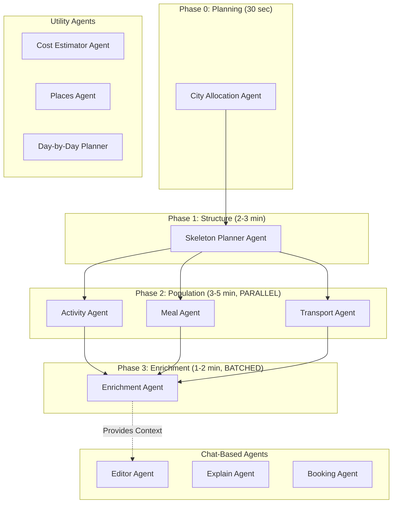
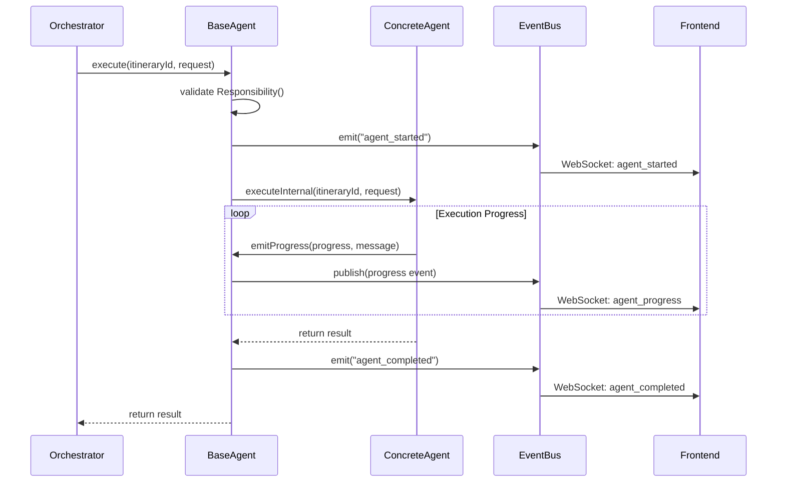
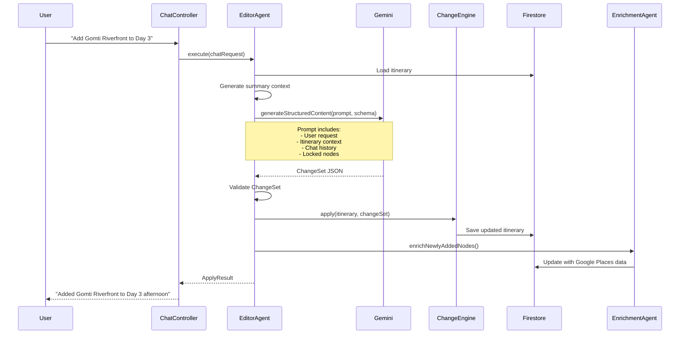

# HLD-04: Multi-Agent System Design
## Agentic Itinerary Planner

**Document Version**: 1.0.0  
**Last Updated**: November 25, 2025  
**Status**: Complete  
**Authors**: AI/ML Team, Backend Development Team  
**Reviewers**: System Architect, Backend Tech Lead

---

## Document Information

### Purpose
This document provides comprehensive documentation of the multi-agent AI system that powers intelligent itinerary generation and chat-based editing for the Agentic Itinerary Planner.

### Target Audience
- AI/ML Engineers
- Backend Developers
- System Architects
- DevOps Engineers
- Integration Engineers

### Scope
This document covers:
- Multi-agent architecture (14 specialized agents)
- BaseAgent framework and lifecycle
- LLM integration (OpenRouter + Gemini fallback)
- Pipeline orchestration patterns
- Agent communication and event bus
- Prompt engineering strategies
- Error handling and resilience

### Related Documents
- [HLD-01: System Overview & Architecture](01-system-overview-architecture.md) - System context
- [HLD-02: Backend Architecture & Services](02-backend-architecture-services.md) - Service layer
- [HLD-03: Frontend Architecture & State Management](03-frontend-architecture-state.md) - Real-time updates
- [HLD-05: Data Architecture & Analytics](05-data-architecture-analytics.md) - Data models

---

## Table of Contents

1. [Multi-Agent Architecture Overview](#1-multi-agent-architecture-overview)
2. [BaseAgent Framework](#2-baseagent-framework)
3. [Specialized Agents](#3-specialized-agents)
4. [Pipeline Orchestration](#4-pipeline-orchestration)
5. [LLM Integration](#5-llm-integration)
6. [Agent Communication](#6-agent-communication)
7. [Prompt Engineering](#7-prompt-engineering)
8. [Error Handling & Resilience](#8-error-handling--resilience)
9. [Appendices](#9-appendices)

---

## 1. Multi-Agent Architecture Overview

### 1.1 Why Multi-Agent Design?

**Problems with Monolithic Approach**:
- Single 150-second LLM call (timeout risk 80%)
- No progressive loading (all-or-nothing UX)
- Difficult to debug failures
- Single point of failure
- No specialization (generic prompts)

**Benefits of Multi-Agent Architecture**:
- **Reliability**: Smaller API calls reduce timeout risk by 80%
- **Better UX**: Progressive loading shows results as they're ready
- **Easier to debug**: Clear agent boundaries and responsibilities
- **Specialization**: Each agent has focused prompts and validation
- **Parallel execution**: 3-5x faster total time
- **Graceful degradation**: Individual agent failures don't break everything

### 1.2 Agent Taxonomy



### 1.3 Agent Catalog

| Agent | Phase | Type | Purpose | LLM | Execution |
|-------|-------|------|---------|-----|-----------|
| **CityAllocationAgent** | 0 | Planning | Multi-city trip planning | ✅ | Sequential |
| **SkeletonPlannerAgent** | 1 | Structure | Day structure + placeholders | ✅ | Sequential |
| **ActivityAgent** | 2 | Population | Attraction details | ✅ | Parallel |
| **MealAgent** | 2 | Population | Restaurant details | ✅ | Parallel |
| **TransportAgent** | 2 | Population | Transport details | ✅ | Parallel |
| **EnrichmentAgent** | 3 | Enrichment | Google Places data | ❌ | Batched |
| **EditorAgent** | Chat | Editing | Chat-based modifications | ✅ | On-demand |
| **ExplainAgent** | Chat | Information | Explain itinerary items | ✅ | On-demand |
| **BookingAgent** | Chat | Integration | Execute bookings | ✅ | On-demand |
| **CostEstimatorAgent** | Utility | Analysis | Cost breakdown | ✅ | On-demand |
| **PlacesAgent** | Utility | Search | Place search/details | ❌ | On-demand |
| **DayByDayPlannerAgent** | Utility | Planning | Single-day planning | ✅ | On-demand |

**Total: 13 agents** (12 shown + 1 deprecated)

---

## 2. BaseAgent Framework

### 2.1 Design Philosophy

**BaseAgent** provides a standardized foundation for all agents:
- Lifecycle management (`execute`, `executeInternal`)
- Progress reporting (`emitProgress`, `emitEvent`)
- Capability declaration (`getCapabilities`, `canHandle`)
- Event bus integration
- Error handling patterns

### 2.2 BaseAgent Architecture

```java
/**
 * BaseAgent - Abstract base class for all AI agents.
 * Provides standardized lifecycle, event emission, and capability management.
 */
public abstract class BaseAgent {
    
    protected final Logger logger = LoggerFactory.getLogger(getClass());
    protected final AgentEventBus eventBus;
    
    private final String agentId;
    private final AgentEvent.AgentKind agentKind;
    
    protected BaseAgent(AgentEventBus eventBus, AgentEvent.AgentKind agentKind) {
        this.eventBus = eventBus;
        this.agentKind = agentKind;
        this.agentId = UUID.randomUUID().toString();
    }
    
    /**
     * Main execution entry point with standardized lifecycle.
     */
    public final <T> T execute(String itineraryId, AgentRequest<T> request) {
        logger.info("=== {} STARTING ===", getAgentName());
        logRequest(request);
        
        try {
            // Validate responsibility
            validateResponsibility(request);
            
            // Emit start event
            emitEvent(itineraryId, "agent_started", buildStartEventData());
            
            // Execute core logic (implemented by subclasses)
            T result = executeInternal(itineraryId, request);
            
            // Emit completion event
            emitEvent(itineraryId, "agent_completed", buildCompletionEventData(result));
            
            logger.info("=== {} COMPLETE ===", getAgentName());
            return result;
            
        } catch (Exception e) {
            logger.error("{} execution failed", getAgentName(), e);
            emitEvent(itineraryId, "agent_failed", buildErrorEventData(e));
            throw new RuntimeException(getAgentName() + " failed: " + e.getMessage(), e);
        }
    }
    
    /**
     * Emit progress update (0-100).
     */
    protected void emitProgress(String itineraryId, int progress, String message, String stage) {
        AgentEvent event = AgentEvent.builder()
            .eventId(UUID.randomUUID().toString())
            .itineraryId(itineraryId)
            .agentId(agentId)
            .agentKind(agentKind)
            .eventType("progress")
            .progress(progress)
            .message(message)
            .stage(stage)
            .timestamp(Instant.now())
            .build();
            
        eventBus.publish(event);
    }
    
    /**
     * Declare agent capabilities (must be implemented by subclasses).
     */
    public abstract AgentCapabilities getCapabilities();
    
    /**
     * Core execution logic (must be implemented by subclasses).
     */
    protected abstract <T> T executeInternal(String itineraryId, AgentRequest<T> request);
    
    /**
     * Get human-readable agent name.
     */
    protected abstract String getAgentName();
}
```

### 2.3 Agent Lifecycle



### 2.4 AgentCapabilities

```java
public class AgentCapabilities {
    private List<String> supportedTasks;  // e.g., ["skeleton", "populate_attractions"]
    private int priority;                 // Lower = higher priority (1-100)
    private boolean chatEnabled;          // Can handle chat requests?
    private Map<String, Object> configuration; // Agent-specific config
    
    public void addSupportedTask(String task) {
        if (supportedTasks == null) {
            supportedTasks = new ArrayList<>();
        }
        supportedTasks.add(task);
    }
    
    public void setConfigurationValue(String key, Object value) {
        if (configuration == null) {
            configuration = new HashMap<>();
        }
        configuration.put(key, value);
    }
}
```

**Example Usage**:
```java
@Override
public AgentCapabilities getCapabilities() {
    AgentCapabilities capabilities = new AgentCapabilities();
    
    // Declare supported tasks
    capabilities.addSupportedTask("skeleton");
    
    // Set priority (1 = highest)
    capabilities.setPriority(1);
    
    // Chat capabilities
    capabilities.setChatEnabled(false); // Pipeline-only
    
    // Configuration
    capabilities.setConfigurationValue("daysPerBatch", 1);
    capabilities.setConfigurationValue("lightweight", true);
    
    return capabilities;
}
```

---

## 3. Specialized Agents

### 3.1 CityAllocationAgent

**Purpose**: Plan multi-city trips with optimal day allocation per city

**Phase**: 0 (Planning)  
**Execution**: Sequential  
**LLM**: Yes (OpenRouter/Gemini)

**Input**:
```java
CreateItineraryReq {
    destination: "North India",
    startDate: "2025-12-15",
    endDate: "2025-12-23",
    durationDays: 9,
    multiCity: true
}
```

**Output**:
```java
CityAllocationPlan {
    allocations: [
        { cityName: "Delhi", startDay: 1, endDay: 3, nights: 2 },
        { cityName: "Agra", startDay: 4, endDay: 5, nights: 1 },
        { cityName: "Jaipur", startDay: 6, endDay: 9, nights: 3 }
    ],
    travelSegments: [
        { dayNumber: 4, fromCity: "Delhi", toCity: "Agra", estimatedHours: 4 },
        { dayNumber: 6, fromCity: "Agra", toCity: "Jaipur", estimatedHours: 5 }
    ]
}
```

**Key Methods**:
- `allocateCities()` - Main entry point
- `buildCityAllocationPrompt()` - LLM prompt construction
- `parseCityAllocationResponse()` - Parse LLM JSON response
- `validateCityAllocation()` - Ensure valid day counts

**Prompt Strategy**:
- Extract destination hints (e.g., "Golden Triangle" → Delhi, Agra, Jaipur)
- Consider travel times between cities
- Balance days per city (minimum 2 nights for meaningful visit)
- Account for arrival/departure days

### 3.2 SkeletonPlannerAgent

**Purpose**: Generate lightweight day structure with placeholder nodes

**Phase**: 1 (Structure)  
**Execution**: Sequential (day-by-day)  
**LLM**: Yes (focused prompts)

**Responsibilities**:
- Create day structure (day number, date, location)
- Create placeholder nodes (type, rough timing)
- Determine node sequence (logical flow)
- **No detailed information** (titles, descriptions, costs handled by specialized agents)

**Output Example**:
```java
NormalizedDay {
    dayNumber: 2,
    date: "2025-12-16",
    location: "Agra",
    nodes: [
        { id: "day2_node1", type: "attraction", timing: { startTime: "09:00" } },
        { id: "day2_node2", type: "meal", timing: { startTime: "12:30" } },
        { id: "day2_node3", type: "attraction", timing: { startTime: "14:00" } },
        { id: "day2_node4", type: "accommodation", timing: { startTime: "20:00" } }
    ]
}
```

**Why Skeleton-First**:
1. **Fast**: 15-20 seconds vs 60-150s for complete generation
2. **Progressive UX**: Shows structure immediately
3. **Pre-creates infrastructure**: Transport & accommodation nodes before LLM call
4. **Enables parallel population**: Other agents fill in details simultaneously

**Implementation**:
```java
public NormalizedItinerary generateSkeleton(String itineraryId, CreateItineraryReq request) {
    // Load city allocation plan
    CityAllocationPlan cityPlan = loadCityPlan(itineraryId);
    
   // Generate days in batches
    int totalDays = request.getDurationDays();
    List<NormalizedDay> previousDays = new ArrayList<>();
    
    for (int dayNumber = 1; dayNumber <= totalDays; dayNumber++) {
        // Find city for this day
        CityAllocation city = getCityForDay(cityPlan, dayNumber);
        TravelSegment travel = getTravelSegmentForDay(cityPlan, dayNumber);
        
        // Pre-create infrastructure nodes BEFORE LLM call
        List<NormalizedNode> preCreatedNodes = new ArrayList<>();
        
        // Add arrival travel (Day 1)
        if (dayNumber == 1 && shouldAddArrivalTravel(request, city)) {
            preCreatedNodes.add(createArrivalTravelNode(dayNumber, request, city));
        }
        
        // Add inter-city travel
        if (travel != null) {
            preCreatedNodes.add(createTravelNode(dayNumber, travel));
        }
        
        // Add departure travel (Last day)
        if (dayNumber == totalDays && shouldAddDepartureTravel(request, city)) {
            preCreatedNodes.add(createDepartureTravelNode(dayNumber, request, city));
        }
        
        // Add accommodation
        if (!isLastDayReturningHome(dayNumber, totalDays, request, city)) {
            preCreatedNodes.add(createAccommodationNode(dayNumber, city));
        }
        
        // Generate skeleton with LLM (activities + meals only)
        NormalizedDay day = generateDaySkeleton(request, dayNumber, city, travel, 
                                                previousDays, preCreatedNodes);
        
        // Save immediately for real-time access
        itinerary.getDays().add(day);
        itineraryJsonService.updateItineraryWithLock(itinerary);
        
        // Publish day_completed event
        agentEventPublisher.publishDayCompleted(itineraryId, executionId, day);
        
        previousDays.add(day);
    }
    
    return itinerary;
}
```

### 3.3 ActivityAgent

**Purpose**: Populate attraction and activity nodes with detailed information

**Phase**: 2 (Population)  
**Execution**: Parallel (with MealAgent, TransportAgent)  
**LLM**: Yes (specialized prompts)

**Responsibilities**:
- Add specific place names (e.g., "Senso-ji Temple" not "Morning Activity")
- Add detailed descriptions (2-3 sentences)
- Add categories (museum, landmark, park, temple_shrine, etc.)
- Add duration estimates (realistic visit times)
- Add opening hours
- Add difficulty/accessibility info

**Does NOT Handle**: Meals Transport, Accommodation, Costs, Coordinates (handled by other agents)

**Processing Time**: 10-15 seconds for typical itinerary

**Implementation**:
```java
public void populateAttractions(String itineraryId, NormalizedItinerary skeleton) {
    emitProgress(itineraryId, 10, "Loading attraction data", "loading");
    
    // Extract all attraction nodes from skeleton
    List<AttractionContext> contexts = extractAttractionNodes(skeleton);
    
    if (contexts.isEmpty()) {
        logger.info("No attraction nodes to populate");
        return;
    }
    
    // Populate with AI
    List<PopulatedAttraction> populated = populateAttractionsWithAI(skeleton, contexts);
    
    // Validate durations (ensure feasible schedule)
    List<PopulatedAttraction> validated = validateActivityDurations(populated, skeleton);
    
    // Update itinerary
    updateItineraryWithAttractions(itineraryId, skeleton, validated);
    
    emitProgress(itineraryId, 100, 
        String.format("Populated %d attractions", populated.size()), 
        "complete");
}
```

**Prompt Highlights**:
```java
private String buildActivitySystemPrompt() {
    return """
        You are a travel expert specializing in attractions and activities.
        
        CRITICAL: Use the EXACT node IDs provided. Do NOT generate your own node IDs.
        
        Activity Duration Guidelines:
        - Landmark/Monument: 60-90 minutes
        - Museum/Gallery: 90-120 minutes
        - Temple/Shrine: 45-60 minutes
        - Park/Garden: 60-90 minutes
        - Safari/Trek: 240-480 minutes
        - Theme Park: 360-480 minutes
        
        Categories: museum, landmark, park, temple_shrine, entertainment, shopping, nature
        
        Be specific and searchable on Google Maps.
        """;
}
```

### 3.4 MealAgent

**Purpose**: Populate meal nodes with restaurant recommendations

**Phase**: 2 (Population)  
**Execution**: Parallel  
**LLM**: Yes

**Responsibilities**:
- Restaurant names with cuisine type
- Meal type (breakfast, lunch, dinner, snack)
- Price range estimates
- Popular dishes/specialties
- Location details
- Dietary considerations

**Validation**:
- Meal timing consistency (breakfast 7-10am, lunch 12-2pm, dinner 7-10pm)
- No duplicate restaurants in consecutive days
- Cuisine variety across the trip

### 3.5 TransportAgent

**Purpose**: Populate transport nodes with route details

**Phase**: 2 (Population)  
**Execution**: Parallel  
**LLM**: Yes

**Responsibilities**:
- Transport mode selection (flight, train, car, bus, ferry)
- Route information (origin → destination)
- Duration estimates
- Cost estimates by transport class
- Booking hints

**Special Cases**:
- Airport transfers (Day 1 arrival, Last day departure)
- Inter-city travel (multi-city trips)
- Local transport between attractions (optional)

### 3.6 EnrichmentAgent

**Purpose**: Enrich nodes with Google Places API data (coordinates, photos, reviews)

**Phase**: 3 (Enrichment)  
**Execution**: Batched parallel (3 days at a time, configurable)  
**LLM**: No (API-based)

**Data Added**:
- Google Place ID
- Exact coordinates (latitude, longitude)
- Google rating + review count
- Photo URLs (up to 5 per place)
- Opening hours (actual data)
- Official website
- Phone number
- Price level

**Implementation Strategy**:
```java
public void enrichItinerary(String itineraryId, NormalizedItinerary skeleton, String executionId) {
    if ("sequential".equals(enrichmentMode)) {
        // SEQUENTIAL: Day-by-day (slowest, safest)
        executeEnrichmentSequential(itineraryId, skeleton, executionId);
    } else {
        // BATCHED PARALLEL: N days at a time (balanced)
        executeEnrichmentBatchedParallel(itineraryId, skeleton, executionId);
    }
}

private void executeEnrichmentBatchedParallel(String itineraryId, NormalizedItinerary skeleton, String executionId) {
    int batchSize = 3; // Process 3 days at a time
    List<NormalizedDay> days = skeleton.getDays();
    
    for (int i = 0; i < days.size(); i += batchSize) {
        int end = Math.min(i + batchSize, days.size());
        List<NormalizedDay> batch = days.subList(i, end);
        
        // Enrich batch in parallel
        List<CompletableFuture<Void>> futures = batch.stream()
            .map(day -> CompletableFuture.runAsync(() -> {
                enrichDay(itineraryId, day, executionId);
            }, executorService))
            .collect(Collectors.toList());
            
        // Wait for batch completion
        CompletableFuture.allOf(futures.toArray(new CompletableFuture[0])).join();
        
        // Publish progress
        int progress = (int) ((end * 100.0) / days.size());
        publishPhaseProgress(itineraryId, executionId, "enrichment", progress, 
            String.format("Enriched %d/%d days", end, days.size()));
    }
}
```

**Why Batched?**:
- **Avoids rate limits**: Google Places API has rate limits (can't do 50+ places simultaneously)
- **Balances speed vs safety**: Faster than sequential, safer than full parallel
- **Progressive updates**: Frontend sees batches of enriched data incrementally

### 3.7 EditorAgent

**Purpose**: Handle chat-based itinerary modifications using LLM

**Phase**: Chat (on-demand)  
**Execution**: On-demand (triggered by user chat)  
**LLM**: Yes (Gemini)

**Capabilities**:
- Add new nodes ("Add Gomti Riverfront to Day 3")
- Remove nodes ("Remove the lunch on Day 2")
- Replace nodes ("Replace dinner with vegetarian restaurant")
- Move nodes ("Move the museum visit to afternoon")
- Reschedule nodes ("Start Day 1 at 10am instead of 8am")

**Workflow**:



**ChangeSet Format**:
```json
{
  "ops": [
    {
      "op": "insert",
      "after": "day3_att_2",
      "node": {
        "title": "Gomti Riverfront",
        "type": "attraction",
        "location": {
          "name": "Gomti Riverfront, Lucknow",
          "address": "Gomti Riverfront, Lucknow"
        },
        "timing": {
          "startTime": "16:00",
          "endTime": "18:00"
        }
      }
    }
  ],
  "day": 3,
  "reason": "Adding Gomti Riverfront to Day 3 as requested by user",
  "agent": "EditorAgent"
}
```

**Prompt Engineering for EditorAgent**:

```java
private String buildChangeSetPrompt(ChatRequest chatRequest, String context) {
    return """
        === CRITICAL: INTENT PRESERVATION RULES ===
        1. ONLY perform the EXACT action the user requested
        2. If user says 'add X', ONLY add X - do NOT remove anything
        3. If user says 'remove X', ONLY remove X - do NOT add anything
        4. If user says 'replace X with Y', remove X and add Y - nothing else
        
        === TIME FORMAT RULES ===
        1. Use 24-hour format: "HH:mm" (e.g., "14:30", "18:00")
        2. Always use leading zeros ("09:00" not "9:00")
        
        RECENT CONVERSATION:
        """ + chatHistory + """
        
        USER REQUEST:
        """ + chatRequest.getText() + """
        
        CURRENT ITINERARY:
        """ + context + """
        
        INSTRUCTIONS:
        - Look for nodes marked [ID: xxxxx] - use EXACT ID in operations
        - NEVER generate your own node IDs unless adding new nodes
        - For 'add': use 'insert' operation with 'after' field
        - For 'replace': use 'replace' operation with exact node ID
        - For 'delete': use 'delete' operation with exact node ID
        """;
}
```

**Key Features**:
1. **Intent Preservation**: Only performs exactly what user requested (no "helpful" additions)
2. **Pronoun Resolution**: Uses chat history to resolve "it", "that", "this"
3. **Time Format Handling**: Converts 24-hour format (HH:mm) to Unix timestamps
4. **Locked Node Respect**: Validates against locked nodes before LLM call
5. **Automatic Enrichment**: Enriches newly added nodes with Google Places data

### 3.8 ExplainAgent

**Purpose**: Explain itinerary items in natural language

**Phase**: Chat  
**Execution**: On-demand  
**LLM**: Yes

**Capabilities**:
- Explain why a place was recommended
- Describe what makes a place special
- Provide historical/cultural context
- Suggest what to expect

**Does NOT modify** itinerary, only provides information.

### 3.9 BookingAgent

**Purpose**: Execute bookings for flights, hotels, activities

**Phase**: Chat  
**Execution**: On-demand  
**LLM**: Yes (for natural language interface)

**Integrations**:
- Expedia API
- Booking.com API
- Razorpay (payment processing)

**Workflow**: User confirms booking → Agent calls external API → Saves booking reference

---

## 4. Pipeline Orchestration

### 4.1 Pipeline Architecture

The **PipelineOrchestrator** coordinates the multi-phase itinerary generation flow:

```java
@Service
public class PipelineOrchestrator {
    
    @Async
    public void generateItinerary(String itineraryId, CreateItineraryReq request, String userId) {
        String executionId = UUID.randomUUID().toString();
        long start Time = System.currentTimeMillis();
        
        try {
            // Phase 0: City Allocation (30 sec)
            if (request.isMultiCity()) {
                executeCityAllocationPhase(itineraryId, request, executionId);
            }
            
            // Phase 1: Skeleton Generation (2-3 min)
            NormalizedItinerary skeleton = executeSkeletonPhase(itineraryId, request, executionId);
            
            // Phase 2: Node Population (3-5 min, PARALLEL)
            executePopulationPhase(itineraryId, skeleton, executionId);
            
            // Phase 3: Enrichment (1-2 min, BATCHED)
            executeEnrichmentPhase(itineraryId, skeleton, executionId);
            
            // Phase 4: Finalization (10 sec)
            executeFinalizationPhase(itineraryId);
            
            // Publish completion
            long totalTime = System.currentTimeMillis() - startTime;
            publishPipelineComplete(itineraryId, executionId, totalTime);
            
        } catch (Exception e) {
            publishPipelineError(itineraryId, executionId, e);
        }
    }
}
```

### 4.2 Phase 2: Parallel Population

**Key Insight**: ActivityAgent, MealAgent, and TransportAgent can run **in parallel** because they operate on independent node types.

```java
private void executePopulationPhase(String itineraryId, NormalizedItinerary skeleton, String executionId) {
    publishPhaseStart(itineraryId, executionId, "population", "Populating activities, meals, transport");
    
    // Create parallel tasks
    List<CompletableFuture<Void>> futures = new ArrayList<>();
    
    // Activity Agent
    futures.add(CompletableFuture.runAsync(() -> {
        activityAgent.populateAttractions(itineraryId, skeleton);
    }, executorService));
    
    // Meal Agent
    futures.add(CompletableFuture.runAsync(() -> {
        mealAgent.populateMeals(itineraryId, skeleton);
    }, executorService));
    
    // Transport Agent
    futures.add(CompletableFuture.runAsync(() -> {
        transportAgent.populateTransport(itineraryId, skeleton);
    }, executorService));
    
    // Wait for ALL to complete
    CompletableFuture.allOf(futures.toArray(new CompletableFuture[0])).join();
    
    publishPhaseComplete(itineraryId, executionId, "population", durationMs);
}
```

**Performance Improvement**:
- **Serial**: 45 seconds (15s × 3 agents)
- **Parallel**: 15 seconds (all run simultaneously)
- **Speedup**: 3x faster

### 4.3 Progress Tracking

Each phase reports progress to frontend via WebSocket:

```java
private void publishPhaseProgress(String itineraryId, String executionId, String phase, int progress, String message) {
    AgentEvent event = AgentEvent.builder()
        .eventId(UUID.randomUUID().toString())
        .itineraryId(itineraryId)
        .executionId(executionId)
        .eventType("phase_progress")
        .phase(phase)
        .progress(progress)
        .message(message)
        .timestamp(Instant.now())
        .build();
        
    agentEventPublisher.publish(itineraryId, event);
}
```

**Frontend receives**:
```json
{
  "type": "agent_progress",
  "agentId": "activity_agent_123",
  "progress": 45,
  "message": "Populated 5 of 12 attractions",
  "phase": "population"
}
```

---

## 5. LLM Integration

### 5.1 Multi-LLM Strategy

**Primary**: OpenRouter (Claude 3.5 Sonnet)  
**Fallback**: Google Gemini 1.5 Pro

**LLMService** implements automatic fallback:

```java
@Service
public class LLMService {
    
    private final OpenRouterClient openRouterClient;
    private final GeminiClient geminiClient;
    
    public String complete(String prompt) {
        try {
            // Try OpenRouter first (Claude 3.5 Sonnet)
            return openRouterClient.complete(prompt);
        } catch (Exception e) {
            logger.warn("OpenRouter failed, falling back to Gemini", e);
            try {
                // Fallback to Gemini
                return geminiClient.complete(prompt);
            } catch (Exception fallbackEx) {
                logger.error("Both LLM providers failed", fallbackEx);
                throw new RuntimeException("LLM service unavailable");
            }
        }
    }
    
    public String completeWithSchema(String prompt, String jsonSchema, String systemPrompt) {
        try {
            return openRouterClient.generateStructuredContent(prompt, jsonSchema, systemPrompt);
        } catch (Exception e) {
            logger.warn("OpenRouter failed, falling back to Gemini", e);
            return geminiClient.generateStructuredContent(prompt, jsonSchema, systemPrompt);
        }
    }
}
```

### 5.2 Schema-Validated Responses

All LLM responses are validated against JSON schemas:

```java
@Service
public class LLMSchemaValidator {
    
    public ValidationResult validateWithLogging(String response, String schema, String agentName) {
        try {
            // Parse response JSON
            JsonNode responseJson = objectMapper.readTree(response);
            
            // Parse schema
            JsonSchema jsonSchema = JsonSchemaFactory.getInstance(SpecVersion.VersionFlag.V7)
                .getSchema(schema);
            
            // Validate
            Set<ValidationMessage> errors = jsonSchema.validate(responseJson);
            
            if (errors.isEmpty()) {
                logger.info("{}: Schema validation PASSED", agentName);
                return ValidationResult.success(responseJson);
            } else {
                logger.error("{}: Schema validation FAILED - {}", agentName, errors);
                return ValidationResult.failure(errors);
            }
            
        } catch (Exception e) {
            logger.error("{}: Schema validation error", agentName, e);
            return ValidationResult.failure(e.getMessage());
        }
    }
}
```

**Benefits**:
1. **Type safety**: Ensures LLM returns expected structure
2. **Early failure detection**: Catches issues before deserialization
3. **Retry opportunity**: Can retry on validation failure
4. **Debugging**: Logs exact location of schema violations

### 5.3 Retry Strategy

**ResilientAiClient** implements exponential backoff retry:

```java
@Service
public class ResilientAiClient {
    
    private final AiClient aiClient;
    private final RetryStrategy retryStrategy;
    
    public String generateWithRetry(String prompt, String schema, String systemPrompt) {
        int maxRetries = 3;
        int baseDelay = 1000; // 1 second
        
        for (int attempt = 1; attempt <= maxRetries; attempt++) {
            try {
                String response = aiClient.generateStructuredContent(prompt, schema, systemPrompt);
                
                // Validate response
                if (schemaValidator.validate(response, schema).isValid()) {
                    return response;
                } else {
                    throw new ValidationException("Schema validation failed");
                }
                
            } catch (Exception e) {
                logger.warn("Attempt {} failed: {}", attempt, e.getMessage());
                
                if (attempt == maxRetries) {
                    throw new RuntimeException("All retries exhausted", e);
                }
                
                // Exponential backoff
                int delay = baseDelay * (int) Math.pow(2, attempt - 1);
                Thread.sleep(delay);
            }
        }
        
        throw new RuntimeException("Unexpected retry logic error");
    }
}
```

---

## 6. Agent Communication

### 6.1 AgentEventBus

**Purpose**: Publish/subscribe pattern for agent events

```java
@Service
public class AgentEventBus {
    
    private final Map<String, List<EventListener>> listeners = new ConcurrentHashMap<>();
    
    public void subscribe(String eventType, EventListener listener) {
        listeners.computeIfAbsent(eventType, k -> new CopyOnWriteArrayList<>()).add(listener);
    }
    
    public void publish(AgentEvent event) {
        List<EventListener> eventListeners = listeners.get(event.getEventType());
        if (eventListeners != null) {
            for (EventListener listener : eventListeners) {
                try {
                    listener.onEvent(event);
                } catch (Exception e) {
                    logger.error("Event listener failed", e);
                }
            }
        }
    }
}
```

### 6.2 WebSocket Event Publishing

```java
@Service
public class AgentEventPublisher {
    
    private final WebSocketBroadcastService webSocketService;
    
    public void publishAgentProgress(String itineraryId, String executionId, String agentName, int progress) {
        Map<String, Object> payload = new HashMap<>();
        payload.put("agentName", agentName);
        payload.put("progress", progress);
        payload.put("executionId", executionId);
        
        webSocketService.sendToItinerary(itineraryId, "agent_progress", payload);
    }
    
    public void publishDayCompleted(String itineraryId, String executionId, NormalizedDay day) {
        Map<String, Object> payload = new HashMap<>();
        payload.put("dayNumber", day.getDayNumber());
        payload.put("executionId", executionId);
        payload.put("day", day); // Include full day data for immediate rendering
        
        webSocketService.sendToItinerary(itineraryId, "day_completed", payload);
    }
    
    public void publishPhaseTransition(String itineraryId, String executionId, String fromPhase, String toPhase) {
        Map<String, Object> payload = new HashMap<>();
        payload.put("fromPhase", fromPhase);
        payload.put("toPhase", toPhase);
        payload.put("executionId", executionId);
        
        webSocketService.sendToItinerary(itineraryId, "phase_transition", payload);
    }
}
```

### 6.3 Event Types

| Event Type | Purpose | Payload |
|------------|---------|---------|
| `agent_started` | Agent begins execution | `{ agentName, executionId }` |
| `agent_progress` | Progress update (0-100) | `{ agentName, progress, message }` |
| `agent_completed` | Agent finished successfully | `{ agentName, executionId, resultCount }` |
| `agent_failed` | Agent execution failed | `{ agentName, error, executionId }` |
| `day_completed` | Day structure created | `{ dayNumber, day, executionId }` |
| `phase_transition` | Moving to next phase | `{ fromPhase, toPhase, executionId }` |
| `pipeline_complete` | Full pipeline finished | `{ totalTime, itineraryId }` |

---

## 7. Prompt Engineering

### 7.1 Prompt Structure

**Effective agent prompts follow this structure**:

1. **Role Definition**: "You are a travel expert specializing in..."
2. **Task Description**: "Your task: Suggest specific attractions..."
3. **Critical Rules**: "CRITICAL: Use EXACT node IDs..."
4. **Guidelines**: "1. Use real place names 2. Write engaging descriptions..."
5. **Examples**: "Example 1: Good vs Bad..."
6. **JSON Schema Reference**: "Generate ONLY the JSON, no additional text"

### 7.2 Example: ActivityAgent Prompt

```java
private String buildActivitySystemPrompt() {
    return """
        You are a travel expert specializing in attractions and activities.
        
        Your task: Suggest SPECIFIC attractions for placeholder activity nodes.
        
        CRITICAL: Use the EXACT node IDs provided. Do NOT generate your own node IDs.
        
        Guidelines:
        1. Provide real, specific place names (e.g., "Tokyo National Museum" not "Museum")
        2. Write engaging descriptions (2-3 sentences)
        3. Assign appropriate categories
        4. Estimate realistic visit durations
        5. For locationName, provide SPECIFIC place name, NOT just district
           - GOOD: "Shibuya Crossing", "Senso-ji Temple"
           - BAD: "Shibuya", "Asakusa"
        
        Duration Guidelines:
        - Landmark: 60-90 min
        - Museum: 90-120 min
        - Temple: 45-60 min
        - Safari: 240-480 min
        
        Categories: museum, landmark, park, temple_shrine, entertainment, shopping, nature
        
        Be specific enough to find on Google Maps.
        """;
}

private String buildActivityUserPrompt(NormalizedItinerary skeleton, List<AttractionContext> contexts) {
    StringBuilder prompt = new StringBuilder();
    
    // Group by day to prevent wrong-city suggestions
    Map<Integer, List<AttractionContext>> contextsByDay = groupByDay(contexts);
    
    prompt.append("=== ATTRACTION SLOTS TO POPULATE (BY DAY) ===\n");
    
    for (Map.Entry<Integer, List<AttractionContext>> entry : contextsByDay.entrySet()) {
        int dayNum = entry.getKey();
        String dayLocation = entry.getValue().get(0).dayLocation;
        
        prompt.append(String.format("\n** DAY %d - LOCATION: %s **\n", dayNum, dayLocation));
        prompt.append(String.format("CRITICAL: All attractions for Day %d MUST be in %s!\n", dayNum, dayLocation));
        
        for (AttractionContext ctx : entry.getValue()) {
            prompt.append(String.format("  - Node ID: %s, Time: %s\n", ctx.nodeId, ctx.timing));
        }
    }
    
    prompt.append("\n=== CRITICAL RULES ===\n");
    prompt.append("1. Use EXACT node IDs listed above\n");
    prompt.append("2. Each attraction MUST be in the CORRECT CITY for that day\n");
    prompt.append("3. Provide specific names searchable on Google Maps\n");
    
    return prompt.toString();
}
```

### 7.3 Prompt Engineering Best Practices

1. **Be Explicit**: State requirements 2-3 times in different ways
2. **Use Examples**: Show good vs bad examples
3. **Structure with Headings**: Use === SECTION === for scannability
4. **Capitalize Critical Points**: "CRITICAL:", "MUST", "NEVER"
5. **Repeat Node ID Instructions**: LLMs often generate IDs despite instructions
6. **Provide Context Window**: Include related data (previous days, chat history)
7. **Validate Output**: Always validate LLM responses against JSON schema

---

## 8. Error Handling & Resilience

### 8.1 Error Handling Strategy

**Graceful Degradation**: Individual agent failures don't break the entire itinerary.

```java
try {
    activityAgent.populateAttractions(itineraryId, skeleton);
} catch (Exception e) {
    logger.error("ActivityAgent failed, but continuing pipeline", e);
    // Skeleton remains with placeholder nodes
    // User can still see basic structure
    // Can retry population later
}
```

### 8.2 Optimistic Locking

**Problem**: Multiple agents updating same itinerary concurrently → data loss

**Solution**: Optimistic locking with version field

```java
public void updateItineraryWithLock(NormalizedItinerary itinerary) {
    int maxRetries = 3;
    int retryCount = 0;
    
    while (retryCount < maxRetries) {
        try {
            // Read current version from Firestore
            DocumentSnapshot snapshot = firestore
                .collection("itineraries")
                .document(itinerary.getItineraryId())
                .get()
                .get();
                
            Integer currentVersion = snapshot.getLong("version").intValue();
            
            // Check version match
            if (!itinerary.getVersion().equals(currentVersion)) {
                throw new ConcurrentModificationException(
                    "Version mismatch: expected " + currentVersion + ", got " + itinerary.getVersion()
                );
            }
            
            // Increment version
            itinerary.setVersion(currentVersion + 1);
            
            // Write with version check
            firestore
                .collection("itineraries")
                .document(itinerary.getItineraryId())
                .set(itinerary)
                .get();
                
            logger.info("Successfully updated itinerary with lock (version {})", itinerary.getVersion());
            return; // Success
            
        } catch (ConcurrentModificationException e) {
            retryCount++;
            logger.warn("Concurrent modification detected (attempt {}/{})", retryCount, maxRetries);
            
            if (retryCount < maxRetries) {
                // Reload and retry
                itinerary = reloadItinerary(itinerary.getItineraryId());
                Thread.sleep(100 * retryCount); // Exponential backoff
            } else {
                throw new RuntimeException("Max retries exceeded for optimistic locking", e);
            }
        }
    }
}
```

### 8.3 Circuit Breaker Pattern

**For external APIs** (Google Places, LLM providers):

```java
@Service
public class CircuitBreakerService {
    
    private final Map<String, CircuitBreaker> breakers = new ConcurrentHashMap<>();
    
    public <T> T execute(String serviceName, Supplier<T> operation) {
        CircuitBreaker breaker = breakers.computeIfAbsent(serviceName, this::createBreaker);
        
        if (breaker.isOpen()) {
            throw new ServiceUnavailableException(serviceName + " circuit breaker is OPEN");
        }
        
        try {
            T result = operation.get();
            breaker.recordSuccess();
            return result;
        } catch (Exception e) {
            breaker.recordFailure();
            throw e;
        }
    }
    
    private CircuitBreaker createBreaker(String serviceName) {
        return new CircuitBreaker(
            5,      // Max failures before opening
            60000,  // 60 seconds until half-open
            3       // Successful calls to close
        );
    }
}
```

---

## 9. Appendices

### 9.1 Complete Agent List

| # | Agent | Phase | LLM | Parallel | Purpose |
|---|-------|-------|-----|----------|---------|
| 1 | CityAllocationAgent | 0 | ✅ | ❌ | Multi-city planning |
| 2 | SkeletonPlannerAgent | 1 | ✅ | ❌ | Day structure |
| 3 | ActivityAgent | 2 | ✅ | ✅ | Attraction details |
| 4 | MealAgent | 2 | ✅ | ✅ | Restaurant details |
| 5 | TransportAgent | 2 | ✅ | ✅ | Transport details |
| 6 | EnrichmentAgent | 3 | ❌ | Batched | Google Places data |
| 7 | EditorAgent | Chat | ✅ | ❌ | Chat modifications |
| 8 | ExplainAgent | Chat | ✅ | ❌ | Explanations |
| 9 | BookingAgent | Chat | ✅ | ❌ | Booking execution |
| 10 | CostEstimatorAgent | Utility | ✅ | ❌ | Cost breakdown |
| 11 | PlacesAgent | Utility | ❌ | ❌ | Place search |
| 12 | DayByDayPlannerAgent | Utility | ✅ | ❌ | Single-day plans |

### 9.2 Performance Metrics

**Monolithic Approach** (deprecated):
- **Total Time**: 60-150 seconds
- **Timeout Rate**: 80% for 7+ day trips
- **UX**: All-or-nothing (no progressive loading)

**Multi-Agent Pipeline** (current):
- **Total Time**: 6-8 minutes for 7-day trip
  - Phase 0: 30 sec (city allocation)
  - Phase 1: 2-3 min (skeleton)
  - Phase 2: 3-5 min (population, parallel)
  - Phase 3: 1-2 min (enrichment, batched)
  - Phase 4: 10 sec (finalization)
- **Timeout Rate**: <5%
- **UX**: Progressive (day-by-day updates)
- **Parallel Speedup**: 3x faster population phase

### 9.3 LLM Usage by Agent

| Agent | LLM Calls | Tokens (Avg) | Purpose |
|-------|-----------|--------------|---------|
| CityAllocationAgent | 1 | 500 | City planning |
| SkeletonPlannerAgent | N days | 300/day | Day structure |
| ActivityAgent | 1 | 1500 | All attractions |
| MealAgent | 1 | 1000 | All meals |
| TransportAgent | 1 | 800 | All transport |
| EditorAgent | 1/chat | 1200 | Modifications |
| ExplainAgent | 1/query | 500 | Explanations |

**Total for 7-day trip**: ~15,000 tokens (~$0.02 cost)

### 9.4 Version History

| Version | Date | Changes |
|---------|------|---------|
| 1.0.0 | 2025-11-25 | Initial HLD-04 document |

---

**Document Status**: ✅ Complete  
**Next Review Date**: 2026-02-25  
**Owner**: AI/ML Team Lead

---

*This document is part of the Agentic Itinerary Planner High-Level Design documentation suite.*
