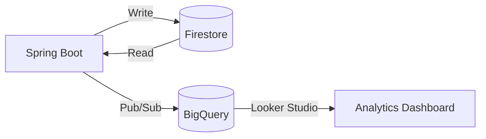
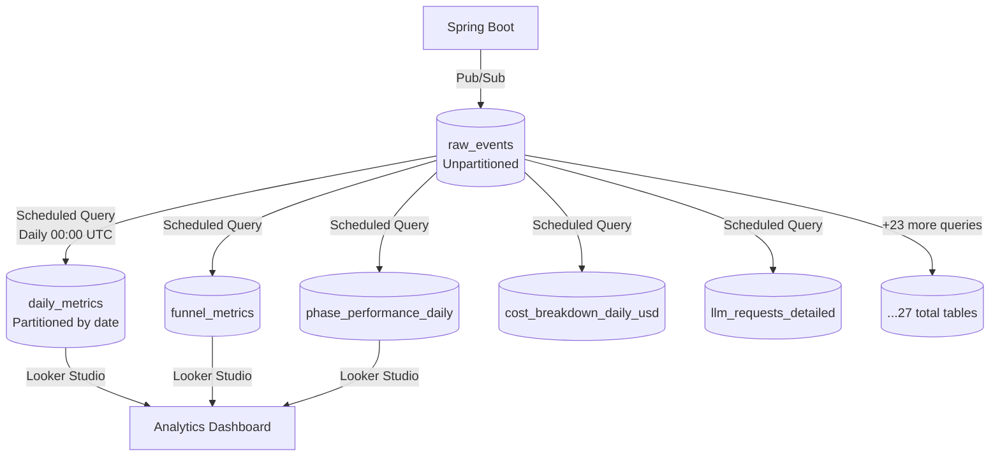
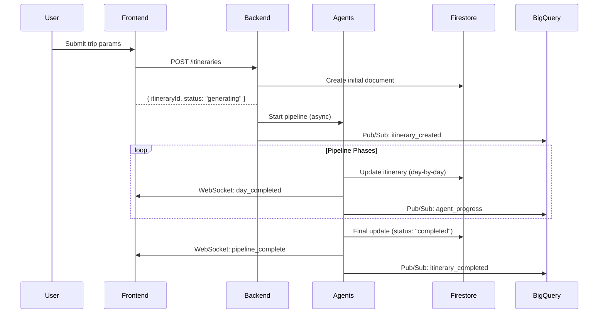
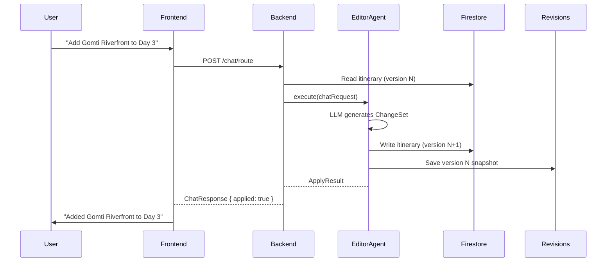
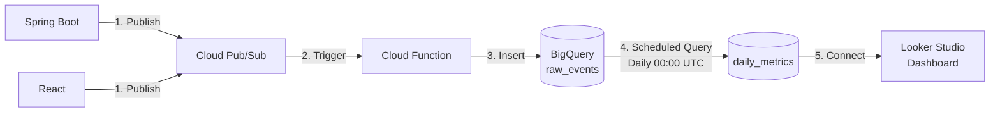

# HLD-05: Data Architecture & Analytics
## Agentic Itinerary Planner

**Document Version**: 1.0.0  
**Last Updated**: November 25, 2025  
**Status**: Complete  
**Authors**: Data Engineering Team  
**Reviewers**: System Architect, Data Lead

---

## Document Information

### Purpose
Comprehensive documentation of data architecture, database schema, analytics pipeline, and data flow patterns.

### Target Audience
Data Engineers, Backend Developers, Database Administrators, Analytics Engineers, BI Team

### Scope
- Normalized Itinerary data model
- Firestore schema (4 collections + subcollections)
- BigQuery analytics (28+ queries, scheduled updates)
- Currency normalization (USD storage strategy)
- Data flow and caching

### Related Documents
- [HLD-01: System Overview](01-system-overview-architecture.md) - System context
- [HLD-02: Backend Architecture](02-backend-architecture-services.md) - Service layer
- [HLD-04: Multi-Agent System](04-multi-agent-system-design.md) - Agent data requirements

---

## Table of Contents

1. [Data Architecture Overview](#1-data-architecture-overview)
2. [Normalized Itinerary Model](#2-normalized-itinerary-model)
3. [Firestore Schema](#3-firestore-schema)
4. [BigQuery Analytics](#4-bigquery-analytics)
5. [Currency Normalization](#5-currency-normalization)
6. [Data Flow](#6-data-flow)
7. [Appendices](#7-appendices)

---

## 1. Data Architecture Overview

### 1.1 Database Strategy

**Operational**: Google Cloud Firestore (NoSQL)  
**Analytics**: BigQuery  
**Caching**: React Query (frontend), In-memory (backend)



### 1.2 Collections Overview

| Collection | Purpose | Documents | Size |
|------------|---------|-----------|------|
| `itineraries` | Trip plans | ~1,000 | ~50MB |
| `users` | User profiles | ~500 | ~5MB |
| `itineraries/{id}/revisions` | Version history | ~5,000 | ~25MB |
| `itineraries/{id}/chatHistory` | Chat messages | ~2,000 | ~2MB |

**Analytics Tables**:
- `analytics.raw_events` (~100K events/month, ~500MB/month)
- `analytics.daily_metrics` (partitioned by date)
- 27 additional analytics tables

---

## 2. Normalized Itinerary Model

### 2.1 Core Structure

```typescript
interface NormalizedItinerary {
  // Identity (Primary Key: itineraryId)
  itineraryId: string;              // e.g., "itin_abc123"
  version: number;                  // Optimistic locking
  userId: string;                   // Firebase UID
  createdAt: number;                // Unix ms
  updatedAt: number;                // Unix ms
  
  // Status & Metadata
  status: 'planning' | 'generating' | 'completed' | 'failed';
  summary: string;                  // Trip name
  currency: string;                 // Display (e.g., "EUR")
  themes: string[];                 // ["adventure", "culture"]
  
  // Trip Parameters
  destination: string;
  startDate: string;                // ISO: "2025-12-15"
  endDate: string;
  budgetMin: number;                // USD (storage)
  budgetMax: number;                // USD (storage)
  partySize: number;
  
  // **Core Collections**
  days: NormalizedDay[];            // Day plans
  settings: ItinerarySettings;
  agents: Record<string, AgentStatus>;
  
  // Budget
  budgetSummary: BudgetSummary;
  
  // Map
  mapBounds: MapBounds;
  countryCentroid: Coordinates;
}
```

### 2.2 NormalizedDay

```typescript
interface NormalizedDay {
  dayNumber: number;                // 1-based
  date: string;                     // ISO
  location: string;                 // City name
  summary?: string;
  pace?: 'relaxed' | 'balanced' | 'intense';
  
  // Metrics
  totalDistance?: number;           // km
  totalCost?: number;               // USD
  totalDuration?: number;           // minutes
  
  // **Core**
  nodes: NormalizedNode[];          // Activities, meals, transport
  edges?: Edge[];                   // Node connections
  
  // Constraints
  timeWindowStart?: string;         // "09:00"
  timeWindowEnd?: string;           // "18:00"
  timeZone?: string;                // "UTC"
}
```

### 2.3 NormalizedNode (Activity/Meal/Transport/Hotel)

```typescript
interface NormalizedNode {
  id: string;                       // "day2_node3"
  type: 'attraction' | 'meal' | 'hotel' | 'transit';
  title: string;
  
  // Location (enriched by Google Places)
  location?: {
    name: string;
    address: string;
    coordinates: { lat: number, lng: number };
    placeId?: string;               // Google Place ID
    photos?: string[];              // Photo URLs
    rating?: number;                // 0-5
    userRatingsTotal?: number;
    priceLevel?: number;            // 1-4
  };
  
  // Timing
  timing?: {
    startTime?: number;             // Unix ms
    endTime?: number;
    durationMin?: number;
  };
  
  // Cost (ALWAYS USD)
  cost?: {
    amountPerPerson: number;        // USD
    currency: "USD";                // Hardcoded
  };
  
  // Details
  details?: {
    category?: string;              // "museum", "landmark"
    tags?: string[];
    googleMapsUri?: string;
  };
  
  // State
  locked?: boolean;                 // Prevent edits
  bookingRef?: string;
  status?: 'planned' | 'in_progress' | 'completed';
  enrichmentStatus?: 'pending' | 'enriching' | 'enriched' | 'failed';
  updatedBy?: 'agent' | 'user';
  updatedAt?: number;
}
```

### 2.4 Budget Summary

```typescript
interface BudgetSummary {
  totalCostPerPerson: number;       // USD
  totalCostForParty: number;        // USD
  budgetMin: number;                // USD
  budgetMax: number;                // USD
  currency: "USD";                  // Storage
  partySize: number;
  warnings: string[];
  percentageUsed: number;           // 0-100
  
  dayBreakdown: DayBudget[];
  categoryBreakdown: CategoryBudget;
}
```

**Key Design Decision**: All costs stored in **USD** internally, converted to display currency on frontend.

---

## 3. Firestore Schema

### 3.1 Collection: `itineraries`

**Document ID**: `itineraryId` (UUID)

**Fields**:
```json
{
  "itineraryId": "itin_abc123",
  "version": 3,
  "userId": "firebase_uid_xyz",
  "createdAt": 1732512000000,
  "updatedAt": 1732598400000,
  "status": "completed",
  "summary": "7-Day Japan Adventure",
  "currency": "JPY",
  "themes": ["culture", "food"],
  "destination": "Tokyo, Japan",
  "startDate": "2025-12-15",
  "endDate": "2025-12-22",
  "budgetMin": 1500,
  "budgetMax": 2500,
  "partySize": 2,
  "days": [ /* NormalizedDay[] */ ],
  "settings": { "autoApply": false },
  "agents": {
    "SkeletonPlannerAgent": { "status": "completed", "lastRunAt": 1732590000000 },
    "ActivityAgent": { "status": "completed", "lastRunAt": 1732590300000 }
  },
  "budgetSummary": { /* ... */ },
  "mapBounds": { "south": 35.6, "north": 35.7, "west": 139.7, "east": 139.8 }
}
```

**Indexes**:
- `userId` (for user queries)
- `status` (for filtering)
- `createdAt` (for sorting)

**Composite Index**:
- `userId ASC`, `createdAt DESC` (user's recent trips)

### 3.2 Subcollection: `itineraries/{id}/revisions`

**Purpose**: Immutable history for undo/redo

**Document ID**: `v{version}` (e.g., "v1", "v2", "v3")

**Fields**:
```json
{
  "version": 2,
  "itinerarySnapshot": { /* complete NormalizedItinerary at this version */ },
  "changeSet": { /* ChangeSet that produced this version */ },
  "createdAt": 1732594000000,
  "createdBy": "firebase_uid_xyz"
}
```

**Retention**: Last 20 versions (configurable)

### 3.3 Subcollection: `itineraries/{id}/chatHistory`

**Purpose**: Chat conversation context for EditorAgent

**Document ID**: Auto-generated

**Fields**:
```json
{
  "timestamp": 1732595000000,
  "sender": "user",
  "text": "Add Gomti Riverfront to Day 3",
  "intent": "change",
  "applied": true,
  "changeSet": { /* ChangeSet if applied */ }
}
```

### 3.4 Collection: `users`

**Document ID**: Firebase UID

**Fields**:
```json
{
  "uid": "firebase_uid_xyz",
  "email": "user@example.com",
  "displayName": "John Doe",
  "photoURL": "https://...",
  "createdAt": 1732500000000,
  "preferences": {
    "defaultCurrency": "USD",
    "emailNotifications": true
  },
  "subscription": {
    "tier": "free",
    "expiresAt": null
  }
}
```

### 3.5 Firestore Rules

```javascript
rules_version = '2';
service cloud.firestore {
  match /databases/{database}/documents {
    
    // Itineraries: Owner can CRUD
    match /itineraries/{itineraryId} {
      allow read: if request.auth != null && 
                     (resource.data.userId == request.auth.uid || 
                      resource.data.public == true);
      allow create: if request.auth != null && 
                       request.resource.data.userId == request.auth.uid;
      allow update, delete: if request.auth != null && 
                               resource.data.userId == request.auth.uid;
      
      // Revisions: Owner can read/write
      match /revisions/{versionId} {
        allow read, write: if request.auth != null && 
                              get(/databases/$(database)/documents/itineraries/$(itineraryId)).data.userId == request.auth.uid;
      }
      
      // Chat history: Owner can read/write
      match /chatHistory/{chatId} {
        allow read, write: if request.auth != null && 
                              get(/databases/$(database)/documents/itineraries/$(itineraryId)).data.userId == request.auth.uid;
      }
    }
    
    // Users: Own profile only
    match /users/{userId} {
      allow read, write: if request.auth != null && request.auth.uid == userId;
    }
  }
}
```

---

## 4. BigQuery Analytics

### 4.1 Analytics Architecture



### 4.2 Raw Events Table

**Schema** (`analytics.raw_events`):
```json
{
  "eventId": "evt_abc123",
  "eventName": "trip_creation_completed",
  "timestamp": 1732598400000,
  "userId": "firebase_uid_xyz",
  "sessionId": "sess_123",
  "properties": {
    "itineraryId": "itin_abc123",
    "destination": "Tokyo",
    "durationDays": 7,
    "budgetUSD": 2000,
    "success": true
  },
  "userAgent": "Mozilla/5.0...",
  "ipAddress": "203.0.113.42" // Anonymized
}
```

**Event Types** (28+ events):
- `trip_wizard_started`
- `trip_creation_initiated`
- `trip_creation_completed`
- `trip_creation_failed`
- `itinerary_created`
- `itinerary_completed`
- `agent_started` / `agent_completed` / `agent_failed`
- `chat_message_sent` / `chat_response_received`
- `booking_initiated` / `booking_completed`
- `payment_initiated` / `payment_completed`
- `pdf_export_completed`
- ... (15 more)

### 4.3 Daily Metrics Table

**Table**: `analytics.daily_metrics`  
**Partition**: `date` (DATE)  
**Cluster**: `date`

**Schema**:
```sql
CREATE TABLE analytics.daily_metrics (
  date DATE,
  
  -- User Metrics
  dau INT64,                        -- Daily Active Users
  new_signups INT64,
  daily_logins INT64,
  
  -- Trip Metrics
  trip_wizard_starts INT64,
  trips_initiated INT64,
  trips_created INT64,
  trip_creation_failures INT64,
  
  -- Itinerary Metrics
  itineraries_created INT64,
  itineraries_completed INT64,
  
  -- Booking Metrics
  booking_initiations INT64,
  bookings_completed INT64,
  
  -- Export Metrics
  pdf_exports INT64,
  public_links_created INT64,
  
  -- Engagement
  total_page_views INT64,
  unique_sessions INT64,
  
  -- Chat Metrics
  chat_messages_sent INT64,
  chat_responses_received INT64,
  chat_failures INT64,
  
  -- Revenue
  revenue FLOAT64,
  
  -- Conversion Rates
  trip_completion_rate FLOAT64,
  booking_conversion_rate FLOAT64,
  itinerary_success_rate FLOAT64,
  
  last_updated TIMESTAMP
)
PARTITION BY date
CLUSTER BY date;
```

**Query** (Scheduled daily at 00:00 UTC):
```sql
-- See: bigquery/queries/daily_metrics.sql
INSERT INTO analytics.daily_metrics
SELECT
  DATE(TIMESTAMP_MILLIS(timestamp)) as date,
  COUNT(DISTINCT userId) as dau,
  COUNT(DISTINCT CASE WHEN eventName = 'user_signup_completed' THEN userId END) as new_signups,
  -- ... (60+ lines of aggregation)
FROM analytics.raw_events
WHERE DATE(TIMESTAMP_MILLIS(timestamp)) = CURRENT_DATE() - 1
GROUP BY date;
```

### 4.4 Funnel Metrics Table

**Table**: `analytics.funnel_metrics`

**Conversions Tracked**:
1. **Trip Creation Funnel**:
   - Wizard Started → Initiated (75% typical)
   - Initiated → Completed (60% typical)
   - Overall: Wizard → Completed (45% typical)

2. **Booking Funnel**:
   - Initiated → Completed (70% typical)

3. **Payment Funnel**:
   - Initiated → Completed (85% typical)

4. **Export Funnel**:
   - Initiated → Completed (95% typical)

### 4.5 Phase Performance Table

**Table**: `analytics.phase_performance_daily`

**Metrics by Pipeline Phase**:
```sql
CREATE TABLE analytics.phase_performance_daily (
  date DATE,
  phase STRING,                     -- "city_allocation", "skeleton", "population", "enrichment", "finalization"
  avg_duration_seconds FLOAT64,
  median_duration_seconds FLOAT64,
  p95_duration_seconds FLOAT64,
  success_rate FLOAT64,
  failure_count INT64,
  total_executions INT64
)
PARTITION BY date;
```

### 4.6 Complete Table List (28 tables)

| Table | Purpose | Update Frequency |
|-------|---------|------------------|
| `raw_events` | All events | Real-time (Pub/Sub) |
| `daily_metrics` | Daily KPIs | Daily 00:00 UTC |
| `funnel_metrics` | Conversion funnels | Daily 00:00 UTC |
| `phase_performance_daily` | Pipeline performance | Daily 00:00 UTC |
| `cost_breakdown_daily_usd` | Budget analysis | Daily 00:00 UTC |
| `llm_requests_detailed` | LLM usage & costs | Daily 00:00 UTC |
| `agent_error_patterns` | Agent failures | Daily 00:00 UTC |
| `itinerary_metrics_daily` | Itinerary stats | Daily 00:00 UTC |
| `user_engagement_daily` | User retention | Daily 00:00 UTC |
| `destination_popularity_daily` | Top destinations | Daily 00:00 UTC |
| `interest_analysis_daily` | Popular interests | Daily 00:00 UTC |
| `budget_accuracy_analysis` | Budget adherence | Daily 00:00 UTC |
| `validation_metrics_daily` | Data quality | Daily 00:00 UTC |
| `api_calls_performance` | API latency | Daily 00:00 UTC |
| ... (14 more tables) |

---

## 5. Currency Normalization

### 5.1 Strategy: USD Storage, Multi-Currency Display

**Problem**: Storing costs in multiple currencies makes analytics impossible

**Solution**: **Store all costs in USD**, convert to display currency on frontend

### 5.2 Storage Format

**Backend** (Java):
```java
public class NodeCost {
    private Double amountPerPerson; // ALWAYS in USD
    private String currency;        // ALWAYS "USD"
}
```

**Database** (Firestore):
```json
{
  "cost": {
    "amountPerPerson": 25.50,
    "currency": "USD"
  }
}
```

**Frontend** (TypeScript):
```typescript
interface NodeCost {
  amountPerPerson: number; // USD
  currency: "USD";
}
```

### 5.3 Conversion Flow

**During Itinerary Creation**:
1. User selects display currency (e.g., "EUR")
2. Agents generate costs in USD
3. Firestore stores costs in USD
4. Frontend converts USD → EUR for display

**Currency Service**:
```typescript
// frontend/src/services/currencyService.ts
export async function convert(amountUSD: number, toCurrency: string): Promise<number> {
  const rate = await getExchangeRate("USD", toCurrency);
  return amountUSD * rate;
}

// Display cost
const costInUserCurrency = await convert(node.cost.amountPerPerson, itinerary.currency);
```

### 5.4 Exchange Rates

**Provider**: Open Exchange Rates API  
**Update Frequency**: Daily  
**Cache**: Redis (24-hour TTL)

**Rates Table** (BigQuery):
```sql
CREATE TABLE analytics.exchange_rates (
  date DATE,
  from_currency STRING, -- "USD"
  to_currency STRING,   -- "EUR", "JPY", etc.
  rate FLOAT64
)
PARTITION BY date;
```

---

## 6. Data Flow

### 6.1 Itinerary Creation Flow



### 6.2 Chat-Based Edit Flow



### 6.3 Analytics Event Flow



**Event Publishing** (Backend):
```java
@Service
public class AnalyticsService {
    
    public void trackEvent(String eventName, Map<String, Object> properties) {
        AnalyticsEvent event = AnalyticsEvent.builder()
            .eventId(UUID.randomUUID().toString())
            .eventName(eventName)
            .timestamp(System.currentTimeMillis())
            .userId(getCurrentUserId())
            .sessionId(getSessionId())
            .properties(properties)
            .build();
            
        // Publish to Pub/Sub
        pubSubPublisher.publish("analytics-events", event);
    }
}
```

---

## 7. Appendices

### 7.1 Data Size Calculations

**Single Itinerary** (~50KB):
- Metadata: ~2KB
- 7 days × 6 nodes × 1KB = ~42KB
- Budget & settings: ~2KB
- Agent state: ~2KB
- Map bounds: ~1KB

**1,000 Itineraries**: ~50MB  
**10,000 Itineraries**: ~500MB  
**100,000 Itineraries**: ~5GB

### 7.2 BigQuery Cost Estimates

**Query Costs** (on-demand pricing: $5 per TB):
- Daily metrics query: ~0.5GB scanned = $0.0025/day = $0.91/year
- 28 scheduled queries × $0.91 = ~$25/year
- **Total**: <$30/year for scheduled queries

**Storage Costs** ($0.02 per GB/month):
- Raw events: 6GB/year = $1.44/year
- Aggregated tables: 1GB/year = $0.24/year
-**Total**: <$2/year storage

### 7.3 Firestore Cost Estimates

**Read Operations** (100K reads/day):
- 3M reads/month × $0.06 per 100K = $1.80/month = $21.60/year

**Write Operations** (20K writes/day):
- 600K writes/month × $0.18 per 100K = $1.08/month = $12.96/year

**Storage** (500MB):
- 0.5GB × $0.18/GB = $0.09/month = $1.08/year

**Total Firestore**: ~$36/year

### 7.4 Performance Benchmarks

| Operation | Latency | Notes |
|-----------|---------|-------|
| Get itinerary (Firestore) | 50-100ms | Single document read |
| Update itinerary (Firestore) | 100-200ms | Write + optimistic locking |
| BigQuery scheduled query | 5-30s | Depends on date range |
| WebSocket event publish | <10ms | Real-time updates |

### 7.5 Version History

| Version | Date | Changes |
|---------|------|---------|
| 1.0.0 | 2025-11-25 | Initial HLD-05 document |

---

**Document Status**: ✅ Complete  
**Next Review Date**: 2026-02-25  
**Owner**: Data Engineering Lead

---

*This document is part of the Agentic Itinerary Planner High-Level Design documentation suite.*
