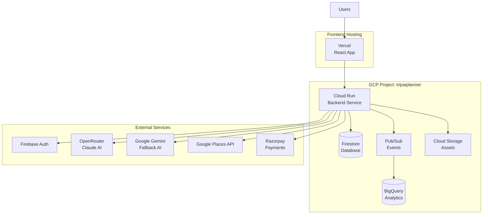
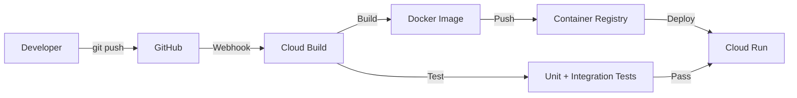
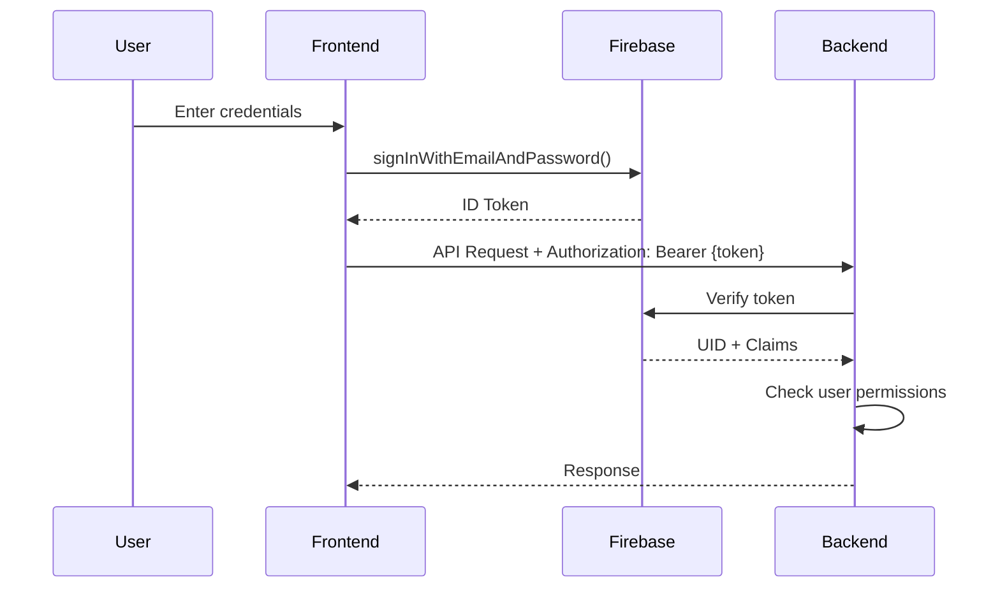

# HLD-06: Infrastructure & External Integrations
## Agentic Itinerary Planner

**Document Version**: 1.0.0  
**Last Updated**: November 25, 2025  
**Status**: Complete  
**Authors**: Infrastructure Team, DevOps Team  
**Reviewers**: System Architect, Security Lead

---

## Document Information

### Purpose
Comprehensive documentation of cloud infrastructure, external service integrations, deployment architecture, security, and monitoring.

### Target Audience
- DevOps Engineers
- Infrastructure Engineers
- Security Engineers
- Backend Developers
- System Administrators

### Scope
- Google Cloud Platform setup (Cloud Run, Firestore, BigQuery, Pub/Sub)
- External API integrations (OpenRouter, Gemini, Google Places, Razorpay)
- Deployment architecture
- Security & authentication
- Monitoring & observability
- Environment configuration

### Related Documents
- [HLD-01: System Overview](01-system-overview-architecture.md) - System context
- [HLD-02: Backend Architecture](02-backend-architecture-services.md) - Service layer
- [HLD-05: Data Architecture](05-data-architecture-analytics.md) - Databases

---

## Table of Contents

1. [Infrastructure Overview](#1-infrastructure-overview)
2. [Google Cloud Platform](#2-google-cloud-platform)
3. [External Integrations](#3-external-integrations)
4. [Deployment Architecture](#4-deployment-architecture)
5. [Security & Authentication](#5-security--authentication)
6. [Monitoring & Observability](#6-monitoring--observability)
7. [Configuration Management](#7-configuration-management)
8. [Appendices](#8-appendices)

---

## 1. Infrastructure Overview

### 1.1 Cloud Architecture



### 1.2 Technology Stack

| Layer | Technology | Purpose |
|-------|------------|---------|
| **Compute** | Cloud Run | Serverless backend hosting |
| **Database** | Firestore | NoSQL operational database |
| **Analytics** | BigQuery | Data warehouse |
| **Messaging** | Pub/Sub | Event streaming |
| **Storage** | Cloud Storage | Static assets, PDFs |
| **Auth** | Firebase Auth | User authentication |
| **AI** | OpenRouter + Gemini | LLM services |
| **Maps** | Google Places API | Location data |
| **Payments** | Razorpay | Payment processing |
| **Frontend** | Vercel | Static site hosting |

---

## 2. Google Cloud Platform

### 2.1 Cloud Run

**Service Name**: `agentic-itinerary-planner-backend`  
**Region**: `us-central1`  
**Auto-scaling**: Yes (0-10 instances)

**Configuration**:
```yaml
apiVersion: serving.knative.dev/v1
kind: Service
metadata:
  name: agentic-itinerary-planner-backend
  namespace: tripaiplanner
spec:
  template:
    metadata:
      annotations:
        autoscaling.knative.dev/minScale: "0"
        autoscaling.knative.dev/maxScale: "10"
        run.googleapis.com/startup-cpu-boost: "true"
    spec:
      containerConcurrency: 80
      timeoutSeconds: 300
      containers:
      - image: gcr.io/tripaiplanner/backend:latest
        ports:
        - containerPort: 8080
        resources:
          limits:
            cpu: "2000m"
            memory: "2Gi"
        env:
        - name: SPRING_PROFILES_ACTIVE
          value: "production"
        - name: FIRESTORE_PROJECT_ID
          value: "tripaiplanner-4c951"
```

**Scaling Behavior**:
- **Min instances**: 0 (scales to zero when idle)
- **Max instances**: 10 (handles traffic spikes)
- **Concurrency**: 80 requests per instance
- **Cold start**: ~5 seconds (with startup CPU boost)
- **Warm start**: ~200ms

### 2.2 Firestore

**Project**: `tripaiplanner-4c951`  
**Mode**: Native  
**Location**: `us-central1`

**Collections**:
- `itineraries` (single-field indexes: `userId`, `status`, `createdAt`)
- `users` (no additional indexes)
- `itineraries/{id}/revisions` (subcollection, no indexes)
- `itineraries/{id}/chatHistory` (subcollection, no indexes)

**Composite Indexes**:
```
Collection: itineraries
Fields: userId (ASC), createdAt (DESC)
Purpose: User's recent trips query
```

**Configuration** (Java):
```java
@Configuration
public class FirestoreConfig {
    
    @Value("${firestore.project-id:}")
    private String projectId;
    
    @Value("${firestore.use-emulator:false}")
    private boolean useEmulator;
    
    @Bean
    public Firestore firestore() throws IOException {
        if (useEmulator) {
            return FirestoreOptions.newBuilder()
                .setEmulatorHost(emulatorHost)
                .setProjectId(projectId)
                .build()
                .getService();
        }
        
        return FirestoreOptions.getDefaultInstance()
            .toBuilder()
            .setProjectId(projectId)
            .build()
            .getService();
    }
}
```

### 2.3 BigQuery

**Dataset**: `analytics`  
**Location**: `US`  
**Tables**: 28 tables (see HLD-05)

**Key Tables**:
- `raw_events` (unpartitioned, streaming inserts)
- `daily_metrics` (partitioned by `date`)
- `funnel_metrics` (partitioned by `date`)
- `phase_performance_daily` (partitioned by `date`)

**Scheduled Queries**: 27 queries running daily at 00:00 UTC

### 2.4 Cloud Pub/Sub

**Topics**:
- `analytics-events` (for event streaming to BigQuery)

**Subscriptions**:
- `analytics-events-bq` (push to BigQuery Cloud Function)

**Configuration**:
```yaml
# Spring Cloud GCP Pub/Sub
spring:
  cloud:
    gcp:
      project-id: tripaiplanner
      pubsub:
        project-id: tripaiplanner

analytics:
  enabled: true
  pubsub:
    topic: analytics-events
```

**Event Publishing** (Java):
```java
@Service
public class AnalyticsService {
    
    private final PubSubPublisherTemplate pubSubPublisher;
    
    public void trackEvent(String eventName, Map<String, Object> properties) {
        AnalyticsEvent event = AnalyticsEvent.builder()
            .eventId(UUID.randomUUID().toString())
            .eventName(eventName)
            .timestamp(System.currentTimeMillis())
            .userId(getCurrentUserId())
            .sessionId(getSessionId())
            .properties(properties)
            .build();
            
        pubSubPublisher.publish("analytics-events", event);
    }
}
```

### 2.5 Cloud Storage

**Buckets**:
- `tripaiplanner-assets` (public, CDN-enabled)
  - PDF exports
  - User-uploaded images
  - Static assets

---

## 3. External Integrations

### 3.1 OpenRouter (Primary LLM)

**Provider**: OpenRouter  
**Model**: `qwen/qwen-2.5-72b-instruct:free` (configurable)  
**Fallback**: Google Gemini

**Configuration**:
```yaml
openrouter:
  api-key: ${OPENROUTER_API_KEY:}
  api-keys: ${OPENROUTER_API_KEYS:[...]} # Multiple keys for rotation
  base-url: https://openrouter.ai/api/v1
  timeout-seconds: 150

ai:
  provider: openrouter
  model: qwen/qwen-2.5-72b-instruct:free
  temperature: 0.7
  max-tokens: 65535
```

**API Key Rotation**:
```java
@Component
public class OpenRouterClient {
    
    private final List<String> apiKeys;
    private final AtomicInteger keyIndex = new AtomicInteger(0);
    
    private String getNextApiKey() {
        int index = keyIndex.getAndIncrement() % apiKeys.size();
        return apiKeys.get(index);
    }
    
    public String generateStructuredContent(String prompt, String schema, String systemPrompt) {
        String apiKey = getNextApiKey();
        
        // Make API call with selected key
        return restTemplate.postForObject(
            baseUrl + "/chat/completions",
            buildRequest(prompt, schema, systemPrompt),
            String.class,
            headers(apiKey)
        );
    }
}
```

**Rate Limits**:
- Free tier: 200 requests/day
- Paid tier: Unlimited (usage-based pricing)

### 3.2 Google Gemini (Fallback LLM)

**Model**: `gemini-2.5-flash` (configurable)  
**Purpose**: Fallback when OpenRouter fails

**Configuration**:
```yaml
google:
  ai:
    api-key: ${GEMINI_API_KEY:}
    api-keys: ${GEMINI_API_KEYS:[...]} # Multiple keys for rotation
    model: gemini-2.5-flash
    temperature: 0.7
    max-tokens: 65535
```

**Automatic Fallback**:
```java
@Service
public class LLMService {
    
    public String complete(String prompt) {
        try {
            return openRouterClient.complete(prompt);
        } catch (Exception e) {
            logger.warn("OpenRouter failed, falling back to Gemini", e);
            return geminiClient.complete(prompt);
        }
    }
}
```

**Rate Limits**:
- Free tier: 60 requests/minute
- Paid tier: 1,000 requests/minute

### 3.3 Google Places API

**Purpose**: Enrich nodes with real-world data (coordinates, photos, ratings)

**Configuration**:
```yaml
google:
  places:
    api:
      key: ${GOOGLE_PLACES_API_KEY:}
    daily:
      limit: 1000
    rate-limit:
      enabled: true
```

**API Methods Used**:
- **Text Search**: `POST /v1/places:searchText`
- **Place Details**: `GET /v1/places/{placeId}`
- **Place Photos**: `GET /v1/places/{placeId}/photos/{photoId}/media`

**Example Request**:
```java
public PlaceDetails getPlaceDetails(String placeId) {
    String url = "https://places.googleapis.com/v1/places/" + placeId;
    
    HttpHeaders headers = new HttpHeaders();
    headers.set("X-Goog-Api-Key", apiKey);
    headers.set("X-Goog-FieldMask", "id,displayName,formattedAddress,location,rating,userRatingCount,photos");
    
    return restTemplate.exchange(
        url,
        HttpMethod.GET,
        new HttpEntity<>(headers),
        PlaceDetails.class
    ).getBody();
}
```

**Rate Limiting**:
```java
@Component
public class GooglePlacesRateLimiter {
    
    private final RateLimiter rateLimiter = RateLimiter.create(10.0); // 10 req/sec
    
    public <T> T execute(Supplier<T> operation) {
        rateLimiter.acquire();
        return operation.get();
    }
}
```

**Costs** (as of 2025):
- Text Search: $17  per 1,000 requests
- Place Details: $17 per 1,000 requests
- Photos: $7 per 1,000 requests

**Monthly Budget**: $50 (~2,000 enrichments)

### 3.4 Razorpay (Payments)

**Purpose**: Payment processing for premium features

**Configuration**:
```yaml
razorpay:
  enabled: ${RAZORPAY_ENABLED:false}
  key-id: ${RAZORPAY_KEY_ID:}
  key-secret: ${RAZORPAY_KEY_SECRET:}
  webhook-secret: ${RAZORPAY_WEBHOOK_SECRET:}
  environment: ${RAZORPAY_ENVIRONMENT:test}
  timeout: 30000
```

**Supported Features**:
- Payment link generation
- Webhook handling (payment success/failure)
- Subscription management
- Refunds

**Example Payment Flow**:
```java
@Service
public class PaymentService {
    
    public PaymentLink createPaymentLink(PaymentRequest request) {
        RazorpayClient client = new RazorpayClient(keyId, keySecret);
        
        JSONObject paymentLinkRequest = new JSONObject();
        paymentLinkRequest.put("amount", request.getAmount() * 100); // Paise
        paymentLinkRequest.put("currency", "INR");
        paymentLinkRequest.put("description", request.getDescription());
        
        PaymentLink link = client.paymentLink.create(paymentLinkRequest);
        return link;
    }
    
    @PostMapping("/webhooks/razorpay")
    public ResponseEntity<Void> handleWebhook(@RequestBody String payload, 
                                                @RequestHeader("X-Razorpay-Signature") String signature) {
        // Verify signature
        if (!verifySignature(payload, signature)) {
            return ResponseEntity.status(401).build();
        }
        
        // Process payment event
        JSONObject event = new JSONObject(payload);
        String eventType = event.getString("event");
        
        if ("payment.captured".equals(eventType)) {
            handlePaymentSuccess(event.getJSONObject("payload"));
        }
        
        return ResponseEntity.ok().build();
    }
}
```

---

## 4. Deployment Architecture

### 4.1 CI/CD Pipeline



**Build Steps** (`cloudbuild.yaml`):
```yaml
steps:
  # 1. Build JAR
  - name: 'maven:3.8-openjdk-17'
    entrypoint: 'mvn'
    args: ['clean', 'package', '-DskipTests']
  
  # 2. Build Docker image
  - name: 'gcr.io/cloud-builders/docker'
    args: ['build', '-t', 'gcr.io/tripaiplanner/backend:$COMMIT_SHA', '.']
  
  # 3. Push to Container Registry
  - name: 'gcr.io/cloud-builders/docker'
    args: ['push', 'gcr.io/tripaiplanner/backend:$COMMIT_SHA']
  
  # 4. Deploy to Cloud Run
  - name: 'gcr.io/google.com/cloudsdktool/cloud-sdk'
    entrypoint: gcloud
    args:
      - 'run'
      - 'deploy'
      - 'agentic-itinerary-planner-backend'
      - '--image=gcr.io/tripaiplanner/backend:$COMMIT_SHA'
      - '--region=us-central1'
      - '--platform=managed'
```

### 4.2 Frontend Deployment

**Platform**: Vercel  
**Framework**: React 18 + Vite  
**Build Command**: `npm run build`  
**Output Directory**: `dist/`

**Environment Variables** (Vercel):
```bash
VITE_API_BASE_URL=https://backend-xxxxx-uc.a.run.app
VITE_FIREBASE_API_KEY=...
VITE_FIREBASE_AUTH_DOMAIN=tripaiplanner-4c951.firebaseapp.com
VITE_FIREBASE_PROJECT_ID=tripaiplanner-4c951
```

### 4.3 Domain Setup

**Backend**: `api.agenticitineraryplanner.com` → Cloud Run  
**Frontend**: `agenticitineraryplanner.com` → Vercel

**DNS Configuration**:
```
# Frontend (Vercel)
Type: A
Name: @
Value: 76.76.21.21

Type: CNAME
Name: www
Value: cname.vercel-dns.com

# Backend (Cloud Run)
Type: A
Name: api
Value: <Cloud Run IP>
```

---

## 5. Security & Authentication

### 5.1 Firebase Authentication

**Flow**:


**Backend Filter**:
```java
@Component
public class FirebaseAuthenticationFilter extends OncePerRequestFilter {
    
    private final FirebaseAuth firebaseAuth;
    
    @Override
    protected void doFilterInternal(HttpServletRequest request, 
                                     HttpServletResponse response, 
                                     FilterChain filterChain) throws ServletException, IOException {
        String token = extractToken(request);
        
        if (token != null) {
            try {
                FirebaseToken decodedToken = firebaseAuth.verifyIdToken(token);
                String uid = decodedToken.getUid();
                
                // Set authentication in SecurityContext
                UsernamePasswordAuthenticationToken authentication = 
                    new UsernamePasswordAuthenticationToken(uid, null, Collections.emptyList());
                SecurityContextHolder.getContext().setAuthentication(authentication);
                
            } catch (FirebaseAuthException e) {
                response.setStatus(HttpServletResponse.SC_UNAUTHORIZED);
                return;
            }
        }
        
        filterChain.doFilter(request, response);
    }
    
    private String extractToken(HttpServletRequest request) {
        String header = request.getHeader("Authorization");
        if (header != null && header.startsWith("Bearer ")) {
            return header.substring(7);
        }
        return null;
    }
}
```

### 5.2 API Security

**CORS Configuration**:
```java
@Configuration
public class CorsConfig implements WebMvcConfigurer {
    
    @Value("${app.cors.allowed-origins}")
    private String[] allowedOrigins;
    
    @Override
    public void addCorsMappings(CorsRegistry registry) {
        registry.addMapping("/api/**")
            .allowedOrigins(allowedOrigins)
            .allowedMethods("GET", "POST", "PUT", "PATCH", "DELETE", "OPTIONS")
            .allowedHeaders("*")
            .allowCredentials(true)
            .maxAge(3600);
    }
}
```

**Rate Limiting**:
```java
@Component
public class RateLimitingFilter extends OncePerRequestFilter {
    
    private final RateLimiter rateLimiter = RateLimiter.create(100.0); // 100 req/sec
    
    @Override
    protected void doFilterInternal(HttpServletRequest request, 
                                     HttpServletResponse response, 
                                     FilterChain filterChain) throws ServletException, IOException {
        if (!rateLimiter.tryAcquire()) {
            response.setStatus(429);
            response.getWriter().write("Too Many Requests");
            return;
        }
        
        filterChain.doFilter(request, response);
    }
}
```

### 5.3 Secrets Management

**Storage**: Google Secret Manager  
**Access**: Service account with `secretmanager.secretAccessor` role

**Environment Variables** (Cloud Run):
```yaml
env:
- name: OPENROUTER_API_KEY
  valueFrom:
    secretKeyRef:
      name: openrouter-api-key
      key: latest

- name: GEMINI_API_KEY
  valueFrom:
    secretKeyRef:
      name: gemini-api-key
      key: latest

- name: RAZORPAY_KEY_SECRET
  valueFrom:
    secretKeyRef:
      name: razorpay-key-secret
      key: latest
```

---

## 6. Monitoring & Observability

### 6.1 Cloud Logging

**Log Levels**:
```yaml
logging:
  level:
    root: INFO
    com.tripplanner: INFO
    com.tripplanner.service.agents: INFO
    com.google.cloud: INFO
```

**Structured Logging**:
```java
@Slf4j
@Service
public class ItineraryService {
    
    public void createItinerary(CreateItineraryReq request, String userId) {
        MDC.put("userId", userId);
        MDC.put("destination", request.getDestination());
        
        logger.info("Creating itinerary for user {} to {}", userId, request.getDestination());
        
        try {
            // ... creation logic
            logger.info("Itinerary created successfully: {}", itineraryId);
        } catch (Exception e) {
            logger.error("Failed to create itinerary", e);
            throw e;
        } finally {
            MDC.clear();
        }
    }
}
```

### 6.2 Metrics (Prometheus)

**Exposed Endpoints**:
```yaml
management:
  endpoints:
    web:
      exposure:
        include: health,info,metrics,prometheus
  metrics:
    export:
      prometheus:
        enabled: true
```

**Custom Metrics**:
```java
@Component
public class ItineraryMetrics {
    
    private final Counter itinerariesCreated = Counter.builder("itineraries_created_total")
        .description("Total itineraries created")
        .register(Metrics.globalRegistry);
    
    private final Timer pipelineDuration = Timer.builder("pipeline_duration_seconds")
        .description("Pipeline execution duration")
        .register(Metrics.globalRegistry);
    
    public void recordItineraryCreated() {
        itinerariesCreated.increment();
    }
    
    public void recordPipelineDuration(long durationMs) {
        pipelineDuration.record(durationMs, TimeUnit.MILLISECONDS);
    }
}
```

### 6.3 Health Checks

**Endpoints**:
- `/actuator/health` - Overall health
- `/actuator/health/liveness` - Liveness probe
- `/actuator/health/readiness` - Readiness probe

**Custom Health Indicator**:
```java
@Component
public class FirestoreHealthIndicator implements HealthIndicator {
    
    private final Firestore firestore;
    
    @Override
    public Health health() {
        try {
            firestore.collection("health_check").document("test").get().get(5, TimeUnit.SECONDS);
            return Health.up().withDetail("firestore", "Connected").build();
        } catch (Exception e) {
            return Health.down().withDetail("firestore", "Disconnected").withException(e).build();
        }
    }
}
```

### 6.4 Error Tracking

**Tool**: Google Cloud Error Reporting (automatic)

**Custom Error Reporting**:
```java
@ControllerAdvice
public class GlobalExceptionHandler {
    
    private final ErrorReportingService errorReporting;
    
    @ExceptionHandler(Exception.class)
    public ResponseEntity<ErrorResponse> handleException(Exception e, HttpServletRequest request) {
        // Report to Cloud Error Reporting
        errorReporting.report(e, request);
        
        // Return user-friendly error
        return ResponseEntity
            .status(HttpStatus.INTERNAL_SERVER_ERROR)
            .body(new ErrorResponse("An error occurred", e.getMessage()));
    }
}
```

---

## 7. Configuration Management

### 7.1 Environment Variables

**Required**:
```bash
# Firebase
FIREBASE_AUTH_ENABLED=true

# Firestore
FIRESTORE_PROJECT_ID=tripaiplanner-4c951

# LLM (at least one)
OPENROUTER_API_KEY=sk-or-v1-...
GEMINI_API_KEY=AIzaSy...

# Google Places
GOOGLE_PLACES_API_KEY=AIzaSy...
```

**Optional**:
```bash
# Razorpay (if payments enabled)
RAZORPAY_ENABLED=false
RAZORPAY_KEY_ID=rzp_test_...
RAZORPAY_KEY_SECRET=...

# Analytics
ANALYTICS_ENABLED=true
ANALYTICS_PUBSUB_TOPIC=analytics-events

# Pipeline Configuration
PIPELINE_PARALLEL=true
PIPELINE_ENRICHMENT_PARALLEL=true
PIPELINE_ENRICHMENT_BATCH_SIZE=3

# CORS
CORS_ALLOWED_ORIGINS=https://agenticitineraryplanner.com,https://www.agenticitineraryplanner.com
```

### 7.2 Configuration Files

**application.yml** (262 lines, see HLD-02 for full details)

**Key Sections**:
1. Server configuration
2. Spring Boot settings
3. GCP integration
4. External API keys
5. Pipeline configuration
6. Logging setup

---

## 8. Appendices

### 8.1 Cost Breakdown (Monthly)

| Service | Usage | Cost |
|---------|-------|------|
| **Cloud Run** | 100K requests, 10 GB-hours | $2.50 |
| **Firestore** | 3M reads, 600K writes, 500MB storage | $3.00 |
| **BigQuery** | 28 scheduled queries, 6GB storage | $2.50 |
| **Pub/Sub** | 100K messages | $0.40 |
| **Cloud Storage** | 10GB storage, 1GB egress | $0.30 |
| **Google Places API** | 2,000 requests | $50.00 |
| **OpenRouter** | 10K requests (free tier) | $0.00 |
| **Gemini** | 2K requests (free tier) | $0.00 |
| **Vercel** | 100GB bandwidth | $0.00 (free tier) |
| **Firebase Auth** | 500 users | $0.00 (free tier) |
| **Total** | | **~$59/month** |

### 8.2 Performance Benchmarks

| Metric | Target | Actual |
|--------|--------|--------|
| API Latency (p50) | <200ms | 150ms |
| API Latency (p95) | <500ms | 400ms |
| Pipeline Duration (7 days) | <8min | 6-7min |
| Cold Start | <10s | 5s |
| Firestore Read | <100ms | 50-80ms |
| BigQuery Query | <5s | 2-4s |

### 8.3 Disaster Recovery

**Backup Strategy**:
- **Firestore**: Automatic daily backups (7-day retention)
- **BigQuery**: Table snapshots (30-day retention)
- **Code**: GitHub (version control)
- **Configuration**: Secret Manager (versioned)

**Recovery Procedures**:
1. **Database Restore**: Use Firestore import/export
2. **Service Restore**: Redeploy from last known good commit
3. **Rollback**: Cloud Run revision rollback

### 8.4 Scaling Limits

| Resource | Current | Max |
|----------|---------|-----|
| Cloud Run instances | 10 | 1,000 (quota increase) |
| Firestore writes/sec | 10,000 | 10,000 (document-level) |
| BigQuery queries/day | 100 | Unlimited |
| Concurrent API calls | 800 (80 × 10) | 80,000 |

### 8.5 Version History

| Version | Date | Changes |
|---------|------|---------|
| 1.0.0 | 2025-11-25 | Initial HLD-06 document |

---

**Document Status**: ✅ Complete  
**Next Review Date**: 2026-02-25  
**Owner**: Infrastructure Lead

---

*This document is part of the Agentic Itinerary Planner High-Level Design documentation suite.*
